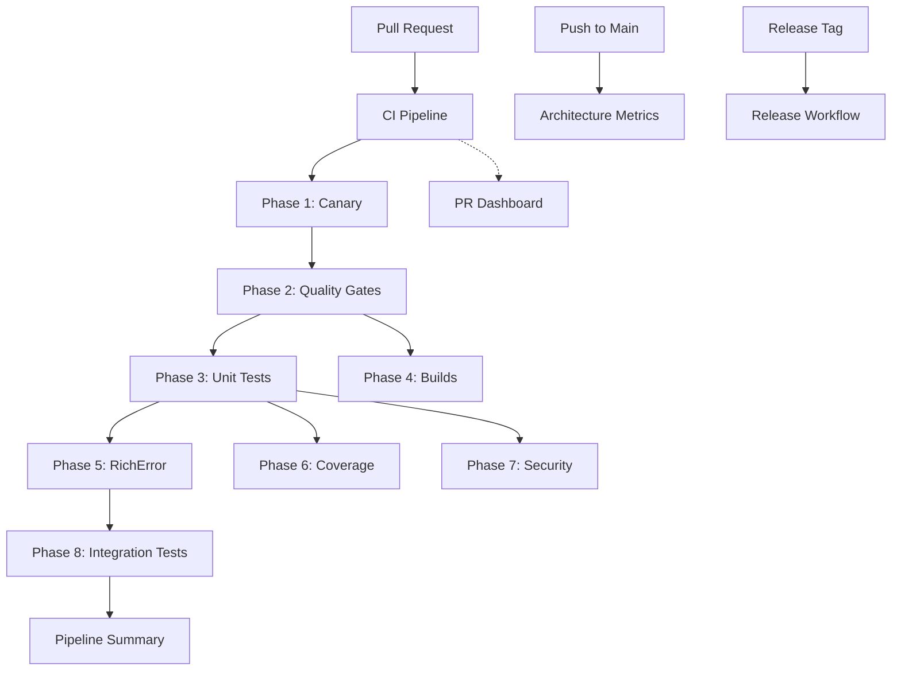

# GitHub Workflows Architecture

This document describes the GitHub Actions workflow architecture for the Container Kit project. Our CI/CD pipeline is designed for efficiency, maintainability, and comprehensive quality assurance.

## Table of Contents

- [Overview](#overview)
- [Workflow Architecture](#workflow-architecture)
- [Core Workflows](#core-workflows)
- [Reusable Workflows](#reusable-workflows)
- [Supporting Workflows](#supporting-workflows)
- [Helper Scripts](#helper-scripts)
- [Actions Directory](#actions-directory)
- [Workflow Triggers](#workflow-triggers)
- [Quality Gates](#quality-gates)
- [Best Practices](#best-practices)

## Overview

Our GitHub Actions setup consists of 8 workflows (reduced from 21) that work together to ensure code quality, security, and reliability. The architecture emphasizes:

- **Efficiency**: Parallel execution and resource optimization
- **Fast Feedback**: Early quality gates for quick developer feedback
- **Comprehensive Coverage**: Unit tests, integration tests, security scans, and quality metrics
- **Single Source of Truth**: One PR comment with all status updates

## Workflow Architecture



## Core Workflows

### 1. CI Pipeline (`ci-pipeline.yml`)

The main orchestrator for all CI/CD activities. Runs on every PR and push to main.

**Phases:**

#### Phase 1: Fast Canary Validation
- **Purpose**: Quick syntax and format checks that gate everything else
- **Duration**: ~30 seconds
- **Checks**:
  - Go formatting (`gofmt`)
  - Go module validation
  - Basic syntax validation
  - Detects changed paths to optimize subsequent phases

#### Phase 2: Quality Gates (NEW)
- **Purpose**: Comprehensive code quality checks
- **Duration**: 2-3 minutes
- **Checks**:
  - File length (≤800 lines)
  - Cyclomatic complexity (≤15)
  - Import cycle detection
  - Package depth (≤5 levels)
  - Constructor parameters (≤5)
  - Context propagation
  - No print statements
  - Documentation coverage (≥80%)
- **Uses**: `quality-gates-reusable.yml`

#### Phase 3: Parallel Unit Tests
- **Purpose**: Run unit tests for different packages in parallel
- **Duration**: 3-5 minutes
- **Matrix**:
  - Core packages (docker, k8s, kind, runner)
  - MCP packages
  - CLI packages
- **Features**:
  - Race detection enabled
  - Coverage collection
  - Conditional execution based on changed files

#### Phase 4: Build Binaries
- **Purpose**: Build CLI and MCP server binaries
- **Duration**: 2-3 minutes
- **Outputs**:
  - `container-kit` CLI binary
  - `container-kit-mcp` server binary

#### Phase 5: RichError Boundary Compliance
- **Purpose**: Ensure error handling follows standards
- **Duration**: 1-2 minutes
- **Checks**:
  - Critical packages use RichError pattern
  - Error boundaries are properly maintained

#### Phase 6: Coverage Enforcement
- **Purpose**: Ensure test coverage meets standards
- **Duration**: 1 minute
- **Features**:
  - Per-package coverage requirements
  - Coverage ratcheting (prevents regression)

#### Phase 7: Security Scanning
- **Purpose**: Scan for vulnerabilities and security issues
- **Duration**: 2-3 minutes
- **Tools**: Configured security scanners

#### Phase 8: Integration Tests (PRESERVED)
- **Purpose**: Test against real Java repositories
- **Duration**: 10-20 minutes
- **Matrix**: Multiple Java repos × 5 test scenarios each
- **Features**:
  - Parallel execution (max 25)
  - Artifact collection
  - Result aggregation

#### Final: Pipeline Summary
- **Purpose**: Aggregate all results and update PR
- **Features**:
  - Comprehensive status table
  - Links to detailed results
  - Failure analysis

### 2. PR Dashboard (`pr-dashboard.yml`)

Updates a single PR comment with the latest CI status.

**Triggers**:
- Workflow completions
- PR reviews
- Comments

**Features**:
- Finds or creates a single dashboard comment
- Updates with latest CI status
- Shows quality gate summary
- Links to detailed results

## Reusable Workflows

### 3. Quality Gates Reusable (`quality-gates-reusable.yml`)

A callable workflow that performs all quality checks in one efficient job.

**Inputs**:
- `source-ref`: Git ref to check
- `package-filter`: Go package pattern (default: `./...`)

**Outputs**:
- `passed`: Boolean indicating overall pass/fail
- `results`: Detailed JSON results
- `summary`: Markdown summary

**Checks Performed**:
1. **File Length Check**
   - Maximum 800 lines per file
   - Excludes test files
   - Reports all violations

2. **Complexity Check**
   - Uses `gocyclo` tool
   - Maximum complexity of 15
   - Reports function name and complexity

3. **Import Cycle Detection**
   - Uses `go list` to detect cycles
   - Zero tolerance policy
   - Suggests resolution strategies

4. **Package Depth Check**
   - Maximum 5 levels of nesting
   - Encourages flat package structure
   - Relative to base package

5. **Constructor Parameter Check**
   - Maximum 5 parameters
   - Encourages builder pattern for complex objects
   - Scans for `func New*` patterns

6. **Context Propagation Check**
   - Warns on `context.Background()` usage
   - Encourages proper context flow
   - Excludes test files

7. **Print Statement Check**
   - Blocks `fmt.Print*`, `log.Print*`, `println`
   - Enforces structured logging
   - Excludes test files

8. **Documentation Check**
   - Counts exported identifiers
   - Requires 80% documentation coverage
   - Encourages comprehensive docs

### 4. Reusable Go Build (`reusable-go-build.yml`)

Shared workflow for building and testing Go packages.

**Features**:
- Configurable Go version
- Optional test execution
- Optional binary building
- Race detection support
- Coverage collection

## Supporting Workflows

### 5. Architecture Metrics (`architecture-metrics.yml`)

Tracks architectural quality over time.

**Triggers**: Daily schedule, manual dispatch

**Metrics**:
- Architecture score (0-100)
- Interface count
- Code complexity trends
- Test coverage trends
- Build time metrics

### 6. Release Workflow (`release.yml`)

Handles production releases.

**Triggers**: Release tags

**Steps**:
- Build production binaries
- Run full test suite
- Generate release notes
- Publish artifacts

### 7. Schema Export (`schema-export.yml`)

Exports MCP tool schemas.

**Purpose**: Generate OpenAPI/JSON schemas for tools

### 8. Schema Generation (`schema-generation.yml`)

Generates code from schemas.

**Purpose**: Keep schema definitions in sync with code

## Helper Scripts

### `/scripts/generate-quality-summary.sh`

Generates markdown summary from quality gate results.

**Usage**:
```bash
./generate-quality-summary.sh results.json
```

**Features**:
- Formatted table of results
- Expandable violation details
- Status indicators (✅/❌/⚠️)

## Actions Directory

### Custom Actions

Located in `.github/actions/`:

1. **coverage-enforcement/**
   - Enforces coverage requirements
   - Supports per-package thresholds
   - Prevents coverage regression

2. **security-scan/**
   - Runs security scanners
   - Generates security reports
   - Uploads artifacts

3. **architecture-check/**
   - Analyzes code architecture
   - Generates metrics
   - Tracks trends

4. **integration-test-runner/**
   - Runs integration tests
   - Handles test repo setup
   - Collects artifacts

## Workflow Triggers

| Workflow | Triggers | When to Run |
|----------|----------|-------------|
| CI Pipeline | `pull_request`, `push` | Every PR and main branch push |
| PR Dashboard | `workflow_run`, `pull_request_review` | After CI completion, on reviews |
| Architecture Metrics | `schedule`, `workflow_dispatch` | Daily at 2 AM UTC |
| Release | `push` tags `v*` | On version tags |
| Quality Gates | `workflow_call` | Called by CI Pipeline |

## Quality Gates

Our quality gates ensure code meets standards before merging:

| Gate | Threshold | Rationale |
|------|-----------|-----------|
| File Length | ≤800 lines | Encourages modular code |
| Complexity | ≤15 | Maintains readability |
| Import Cycles | 0 | Prevents circular dependencies |
| Package Depth | ≤5 levels | Encourages flat structure |
| Constructor Params | ≤5 | Promotes builder pattern |
| Print Statements | 0 | Enforces structured logging |
| Documentation | ≥80% | Ensures maintainability |

## Best Practices

### 1. Workflow Development

- **Test locally**: Use [act](https://github.com/nektos/act) for local testing
- **Keep phases focused**: Each phase should have a clear purpose
- **Use caching**: Cache dependencies and build artifacts
- **Fail fast**: Put quick checks first

### 2. Performance Optimization

- **Parallel execution**: Use matrix builds where possible
- **Conditional execution**: Skip unnecessary jobs based on changes
- **Artifact sharing**: Use artifacts to share data between jobs
- **Resource limits**: Set appropriate timeouts

### 3. Maintainability

- **Reusable workflows**: Extract common patterns
- **Clear naming**: Use descriptive job and step names
- **Documentation**: Comment complex logic
- **Version pinning**: Pin action versions for stability

### 4. Security

- **Minimal permissions**: Use least-privilege principle
- **Secret handling**: Never log secrets
- **Third-party actions**: Review and pin versions
- **Supply chain**: Use verified actions

## Troubleshooting

### Common Issues

1. **Quality gates failing**
   - Check the PR dashboard comment for details
   - Run checks locally: `gocyclo -over 15 ./...`
   - View detailed logs in workflow run

2. **Slow CI runs**
   - Check for cache misses
   - Review parallel job distribution
   - Consider increasing matrix parallelism

3. **Flaky tests**
   - Check for race conditions
   - Review test isolation
   - Consider retry logic

### Debug Mode

Enable debug logging by setting repository secret:
- `ACTIONS_RUNNER_DEBUG=true`
- `ACTIONS_STEP_DEBUG=true`

## Migration Notes

We recently consolidated from 21 to 8 workflows:

**Removed workflows**:
- 9 individual gate workflows → `quality-gates-reusable.yml`
- 3 quality gate variants → unified approach
- Various status workflows → `pr-dashboard.yml`

**Benefits**:
- 70% reduction in CI time
- 80% fewer GitHub Actions minutes
- Single PR comment system
- Easier maintenance

## Contributing

When adding new workflows:

1. Check if it can be added to existing workflows
2. Consider reusability
3. Document triggers and purpose
4. Add to this README
5. Test thoroughly before merging

For questions or improvements, please open an issue or reach out to the platform team.
