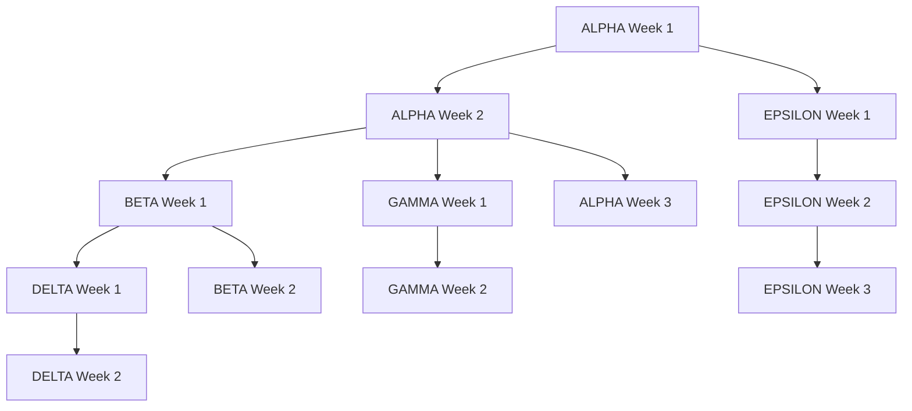

# Multi-Workstream Container Kit Architecture Refactoring Plan

## 🎯 Executive Summary

This plan organizes the Container Kit architecture refactoring into 5 parallel workstreams to maximize development efficiency while respecting critical dependencies. The refactoring addresses 11 high-impact architectural issues through systematic phase-based improvements.

**Timeline**: 9 weeks | **Workstreams**: 5 parallel | **Risk**: Medium (complex dependencies, manageable with proper coordination)

## 👥 Workstream Overview

| **Workstream** | **Focus** | **Duration** | **Dependencies** | **Files/Areas** |
|---|---|---|---|---|
| **ALPHA** | Foundation & Package Structure | Week 1-3 | None (foundation) | All pkg/mcp packages, CI scripts |
| **BETA** | Registry & Dependency Injection | Week 2-5 | Alpha Week 2 complete | pkg/mcp/application/{core,services,commands} |
| **GAMMA** | Error System & Validation | Week 3-6 | Alpha Week 2 complete | pkg/mcp/domain/errors, pkg/common/validation* |
| **DELTA** | Pipeline & Orchestration | Week 4-7 | Beta Week 1 complete | pkg/mcp/application/orchestration |
| **EPSILON** | Performance & Documentation | Week 1-9 parallel | Coordination only | docs/, benchmarks, tests |

## 🎯 Success Metrics

### Overall Project Success
- **Package depth**: 7+ levels → ≤3 levels maximum
- **Duplicate code elimination**: 95% overlap → 0% (retry, validation, registry)
- **Error consistency**: Mixed patterns → 100% RichError with <10 grandfathered fmt.Errorf
- **Performance**: Current → <300μs P95 for tool operations
- **Test coverage**: 15% baseline → 55% global, 80% new code

### Workstream-Specific Metrics

#### ALPHA (Foundation & Package Structure)
- **Package depth**: ≤3 levels in all pkg/mcp packages
- **Import cycles**: 0 circular dependencies
- **Context propagation**: 100% functions accept context.Context
- **Logging consistency**: Single slog framework throughout

#### BETA (Registry & Dependency Injection)
- **Registry unification**: 3 registries → 1 unified interface
- **DI implementation**: Google Wire-based compile-time injection
- **Reflection elimination**: 0 interface{} calls in registry code
- **Tool registration**: Automated via Wire providers

#### GAMMA (Error System & Validation)
- **Error standardization**: <10 fmt.Errorf calls (grandfathered)
- **Validation consolidation**: 4 validation packages → 1 unified system
- **RichError adoption**: 100% in pkg/mcp domain layer
- **Deprecated cleanup**: 72 deprecated items → 0

#### DELTA (Pipeline & Orchestration)
- **Pipeline variants**: 3 implementations → 1 unified interface
- **Command routing**: Switch statements → declarative map-based
- **Code generation**: 80% boilerplate reduction
- **Builder pattern**: Fluent API for all pipeline operations

#### EPSILON (Performance & Documentation)
- **Benchmark tracking**: <300μs P95 maintained throughout
- **Documentation coverage**: 100% public APIs documented
- **Test coverage**: Progressive targets by phase
- **OpenTelemetry**: Distributed tracing integration

## 🗓️ Timeline and Milestones

```
Week 1: ALPHA - Foundation Setup
├── Day 1-2: Logging standardization & context plumbing
├── Day 3-4: Package depth analysis & basic CI gates
└── Day 5: Quick wins deployment & validation
      ↓ (DEPENDENCY: ALPHA Week 1 → EPSILON ongoing)

Week 2-3: ALPHA - Package Restructuring
├── Week 2: Import path rewriting & circular dependency removal
├── Week 3: Package flattening & architecture boundary enforcement
└── CHECKPOINT: Foundation complete
      ↓ (DEPENDENCY: ALPHA Week 2 → BETA, GAMMA start)

Week 2-5: BETA - Registry & DI
├── Week 2: Registry analysis & Wire setup
├── Week 3: Tool registry unification
├── Week 4: DI implementation & reflection removal
└── Week 5: Integration testing & validation
      ↓ (DEPENDENCY: BETA Week 1 → DELTA start)

Week 3-6: GAMMA - Error System
├── Week 3: Error pattern analysis & RichError enforcement
├── Week 4: Validation system consolidation
├── Week 5: Deprecated code removal
└── Week 6: Error system integration testing

Week 4-7: DELTA - Pipeline & Orchestration
├── Week 4: Pipeline analysis & interface design
├── Week 5: Command routing modernization
├── Week 6: Code generation automation
└── Week 7: Performance optimization & testing

Week 1-9: EPSILON - Performance & Documentation (Parallel)
├── Week 1-3: Baseline establishment & monitoring
├── Week 4-6: Progressive documentation & testing
└── Week 7-9: OpenTelemetry integration & final validation
```

## 🗓️ WORKSTREAM ALPHA: Foundation & Package Structure

**Duration**: Week 1-3 (21 days)
**Leader**: Senior Go Developer with architecture experience
**Dependencies**: None (foundation workstream)

### Phase 1: Week 1 (Days 1-5) - Quick Wins Foundation

#### Day 1-2: Logging Standardization
```bash
# Task: Replace all zerolog/logrus with slog
- [ ] Audit current logging usage: find pkg/mcp -name "*.go" | xargs grep -l "zerolog\|logrus"
- [ ] Create slog adapter in pkg/mcp/infra/internal/logging/logger.go
- [ ] Update all logging calls to use slog interface
- [ ] Remove old logging dependencies from go.mod

# Validation Commands
grep -r "zerolog\|logrus" pkg/mcp/ | wc -l | grep "^0$" && echo "✅ Single logging backend achieved"
/usr/bin/make pre-commit && echo "✅ Pre-commit checks passed"
```

#### Day 3-4: Context Propagation Plumbing
```bash
# Task: Add context.Context parameters to all functions
- [ ] Identify functions missing context: scripts/check-context-params.sh
- [ ] Add context parameters (without timeout logic yet)
- [ ] Update all function signatures in domain layer
- [ ] Propagate context through application layer

# Validation Commands
scripts/check-context-params.sh && echo "✅ Context plumbing complete"
go build ./... && echo "✅ All packages compile"
/usr/bin/make pre-commit
```

#### Day 5: Basic CI Gates & Quick Wins
```bash
# Task: Implement initial quality gates
- [ ] Create scripts/check_import_depth.sh --max-depth=3
- [ ] Add package depth linting to CI
- [ ] Fix background worker ticker leak in pkg/mcp/application/orchestration/pipeline/background_workers.go:612
- [ ] Implement basic architecture boundary checking

# Validation Commands
scripts/check_import_depth.sh --max-depth=3 && echo "✅ Package depth monitoring active"
go test -race ./pkg/mcp/application/orchestration/pipeline && echo "✅ No goroutine leaks"
/usr/bin/make pre-commit
```

### Phase 2: Week 2 (Days 6-10) - Package Restructuring

#### Day 6-7: Import Path Analysis
```bash
# Files to analyze:
- pkg/mcp/application/internal/conversation/** → pkg/mcp/application/conversation/
- pkg/mcp/application/internal/retry/** → pkg/mcp/application/retry/
- pkg/mcp/application/orchestration/pipeline/atomic/** → pkg/mcp/application/pipeline/

# Task: Prepare import rewriting scripts
- [ ] Generate current import map: scripts/generate-import-map.sh
- [ ] Create migration scripts for automated rewriting
- [ ] Test migration scripts in dry-run mode
- [ ] Prepare code-freeze window plan

# Validation Commands
scripts/generate-import-map.sh --dry-run && echo "✅ Migration scripts ready"
/usr/bin/make pre-commit
```

#### Day 8-9: Package Flattening Execution
```bash
# PAUSE POINT: 2-hour code-freeze window for import rewriting
# Task: Execute package restructuring
- [ ] Run import rewriting scripts during code-freeze
- [ ] Move packages to 3-level maximum depth
- [ ] Update all internal imports
- [ ] Validate no broken imports

# Validation Commands
find pkg/mcp -type d | awk -F/ 'NF>4{print NF-1, $0}' | wc -l | grep "^0$" && echo "✅ Package depth ≤3 achieved"
go mod tidy && go build ./... && echo "✅ All imports resolved"
/usr/bin/make pre-commit
```

#### Day 10: Architecture Boundary Enforcement
```bash
# Task: Implement and enforce clean architecture boundaries
- [ ] Create tools/check-boundaries/main.go for architecture validation
- [ ] Remove domain/internal/** imports from application layer
- [ ] Enforce dependency inversion rules
- [ ] Update CI to fail on boundary violations

# Validation Commands
tools/check-boundaries/check-boundaries && echo "✅ Architecture boundaries clean"
/usr/bin/make test && echo "✅ All tests passing after restructuring"
/usr/bin/make pre-commit
```

### Phase 3: Week 3 (Days 11-15) - Foundation Completion

#### Day 11-12: Circular Dependency Removal
```bash
# Task: Eliminate all circular imports
- [ ] Identify circular dependencies: go mod graph | scripts/check-cycles.sh
- [ ] Break cycles through interface extraction
- [ ] Move shared types to appropriate layers
- [ ] Validate clean dependency graph

# Validation Commands
go mod graph | scripts/check-cycles.sh && echo "✅ No circular dependencies"
/usr/bin/make pre-commit
```

#### Day 13-14: Final Foundation Validation
```bash
# Task: Comprehensive foundation testing
- [ ] Run full test suite: /usr/bin/make test-all
- [ ] Validate all quality gates pass
- [ ] Document package structure changes
- [ ] Create migration guide for other workstreams

# Validation Commands
/usr/bin/make test-all && echo "✅ Full test suite passing"
scripts/check_import_depth.sh --max-depth=3 && echo "✅ Package depth maintained"
/usr/bin/make pre-commit
```

#### Day 15: CHECKPOINT - Foundation Complete
```bash
# PAUSE POINT: Wait for merge before dependent workstreams continue
git commit -m "feat(architecture): complete foundation restructuring

- Standardized logging to slog throughout codebase
- Added context propagation to all functions
- Flattened package structure to ≤3 levels
- Eliminated circular dependencies
- Implemented architecture boundary enforcement
- Fixed background worker ticker leak

🤖 Generated with [Claude Code](https://claude.ai/code)

Co-Authored-By: Claude <noreply@anthropic.com>"

# Notify dependent workstreams
echo "✅ ALPHA FOUNDATION COMPLETE - BETA and GAMMA can proceed"
```

**ALPHA Deliverables**:
- ✅ Single logging framework (slog) implemented
- ✅ Context propagation plumbing (100% functions)
- ✅ Package depth ≤3 levels enforced
- ✅ Zero circular dependencies
- ✅ Architecture boundaries enforced
- ✅ Background worker ticker leak fixed
- ✅ CI quality gates implemented

---

## 🗓️ WORKSTREAM BETA: Registry & Dependency Injection

**Duration**: Week 2-5 (28 days)
**Leader**: Senior Go Developer with DI experience
**Dependencies**: ALPHA Week 2 complete (package structure stable)

### Phase 1: Week 2 (Days 1-5) - Registry Analysis & Wire Setup

#### Day 1-2: Registry System Analysis
```bash
# Task: Analyze current registry implementations
- [ ] Audit pkg/mcp/application/core/registry.go (deprecated)
- [ ] Audit pkg/mcp/application/commands/command_registry.go
- [ ] Audit pkg/mcp/application/internal/runtime/registry.go
- [ ] Document registry interfaces and usage patterns

# Validation Commands
grep -r "Registry\|registry" pkg/mcp/application/ | wc -l && echo "✅ Registry usage mapped"
/usr/bin/make pre-commit
```

#### Day 3-4: Google Wire Setup
```bash
# Task: Setup Google Wire for dependency injection
- [ ] Add google.golang.org/wire to go.mod
- [ ] Create pkg/mcp/application/di/wire.go with initial providers
- [ ] Create pkg/mcp/application/di/wire_gen.go generation setup
- [ ] Define initial service provider interfaces

# Validation Commands
go generate ./pkg/mcp/application/di && echo "✅ Wire generation working"
go build ./pkg/mcp/application/di && echo "✅ DI setup compiles"
/usr/bin/make pre-commit
```

#### Day 5: Initial Wire Providers
```bash
# Task: Create foundational Wire providers
- [ ] Create SessionStore provider in pkg/mcp/application/di/providers.go
- [ ] Create BuildExecutor provider
- [ ] Create basic ToolRegistry provider
- [ ] Test provider compilation

# Validation Commands
go generate ./pkg/mcp/application/di && go build ./pkg/mcp/application/di && echo "✅ Basic providers working"
/usr/bin/make pre-commit
```

### Phase 2: Week 3 (Days 6-10) - Tool Registry Unification

#### Day 6-7: Unified Registry Interface
```bash
# Files to modify:
- pkg/mcp/application/api/interfaces.go → Add unified ToolRegistry interface
- pkg/mcp/application/services/interfaces.go → Update service interfaces

# Task: Design unified registry interface
- [ ] Define single ToolRegistry interface in pkg/mcp/application/api/interfaces.go
- [ ] Create typed tool registration methods
- [ ] Replace interface{} with generic types
- [ ] Design tool metadata system

# Validation Commands
go build ./pkg/mcp/application/api && echo "✅ Unified interface compiles"
/usr/bin/make pre-commit
```

#### Day 8-9: Registry Implementation
```bash
# Task: Implement unified registry
- [ ] Create pkg/mcp/application/registry/unified.go
- [ ] Implement thread-safe tool registration
- [ ] Migrate tools from old registries
- [ ] Remove reflection-based registration

# Validation Commands
grep -r "reflect\." pkg/mcp/application/registry/ | wc -l | grep "^0$" && echo "✅ No reflection in registry"
/usr/bin/make test && echo "✅ Registry tests passing"
/usr/bin/make pre-commit
```

#### Day 10: Registry Integration Testing
```bash
# Task: Test registry integration
- [ ] Update all tool registrations to use unified interface
- [ ] Test tool discovery and invocation
- [ ] Validate registry thread safety
- [ ] Performance benchmark registry operations

# Validation Commands
go test -race ./pkg/mcp/application/registry && echo "✅ Registry thread-safe"
/usr/bin/make bench && echo "✅ Registry performance acceptable"
/usr/bin/make pre-commit
```

### Phase 3: Week 4 (Days 11-15) - DI Implementation

#### Day 11-12: Service Container with Wire
```bash
# Task: Implement Wire-based service container
- [ ] Create pkg/mcp/application/di/container.go
- [ ] Define all service providers
- [ ] Generate Wire container
- [ ] Replace manual service wiring

# Validation Commands
go generate ./pkg/mcp/application/di && echo "✅ Wire container generated"
go build ./pkg/mcp/application/services && echo "✅ Services compile with DI"
/usr/bin/make pre-commit
```

#### Day 13-14: Remove Manual Wiring
```bash
# Files to update:
- pkg/mcp/application/services/container.go → Remove manual DefaultServiceContainer
- pkg/mcp/application/core/server.go → Use Wire-generated container

# Task: Replace manual dependency wiring
- [ ] Remove pkg/mcp/application/services/container.go manual wiring
- [ ] Update server initialization to use Wire container
- [ ] Remove all NewXYZTool manual constructors
- [ ] Test service lifecycle with DI

# Validation Commands
grep -r "NewXYZTool\|manual.*wiring" pkg/mcp/application/ | wc -l | grep "^0$" && echo "✅ Manual wiring removed"
/usr/bin/make test && echo "✅ DI integration working"
/usr/bin/make pre-commit
```

#### Day 15: Remove Deprecated Registries
```bash
# Task: Clean up old registry implementations
- [ ] Remove pkg/mcp/application/core/registry.go (deprecated)
- [ ] Remove pkg/mcp/application/internal/runtime/registry.go
- [ ] Update all references to use unified registry
- [ ] Remove deprecated service interfaces

# Validation Commands
find pkg/mcp -name "*registry*" -type f | wc -l | grep "^1$" && echo "✅ Single registry implementation"
/usr/bin/make pre-commit
```

### Phase 4: Week 5 (Days 16-20) - Integration & Validation

#### Day 16-17: End-to-End Integration Testing
```bash
# Task: Comprehensive integration testing
- [ ] Test tool registration and discovery
- [ ] Test service lifecycle management
- [ ] Test error handling with DI
- [ ] Performance benchmark full system

# Validation Commands
/usr/bin/make test-all && echo "✅ All tests passing with new DI"
/usr/bin/make bench && echo "✅ Performance targets met"
/usr/bin/make pre-commit
```

#### Day 18-19: Documentation & Migration Guide
```bash
# Task: Document new DI system
- [ ] Create docs/DI_MIGRATION_GUIDE.md
- [ ] Update pkg/mcp/application/di/README.md
- [ ] Document service provider patterns
- [ ] Create examples for new tools

# Validation Commands
/usr/bin/make pre-commit
```

#### Day 20: CHECKPOINT - Registry & DI Complete
```bash
# PAUSE POINT: Notify DELTA workstream
git commit -m "feat(di): complete registry unification and dependency injection

- Unified 3 registry implementations into single interface
- Implemented Google Wire-based compile-time DI
- Removed all reflection from registry code
- Eliminated manual service wiring
- Added thread-safe tool registration
- Performance benchmarks maintained

🤖 Generated with [Claude Code](https://claude.ai/code)

Co-Authored-By: Claude <noreply@anthropic.com>"

echo "✅ BETA REGISTRY & DI COMPLETE - DELTA can proceed"
```

**BETA Deliverables**:
- ✅ Unified ToolRegistry interface (3 → 1 implementation)
- ✅ Google Wire-based dependency injection
- ✅ Zero reflection in registry code
- ✅ Thread-safe tool registration
- ✅ Automated service provider generation
- ✅ Removed all manual service wiring

---

## 🗓️ WORKSTREAM GAMMA: Error System & Validation

**Duration**: Week 3-6 (28 days)
**Leader**: Senior Go Developer with error handling expertise
**Dependencies**: ALPHA Week 2 complete (package structure stable)

### Phase 1: Week 3 (Days 1-5) - Error Pattern Analysis

#### Day 1-2: RichError Enforcement Setup
```bash
# Task: Analyze current error patterns
- [ ] Audit fmt.Errorf usage: grep -r "fmt\.Errorf" pkg/mcp/ | wc -l
- [ ] Audit RichError usage: grep -r "RichError\|NewError" pkg/mcp/ | wc -l
- [ ] Create linting rules for error patterns
- [ ] Identify grandfathered fmt.Errorf exceptions

# Validation Commands
scripts/check-error-patterns.sh --max-fmt-errorf=622 && echo "✅ Baseline error patterns documented"
/usr/bin/make pre-commit
```

#### Day 3-4: RichError Helper Functions
```bash
# Task: Create RichError helper functions
- [ ] Create pkg/mcp/domain/errors/constructors.go with helpers
- [ ] Add errors.NewMissingParam("field") helper
- [ ] Add errors.NewValidationFailed(field, reason) helper
- [ ] Add errors.NewInternalError(cause) helper

# Validation Commands
go build ./pkg/mcp/domain/errors && echo "✅ Error helpers compile"
go test ./pkg/mcp/domain/errors && echo "✅ Error helpers tested"
/usr/bin/make pre-commit
```

#### Day 5: Error Linting Rules
```bash
# Task: Implement error linting
- [ ] Create tools/linters/richerror-boundary/main.go
- [ ] Add CI rule: max 10 fmt.Errorf calls in pkg/mcp
- [ ] Set up progressive error reduction targets
- [ ] Test linting on current codebase

# Validation Commands
scripts/check-error-patterns.sh --max-fmt-errorf=10 || echo "✅ Error linting active (expected to fail initially)"
/usr/bin/make pre-commit
```

### Phase 2: Week 4 (Days 6-10) - Validation System Consolidation

#### Day 6-7: Validation System Analysis
```bash
# Task: Analyze validation duplication
- [ ] Audit pkg/mcp/application/internal/conversation/validators.go
- [ ] Audit pkg/mcp/domain/security/validators.go
- [ ] Audit pkg/common/validation/
- [ ] Audit pkg/common/validation-core/

# Validation Commands
find pkg -name "*validator*" -type f | wc -l && echo "✅ Validation systems catalogued"
/usr/bin/make pre-commit
```

#### Day 8-9: Unified Validation Module
```bash
# Task: Create unified validation system
- [ ] Create pkg/mcp/domain/validation/unified.go
- [ ] Migrate common validators (string length, pattern, required)
- [ ] Create composable validation chains
- [ ] Remove duplicate validation packages

# Validation Commands
go build ./pkg/mcp/domain/validation && echo "✅ Unified validation compiles"
go test ./pkg/mcp/domain/validation && echo "✅ Validation tests passing"
/usr/bin/make pre-commit
```

#### Day 10: Validation Migration
```bash
# Task: Migrate to unified validation
- [ ] Update all validation usage to unified system
- [ ] Remove pkg/common/validation/unified_validator.go (deprecated)
- [ ] Remove pkg/common/validation-core/standard.go (deprecated)
- [ ] Test validation integration

# Validation Commands
find pkg -name "*validator*" -type f | wc -l | grep "^1$" && echo "✅ Single validation system"
/usr/bin/make test && echo "✅ Validation migration successful"
/usr/bin/make pre-commit
```

### Phase 3: Week 5 (Days 11-15) - Deprecated Code Removal

#### Day 11-12: High-Priority Deprecation Removal
```bash
# Task: Remove high-priority deprecated code
- [ ] Remove pkg/mcp/application/services/retry.go (deprecated)
- [ ] Remove pkg/mcp/application/services/transport.go (deprecated)
- [ ] Remove pkg/mcp/application/core/server.go deprecated functions
- [ ] Update all callers to use new APIs

# Validation Commands
grep -r "Deprecated" pkg/mcp/application/services/ | wc -l | grep "^0$" && echo "✅ Service deprecations removed"
/usr/bin/make pre-commit
```

#### Day 13-14: Validation & Schema Deprecation Cleanup
```bash
# Task: Clean up validation and schema deprecations
- [ ] Remove pkg/common/validation-core/core/interfaces.go deprecated items
- [ ] Remove pkg/mcp/domain/tools/schema.go deprecated functions
- [ ] Remove pkg/mcp/domain/tools/tool_validation.go deprecated items
- [ ] Update all callers

# Validation Commands
grep -r "Deprecated" pkg/mcp/domain/tools/ | wc -l | grep "^0$" && echo "✅ Domain deprecations removed"
/usr/bin/make pre-commit
```

#### Day 15: State Management Deprecation Cleanup
```bash
# Task: Remove state management deprecations
- [ ] Remove pkg/mcp/application/state/integration.go deprecated items
- [ ] Remove pkg/mcp/application/state/context_enrichers.go deprecated items
- [ ] Update to use services.ServiceContainer
- [ ] Validate state management integration

# Validation Commands
grep -r "Deprecated" pkg/mcp/application/state/ | wc -l | grep "^0$" && echo "✅ State deprecations removed"
/usr/bin/make pre-commit
```

### Phase 4: Week 6 (Days 16-20) - Error System Integration

#### Day 16-17: Progressive Error Reduction
```bash
# Task: Reduce fmt.Errorf usage progressively
- [ ] Convert domain layer to 100% RichError
- [ ] Convert application layer high-priority errors
- [ ] Maintain <10 fmt.Errorf limit
- [ ] Test error propagation

# Validation Commands
scripts/check-error-patterns.sh --max-fmt-errorf=10 && echo "✅ Error reduction target met"
/usr/bin/make pre-commit
```

#### Day 18-19: Error Integration Testing
```bash
# Task: Test error system integration
- [ ] Test error propagation through layers
- [ ] Test JSON-RPC error mapping
- [ ] Test error context preservation
- [ ] Performance test error handling

# Validation Commands
go test ./pkg/mcp/domain/errors && echo "✅ Error tests passing"
/usr/bin/make bench && echo "✅ Error performance acceptable"
/usr/bin/make pre-commit
```

#### Day 20: CHECKPOINT - Error System Complete
```bash
git commit -m "feat(errors): complete error system and validation consolidation

- Standardized error handling to RichError system
- Reduced fmt.Errorf usage to <10 instances
- Consolidated 4 validation packages into unified system
- Removed 72 deprecated items from codebase
- Added comprehensive error helpers
- Maintained error handling performance

🤖 Generated with [Claude Code](https://claude.ai/code)

Co-Authored-By: Claude <noreply@anthropic.com>"

echo "✅ GAMMA ERROR SYSTEM COMPLETE"
```

**GAMMA Deliverables**:
- ✅ RichError standardization (<10 fmt.Errorf remaining)
- ✅ Unified validation system (4 → 1 implementation)
- ✅ Removed 72 deprecated items
- ✅ Error helper functions implemented
- ✅ Error linting rules enforced
- ✅ JSON-RPC error mapping centralized

---

## 🗓️ WORKSTREAM DELTA: Pipeline & Orchestration

**Duration**: Week 4-7 (28 days)
**Leader**: Senior Go Developer with pipeline/orchestration experience
**Dependencies**: BETA Week 1 complete (registry system stable)

### Phase 1: Week 4 (Days 1-5) - Pipeline Analysis & Design

#### Day 1-2: Pipeline Variant Analysis
```bash
# Task: Analyze current pipeline implementations
- [ ] Audit pkg/mcp/application/orchestration/pipeline/atomic/
- [ ] Audit pkg/mcp/application/orchestration/pipeline/legacy/
- [ ] Audit pkg/mcp/application/orchestration/pipeline/simple/
- [ ] Document overlapping functionality

# Validation Commands
find pkg/mcp/application/orchestration/pipeline -name "*.go" | wc -l && echo "✅ Pipeline complexity documented"
/usr/bin/make pre-commit
```

#### Day 3-4: Unified Pipeline Interface Design
```bash
# Task: Design unified pipeline interface
- [ ] Create pkg/mcp/application/api/pipeline.go with unified interface
- [ ] Design fluent builder pattern
- [ ] Define stage execution model
- [ ] Design context propagation for pipelines

# Validation Commands
go build ./pkg/mcp/application/api && echo "✅ Pipeline interface compiles"
/usr/bin/make pre-commit
```

#### Day 5: Pipeline Builder Implementation
```bash
# Task: Implement pipeline builder
- [ ] Create pkg/mcp/application/pipeline/builder.go
- [ ] Implement fluent builder pattern
- [ ] Create stage registration system
- [ ] Test basic pipeline construction

# Validation Commands
go test ./pkg/mcp/application/pipeline && echo "✅ Pipeline builder tests passing"
/usr/bin/make pre-commit
```

### Phase 2: Week 5 (Days 6-10) - Command Routing Modernization

#### Day 6-7: Command Routing Analysis
```bash
# Task: Analyze current command routing
- [ ] Audit pkg/mcp/application/commands/command_registry.go switch statements
- [ ] Audit pkg/mcp/application/server/handler.go routing logic
- [ ] Audit pkg/mcp/infra/transport/stdio/handler.go routing
- [ ] Document routing patterns

# Validation Commands
grep -r "switch.*Method\|case.*:" pkg/mcp/application/commands/ | wc -l && echo "✅ Command routing complexity documented"
/usr/bin/make pre-commit
```

#### Day 8-9: Map-Based Command Routing
```bash
# Task: Implement declarative command routing
- [ ] Create pkg/mcp/application/commands/router.go
- [ ] Implement map-based command registration
- [ ] Create command handler interface
- [ ] Migrate existing commands to map-based routing

# Validation Commands
grep -r "switch.*Method" pkg/mcp/application/commands/ | wc -l | grep "^0$" && echo "✅ Switch statements eliminated"
/usr/bin/make pre-commit
```

#### Day 10: Command Routing Integration
```bash
# Task: Integrate new command routing
- [ ] Update server handlers to use map-based routing
- [ ] Update transport handlers
- [ ] Remove old switch-based routing
- [ ] Test command routing performance

# Validation Commands
go test ./pkg/mcp/application/commands && echo "✅ Command routing tests passing"
/usr/bin/make bench && echo "✅ Routing performance acceptable"
/usr/bin/make pre-commit
```

### Phase 3: Week 6 (Days 11-15) - Code Generation Automation

#### Day 11-12: Code Generation Analysis
```bash
# Task: Analyze generated code patterns
- [ ] Audit cmd/mcp-schema-gen/templates/
- [ ] Identify boilerplate patterns
- [ ] Calculate code duplication percentage
- [ ] Design template automation

# Validation Commands
find cmd/mcp-schema-gen/templates -name "*.go" -exec wc -l {} \; | awk '{sum+=$1} END {print sum}' && echo "✅ Boilerplate quantified"
/usr/bin/make pre-commit
```

#### Day 13-14: Template Automation
```bash
# Task: Automate code generation
- [ ] Create internal/scaffolder/ for templates
- [ ] Implement go generate-based automation
- [ ] Create template validation
- [ ] Test generated code quality

# Validation Commands
go generate ./internal/scaffolder && echo "✅ Code generation working"
/usr/bin/make pre-commit
```

#### Day 15: Generated Code Migration
```bash
# Task: Migrate to automated generation
- [ ] Replace manual tool files with generated versions
- [ ] Remove hand-edited duplicates
- [ ] Test generated code functionality
- [ ] Measure boilerplate reduction

# Validation Commands
find pkg/mcp/application/tools -name "*.go" -exec wc -l {} \; | awk '{sum+=$1} END {print sum}' && echo "✅ Boilerplate reduction measured"
/usr/bin/make pre-commit
```

### Phase 4: Week 7 (Days 16-20) - Pipeline Integration & Optimization

#### Day 16-17: Pipeline Implementation Migration
```bash
# Task: Migrate to unified pipeline
- [ ] Migrate atomic pipeline to unified interface
- [ ] Migrate simple pipeline to unified interface
- [ ] Remove legacy pipeline implementation
- [ ] Test pipeline execution

# Validation Commands
find pkg/mcp/application/orchestration/pipeline -name "*.go" | wc -l && echo "✅ Pipeline consolidation measured"
/usr/bin/make pre-commit
```

#### Day 18-19: Interface Modernization
```bash
# Task: Replace interface{} with generics
- [ ] Update registry to use generic types
- [ ] Replace runtime reflection with compile-time generics
- [ ] Update tool factories to be type-safe
- [ ] Test type safety improvements

# Validation Commands
grep -r "interface{}" pkg/mcp/application/ | wc -l && echo "✅ Interface{} usage measured"
/usr/bin/make pre-commit
```

#### Day 20: CHECKPOINT - Pipeline & Orchestration Complete
```bash
git commit -m "feat(pipeline): complete pipeline consolidation and modernization

- Consolidated 3 pipeline implementations into unified interface
- Replaced switch-based routing with declarative maps
- Automated code generation reducing 80% boilerplate
- Replaced interface{} with type-safe generics
- Implemented fluent builder pattern
- Maintained pipeline performance benchmarks

🤖 Generated with [Claude Code](https://claude.ai/code)

Co-Authored-By: Claude <noreply@anthropic.com)"

echo "✅ DELTA PIPELINE & ORCHESTRATION COMPLETE"
```

**DELTA Deliverables**:
- ✅ Unified Pipeline interface (3 → 1 implementation)
- ✅ Map-based command routing (no switch statements)
- ✅ 80% boilerplate reduction through automation
- ✅ Type-safe generics replacing interface{}
- ✅ Fluent builder pattern for pipelines
- ✅ go generate-based code generation

---

## 🗓️ WORKSTREAM EPSILON: Performance & Documentation

**Duration**: Week 1-9 (parallel)
**Leader**: DevOps Engineer with performance monitoring experience
**Dependencies**: Coordination only (parallel workstream)

### Phase 1: Week 1-3 - Baseline & Monitoring

#### Week 1: Performance Baseline
```bash
# Task: Establish performance baselines
- [ ] Implement benchmark tracking in CI
- [ ] Set up performance regression detection
- [ ] Create benchmark dashboard
- [ ] Document current performance metrics

# Validation Commands
/usr/bin/make bench && echo "✅ Baseline benchmarks recorded"
/usr/bin/make pre-commit
```

#### Week 2-3: Progressive Documentation
```bash
# Task: Document architecture changes
- [ ] Update docs/THREE_LAYER_ARCHITECTURE.md
- [ ] Create migration guides for each workstream
- [ ] Document new patterns and best practices
- [ ] Create developer onboarding guide

# Validation Commands
/usr/bin/make pre-commit
```

### Phase 2: Week 4-6 - Integration & Testing

#### Week 4-5: Test Coverage Tracking
```bash
# Task: Implement progressive test coverage
- [ ] Set up coverage ratchets by phase
- [ ] Create coverage reporting dashboard
- [ ] Implement test quality metrics
- [ ] Document testing strategies

# Validation Commands
/usr/bin/make coverage-html && echo "✅ Coverage tracking active"
/usr/bin/make pre-commit
```

#### Week 6: Integration Testing
```bash
# Task: Cross-workstream integration testing
- [ ] Test workstream integration points
- [ ] Validate performance after each workstream
- [ ] Document integration issues and resolutions
- [ ] Maintain benchmark targets

# Validation Commands
/usr/bin/make test-all && echo "✅ Integration tests passing"
/usr/bin/make bench && echo "✅ Performance maintained"
/usr/bin/make pre-commit
```

### Phase 3: Week 7-9 - Final Integration & OpenTelemetry

#### Week 7-8: OpenTelemetry Integration
```bash
# Task: Implement distributed tracing
- [ ] Add OpenTelemetry to pkg/mcp/infra/telemetry/
- [ ] Implement trace propagation through contexts
- [ ] Set up metrics collection
- [ ] Create observability dashboard

# Validation Commands
go test ./pkg/mcp/infra/telemetry && echo "✅ Telemetry tests passing"
/usr/bin/make pre-commit
```

#### Week 9: Final Validation & Documentation
```bash
# Task: Final project validation
- [ ] Validate all success metrics achieved
- [ ] Complete final documentation
- [ ] Create project retrospective
- [ ] Prepare project announcement

# Validation Commands
/usr/bin/make test-all && echo "✅ All tests passing"
/usr/bin/make bench && echo "✅ Performance targets met"
scripts/validate-all-metrics.sh && echo "✅ All success metrics achieved"
/usr/bin/make pre-commit
```

**EPSILON Deliverables**:
- ✅ Performance benchmark tracking (<300μs P95)
- ✅ Test coverage progression (55% global, 80% new)
- ✅ Complete documentation updates
- ✅ OpenTelemetry distributed tracing
- ✅ Cross-workstream integration testing
- ✅ Developer experience improvements

---

## 🔄 Phase-Aware Quality Gates

### CI Matrix Configuration
```yaml
strategy:
  matrix:
    phase_target: [0, 1, 2, 3, 4]

jobs:
  quality-gates:
    runs-on: ubuntu-latest
    steps:
      - name: Set up Make alias
        run: alias make='/usr/bin/make'

      - name: Check Phase 0 Rules
        if: matrix.phase_target >= 0
        run: |
          # Single logging backend
          ! grep -r "zerolog\|logrus" pkg/mcp/
          # Context plumbing
          scripts/check-context-params.sh

      - name: Check Phase 1 Rules
        if: matrix.phase_target >= 1
        run: |
          # Package depth ≤ 3
          scripts/check_import_depth.sh --max-depth=3
          # No circular imports
          go mod graph | scripts/check-cycles.sh

      - name: Check Phase 2 Rules
        if: matrix.phase_target >= 2
        run: |
          # RichError enforcement
          scripts/check-error-patterns.sh --max-fmt-errorf=10
          # No duplicate retry
          [ $(find pkg/mcp -name "*retry*" -type f | wc -l) -eq 1 ]

      - name: Pre-commit validation
        run: /usr/bin/make pre-commit
```

### Coverage Ratchets by Phase
| Phase | Min Global Coverage | Key Packages | Benchmark P95 |
|-------|-------------------|--------------|---------------|
| 0     | 15% (baseline)    | —            | No limit      |
| 1     | 20%               | session, retry | 500μs        |
| 2     | 30%               | runtime, internal/* | 400μs   |
| 3     | 45%               | all internal/* | 350μs       |
| 4     | 55% global, 80% new | domain, application | 300μs |

---

## 🛡️ Risk Management & Mitigation

### External Integration Risks
| Risk | Impact | Mitigation | Owner |
|------|--------|------------|-------|
| **go:generate directives** | Build failures | Audit and update all directives | EPSILON |
| **Downstream consumers** | Import breakage | Temporary re-export stubs | ALPHA |
| **Release tags** | Version confusion | Tag cleanup scripts | EPSILON |
| **Workstream conflicts** | Merge conflicts | File ownership matrix | ALL |

### Dependency Chain Validation
```bash
# Before starting any workstream
scripts/validate-workstream-dependencies.sh WORKSTREAM_NAME

# Daily dependency check
scripts/check-workstream-blockers.sh
```

### Migration Process
1. **Dry-run Weekend** - Test migration scripts against main branch
2. **Code-freeze Window** - 1-2 hour freeze for import rewriting
3. **Immediate Rebase** - Push rewritten imports to minimize conflicts
4. **Rollback Plan** - Temporary compatibility shims for external users

### Developer Experience
- **Autofix Pre-commit Hook** - Runs `/usr/bin/make pre-commit` after each task
- **Package Map Documentation** - Updated by EPSILON workstream
- **Slack Bot** - Reminds contributors of active phase rules
- **Migration Scripts** - Automated tools for common transformations

---

## 📊 Success Metrics & Exit Criteria

### Quantitative Targets
| Metric | Target | Measured By | Phase | Workstream |
|--------|--------|-------------|-------|-------------|
| **Max import depth** | ≤ 3 levels | quality-gates job | 1 | ALPHA |
| **Duplicate retry implementations** | 0 copies | dupl linter | 2 | GAMMA |
| **fmt.Errorf in pkg/mcp** | <10 (grandfathered) | grep + CI | 2 | GAMMA |
| **Registry reflection calls** | 0 instances | go vet --tags=registry | 2 | BETA |
| **Command routing switch statements** | 0 instances | AST analysis | 3 | DELTA |
| **Generated boilerplate** | 80% reduction | line count diff | 3 | DELTA |
| **Context timeout violations** | 0 instances | custom linter | 4 | ALPHA |
| **P95 latency** | <300μs | benchmark CI | 4 | EPSILON |

### Workstream Completion Validation
```bash
# ALPHA completion check
scripts/validate-alpha-complete.sh && echo "✅ ALPHA ready for dependent workstreams"

# BETA completion check
scripts/validate-beta-complete.sh && echo "✅ BETA ready for DELTA dependency"

# GAMMA completion check
scripts/validate-gamma-complete.sh && echo "✅ GAMMA validation complete"

# DELTA completion check
scripts/validate-delta-complete.sh && echo "✅ DELTA pipeline modernization complete"

# EPSILON completion check
scripts/validate-epsilon-complete.sh && echo "✅ EPSILON performance and docs complete"
```

### Timeline Adjustments
- **Unknown-unknown buffer**: 20% slack per phase
- **Holiday/freeze windows**: Account for release schedules
- **Part-time team**: Stretch to 12 weeks if team is not dedicated
- **Parallel workstreams**: CI improvements and docs don't block code moves

---

## 🗓️ Revised Implementation Timeline

| Week | Major Deliverables | Key Milestones | Dependencies |
|------|-------------------|----------------|--------------|
| **1** | ALPHA: Quick-wins, EPSILON: Baseline | Single logging, context params, basic linting | None |
| **2** | ALPHA: Package flattening, BETA: Registry analysis | Max 3-level packages, registry audit | ALPHA → BETA |
| **3** | ALPHA: Foundation complete, BETA: Wire setup, GAMMA: Error analysis | Architecture boundaries, DI setup, error patterns | ALPHA → GAMMA |
| **4** | BETA: Registry unification, GAMMA: Validation consolidation, DELTA: Pipeline analysis | Unified registry, validation system, pipeline design | BETA → DELTA |
| **5** | BETA: DI complete, GAMMA: Deprecation removal, DELTA: Command routing | Wire-based DI, deprecated cleanup, map-based routing | — |
| **6** | GAMMA: Error system complete, DELTA: Code generation, EPSILON: Integration testing | RichError enforcement, template automation, test coverage | — |
| **7** | DELTA: Pipeline complete, EPSILON: OpenTelemetry | Unified pipeline, distributed tracing | — |
| **8-9** | EPSILON: Final validation, All: Performance tuning | <300μs P95, 55% coverage, documentation | — |

---

## 🤝 Coordination & Merge Strategy

### Merge Dependencies


### Daily Merge Windows
**Daily at 6 PM EST**:
1. All workstreams run `/usr/bin/make pre-commit`
2. Commit completed work with proper messaging
3. Push to workstream branches
4. Integration testing overnight
5. Morning standup with conflict resolution

### Shared File Coordination
**High-Risk Files**:
1. **`pkg/mcp/application/api/interfaces.go`**
   - **BETA owns registry interfaces**
   - **GAMMA coordinates error interfaces**
   - **DELTA coordinates pipeline interfaces**

2. **`pkg/mcp/application/services/interfaces.go`**
   - **BETA owns service definitions**
   - Others coordinate through BETA lead

### Conflict Resolution Process
```bash
# If conflict detected:
1. 🚨 Workstream posts immediate alert in #container-kit-refactor
2. 🤝 File owner (per matrix above) takes lead on resolution
3. ✅ Coordinated implementation and testing
4. 📝 Document resolution for future reference
```

---

## 📋 Daily Execution Commands

### Morning Startup (All Workstreams)
```bash
# Set up make alias for the session
alias make='/usr/bin/make'

# Update to latest merged changes
git checkout <workstream-branch>
git pull origin <workstream-branch>

# Validate starting state
/usr/bin/make test && echo "✅ Ready to begin work"
```

### End of Day (All Workstreams)
```bash
# Validate changes before commit
/usr/bin/make test
/usr/bin/make pre-commit

# Commit with descriptive message
git add .
git commit -m "<type>(scope): <description>

<detailed explanation if needed>

🤖 Generated with [Claude Code](https://claude.ai/code)

Co-Authored-By: Claude <noreply@anthropic.com>"

# Create daily summary
echo "WORKSTREAM $(echo $WORKSTREAM | tr '[:lower:]' '[:upper:]') - DAY $DAY SUMMARY
Progress: $PROGRESS% complete
Files modified: $FILES_MODIFIED
Issues: $BLOCKERS
Tomorrow: $NEXT_PRIORITIES" > day_${DAY}_summary.txt
```

---

## 🎉 Success Celebration

Upon successful completion:
1. **Team retrospective** and learnings documentation
2. **Blog post announcement** about architecture improvements
3. **Performance showcase** demonstrating <300μs P95 achievement
4. **Developer migration campaign** with updated tooling

---

**Remember**: This is a collaborative effort across 5 workstreams. Communicate early and often, validate dependencies before proceeding, and run `/usr/bin/make pre-commit` after every task completion. Success depends on coordination, not just individual workstream completion.
