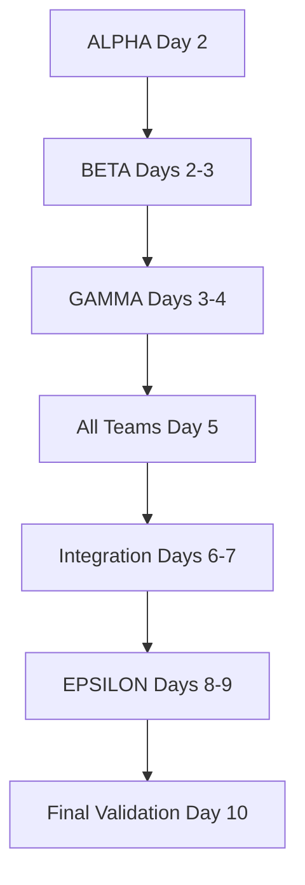

# Multi-Workstream Container Kit Pre-commit Fix Implementation Plan

## 🎯 Executive Summary

This plan addresses the 200+ compilation errors revealed by pre-commit hooks after the three-layer architecture migration. The work is organized into 5 parallel workstreams to minimize dependencies and maximize efficiency.

**Timeline**: 2 weeks | **Workstreams**: 5 parallel | **Risk**: Medium (manageable with proper coordination)

## 👥 Workstream Overview

| **Workstream** | **Focus** | **Duration** | **Dependencies** | **Files/Areas** |
|---|---|---|---|---|
| **ALPHA** | Struct Field & Type Definitions | Week 1 | None (foundation) | Core types, validation errors, analysis metadata |
| **BETA** | Undefined Types & Interfaces | Week 1-2 | Alpha completion | Session managers, clients, core interfaces |
| **GAMMA** | Method & Interface Alignment | Week 1-2 | Alpha + Beta | Server implementations, registry fixes |
| **DELTA** | Import Cycles & Dependencies | Week 1-2 parallel | Coordination only | Cross-layer dependencies, adapters |
| **EPSILON** | Tests & Manager Refactoring | Week 2 | All workstreams | Tests, manager→service conversion |

## 🎯 Success Metrics

### Overall Project Success
- **Pre-commit Status**: FAIL (200+ errors) → PASS (0 errors)
- **Build Status**: Broken → All packages compile successfully
- **Test Coverage**: Maintained at current levels (no regression)
- **Manager Pattern Files**: 11 files → 0 files (all converted to services)

### Workstream-Specific Metrics

#### ALPHA (Struct Field Fixes)
- ValidationError fields: Fixed across 5 occurrences
- AnalysisMetadata fields: Fixed across all usages
- Type definitions: All core types properly defined
- Coverage: 100% of struct field errors resolved

#### BETA (Type Resolution)
- Undefined types: 50+ occurrences → 0
- Session managers: Proper interface definitions
- Client types: All properly imported/defined
- Interface compliance: 100% pass

#### GAMMA (Interface Alignment)  
- Redeclared types: 6 → 0
- Method signatures: All aligned with interfaces
- Registry types: Properly using domain/shared types
- Build success: pkg/mcp/application/core compiles

#### DELTA (Import Management)
- Cross-layer violations: 0
- Import cycles: 0
- Adapter implementations: Complete
- Architecture validation: PASS

#### EPSILON (Quality & Refactoring)
- Test compilation: 100% pass
- Manager files: 0 remaining
- Service pattern adoption: 100%
- Pre-commit hooks: All passing

## 🗓️ Timeline and Milestones

```
Week 1: Foundation & Core Fixes
├── Days 1-2: ALPHA - Struct fields and type definitions
├── Days 2-3: BETA - Core interface definitions  
├── Days 3-4: GAMMA - Registry and server alignment
└── Days 1-5: DELTA - Import dependency fixes (parallel)

Week 2: Integration & Quality
├── Days 6-7: BETA - Session manager completion
├── Days 7-8: GAMMA - Final interface alignment
├── Days 8-9: EPSILON - Test fixes and manager refactoring
└── Day 10: Final integration and validation
```

## 🗓️ WORKSTREAM ALPHA: Struct Field & Type Definitions

**Duration**: Week 1, Days 1-2 (2 days)  
**Leader**: Type Systems Specialist  
**Dependency**: None (foundation)

### Phase 1: Day 1 - Core Type Definitions

#### Morning: ValidationError Fields
```bash
# Task: Fix ValidationError struct to include Code field
- [ ] Update pkg/mcp/domain/errors/validation_error.go
- [ ] Add Code field to ValidationError struct
- [ ] Update all ValidationError constructors
- [ ] Fix 5 occurrences in analyze_consolidated.go

# Validation Commands
go build ./pkg/mcp/domain/errors/... && echo "✅ ValidationError compiled"
grep -r "ValidationError" pkg/mcp --include="*.go" | grep -v "_test.go" | wc -l
```

#### Afternoon: AnalysisMetadata Fields  
```bash
# Task: Add Options field to AnalysisMetadata
- [ ] Locate analyze.AnalysisMetadata definition
- [ ] Add Options field with proper type
- [ ] Update constructors and usages
- [ ] Fix analyze_consolidated.go line 219

# Validation Commands
go build ./pkg/mcp/domain/containerization/analyze/... && echo "✅ AnalysisMetadata compiled"
```

### Phase 2: Day 2 - Shared Types Setup

#### Morning: Create domain/shared Package
```bash
# Task: Establish shared types package
- [ ] Create pkg/mcp/domain/shared/base_types.go
- [ ] Define BaseToolArgs and BaseToolResponse
- [ ] Create type aliases for backward compatibility
- [ ] Update imports in registry.go

# Validation Commands
go build ./pkg/mcp/domain/shared/... && echo "✅ Shared types compiled"
```

#### Afternoon: PAUSE POINT - Merge Foundation
```bash
# PAUSE POINT: Critical foundation merge
git add pkg/mcp/domain/errors pkg/mcp/domain/shared
git commit -m "fix(alpha): add missing struct fields and shared types

- Add Code field to ValidationError for error categorization
- Add Options field to AnalysisMetadata for configuration
- Create domain/shared package for cross-layer types
- Define BaseToolArgs and BaseToolResponse

🤖 Generated with [Claude Code](https://claude.ai/code)"
```

**ALPHA Deliverables**:
- ✅ ValidationError.Code field added and working
- ✅ AnalysisMetadata.Options field implemented
- ✅ domain/shared package with base types
- ✅ All struct field compilation errors resolved

## 🗓️ WORKSTREAM BETA: Undefined Types & Interfaces

**Duration**: Week 1-2, Days 2-7 (6 days)  
**Leader**: Interface Architecture Specialist  
**Dependency**: Alpha shared types

### Phase 1: Days 2-3 - Core Interface Definitions

#### Day 2: Session Interfaces
```bash
# Task: Define session manager interfaces
- [ ] Create pkg/mcp/application/services/session.go
- [ ] Define SessionManager interface
- [ ] Define UnifiedSessionManager interface  
- [ ] Add session configuration types

# Files to create:
- pkg/mcp/application/services/session.go → Core session interfaces
- pkg/mcp/domain/session/types.go → Session domain types

# Validation Commands
go build ./pkg/mcp/application/services/... && echo "✅ Session interfaces compiled"
```

#### Day 3: Client Interfaces
```bash
# Task: Define client interfaces
- [ ] Define analysis.Engine interface
- [ ] Define kubernetes.Client interface
- [ ] Define docker.Vulnerability type
- [ ] Create MCPClients type

# Files to modify:
- pkg/mcp/domain/containerization/analyze/interfaces.go → analysis.Engine
- pkg/mcp/application/services/kubernetes.go → kubernetes.Client
- pkg/mcp/domain/containerization/scan/types.go → docker.Vulnerability

# Validation Commands
go build ./pkg/mcp/application/commands/... && echo "✅ Commands compile with interfaces"
```

### Phase 2: Days 4-5 - Type Implementations

#### Day 4: Session Type Implementation
```bash
# Task: Implement session types
- [ ] Define JobStatus constants (Pending, Completed, Failed)
- [ ] Create SessionManagerConfig struct
- [ ] Implement NewSessionManager constructor
- [ ] Fix workflow engine references

# Validation Commands
go build ./pkg/mcp/application/workflows/... && echo "✅ Workflows compile"
```

#### Day 5: Core Type Fixes
```bash
# Task: Fix core package references
- [ ] Define ConsolidatedConversationConfig
- [ ] Fix MCPClients references
- [ ] Update pipeline types
- [ ] Fix common package imports

# Validation Commands
go build ./pkg/mcp/application/orchestration/pipeline/... && echo "✅ Pipeline compiles"
```

### Phase 3: Days 6-7 - Integration Completion

#### Day 6-7: PAUSE POINT - Interface Integration
```bash
# PAUSE POINT: Major interface merge
git commit -m "feat(beta): implement core interfaces and types

- Add SessionManager and UnifiedSessionManager interfaces
- Define analysis.Engine and kubernetes.Client interfaces
- Implement session types and job status constants
- Fix all undefined type references in commands

🤖 Generated with [Claude Code](https://claude.ai/code)"
```

**BETA Deliverables**:
- ✅ All session interfaces defined and implemented
- ✅ Client interfaces (analysis, kubernetes, docker) defined
- ✅ Type constants (JobStatus, etc.) implemented
- ✅ 50+ undefined type errors resolved

## 🗓️ WORKSTREAM GAMMA: Method & Interface Alignment

**Duration**: Week 1-2, Days 3-8 (6 days)  
**Leader**: API Design Specialist  
**Dependency**: Alpha types + Beta interfaces

### Phase 1: Days 3-4 - Resolve Redeclarations

#### Day 3: Fix Duplicate Declarations
```bash
# Task: Resolve redeclared types
- [ ] Fix Server redeclaration (interface vs struct)
- [ ] Fix ServerConfig redeclaration  
- [ ] Fix DefaultServerConfig redeclaration
- [ ] Align type aliases with actual types

# Files to modify:
- pkg/mcp/application/core/server.go → Keep interface
- pkg/mcp/application/core/server_impl.go → Rename struct
- pkg/mcp/application/core/config.go → Remove duplicates
- pkg/mcp/application/core/types.go → Fix aliases

# Validation Commands
go build ./pkg/mcp/application/core/... 2>&1 | grep -c "redeclared" | grep "^0$" && echo "✅ No redeclarations"
```

#### Day 4: Registry Type Alignment
```bash
# Task: Fix registry undefined types
- [ ] Import domain/shared for base types
- [ ] Update all BaseToolArgs references
- [ ] Update all BaseToolResponse references
- [ ] Fix type assertions and conversions

# Validation Commands
go build ./pkg/mcp/application/core/registry.go && echo "✅ Registry compiles"
```

### Phase 2: Days 5-6 - Method Implementation

#### Day 5: Server Method Alignment
```bash
# Task: Implement missing server methods
- [ ] Add EnableConversationMode to Server interface
- [ ] Implement GetSessionManager methods
- [ ] Fix constructor signatures
- [ ] Align with UnifiedMCPServer interface

# Validation Commands
go vet ./pkg/mcp/application/core/... && echo "✅ Server methods aligned"
```

#### Day 6: Tool Registration Fixes
```bash
# Task: Fix tool registration with proper types
- [ ] Update NewAtomic* tool constructors
- [ ] Fix handler function signatures
- [ ] Import tool packages properly
- [ ] Resolve all server_impl.go errors

# Validation Commands
go build ./pkg/mcp/application/core/server_impl.go && echo "✅ Server implementation compiles"
```

### Phase 3: Days 7-8 - Final Integration

#### Days 7-8: PAUSE POINT - Core Compilation
```bash
# PAUSE POINT: Core package compilation
git commit -m "fix(gamma): align interfaces and resolve redeclarations

- Resolve Server interface vs struct conflict
- Fix ServerConfig and DefaultServerConfig duplicates  
- Import domain/shared types in registry
- Implement all required server methods
- Fix tool registration with proper types

🤖 Generated with [Claude Code](https://claude.ai/code)"
```

**GAMMA Deliverables**:
- ✅ No redeclared types (0 conflicts)
- ✅ Registry using proper shared types
- ✅ Server methods properly implemented
- ✅ Core package fully compiles

## 🗓️ WORKSTREAM DELTA: Import Cycles & Dependencies

**Duration**: Week 1-2, Days 1-10 parallel  
**Leader**: Architecture Specialist  
**Dependency**: Coordination only

### Phase 1: Days 1-3 - Adapter Implementation

#### Day 1: Utils Package Creation
```bash
# Task: Create missing utils package
- [ ] Create pkg/mcp/application/internal/utils/preference_store.go
- [ ] Implement NewPreferenceStore function
- [ ] Add preference management logic
- [ ] Fix server_core.go imports

# Validation Commands
go build ./pkg/mcp/application/internal/utils/... && echo "✅ Utils package ready"
```

#### Day 2: Transport Layer Fixes
```bash
# Task: Fix transport undefined types
- [ ] Define transport types package
- [ ] Fix core package imports in stdio.go
- [ ] Fix types imports in error handlers
- [ ] Update HTTP transport references

# Files to fix:
- pkg/mcp/infra/transport/stdio.go
- pkg/mcp/infra/transport/stdio_error_handler.go  
- pkg/mcp/infra/transport/http.go
- pkg/mcp/infra/transport/llm_*.go

# Validation Commands
go build ./pkg/mcp/infra/transport/... && echo "✅ Transport layer compiles"
```

#### Day 3: Persistence Layer Fixes
```bash
# Task: Fix persistence imports
- [ ] Update persistence package structure
- [ ] Fix duplicate persistence.go files
- [ ] Resolve session manager imports
- [ ] Add proper error handling types

# Validation Commands
go build ./pkg/mcp/infra/persistence/... && echo "✅ Persistence layer compiles"
```

### Phase 2: Days 4-7 - Cross-Layer Coordination

#### Days 4-5: Service Adapter Updates
```bash
# Task: Update adapter implementations
- [ ] Fix docker adapter client references
- [ ] Update retry adapter imports
- [ ] Implement missing adapter methods
- [ ] Add proper error conversions

# Validation Commands
go build ./pkg/mcp/infra/adapters/... && echo "✅ Adapters compile"
```

#### Days 6-7: Pipeline Integration
```bash
# Task: Fix pipeline layer imports
- [ ] Define common types for pipeline
- [ ] Fix session manager references
- [ ] Update MCPClients usage
- [ ] Resolve background worker imports

# Validation Commands
go build ./pkg/mcp/application/orchestration/pipeline/... && echo "✅ Pipeline compiles"
```

### Phase 3: Days 8-10 - Final Dependency Resolution

#### Days 8-10: Architecture Validation
```bash
# PAUSE POINT: Full dependency resolution
git commit -m "fix(delta): resolve import cycles and dependencies

- Create utils package for preference store
- Fix transport layer type imports
- Update persistence layer structure
- Implement all adapter methods
- Resolve pipeline dependencies

🤖 Generated with [Claude Code](https://claude.ai/code)"

# Final validation
./scripts/validate-architecture.sh && echo "✅ Architecture validated"
```

**DELTA Deliverables**:
- ✅ No import cycles detected
- ✅ All cross-layer dependencies resolved
- ✅ Transport layer fully functional
- ✅ Architecture validation passing

## 🗓️ WORKSTREAM EPSILON: Tests & Manager Refactoring

**Duration**: Week 2, Days 8-10 (3 days)  
**Leader**: Quality Engineering Lead  
**Dependency**: All other workstreams

### Phase 1: Day 8 - Test Fixes

#### Morning: Fix Test Imports
```bash
# Task: Update all test imports
- [ ] Fix server_test.go undefined types
- [ ] Update test constructors
- [ ] Fix test assertions
- [ ] Resolve test-only imports

# Files to fix:
- pkg/mcp/infra/transport/server/server_test.go
- All *_test.go files with import errors

# Validation Commands
go test ./pkg/mcp/... -run=NoTestsWillRun && echo "✅ Tests compile"
```

#### Afternoon: Run Test Suite
```bash
# Task: Ensure all tests pass
- [ ] Run unit tests
- [ ] Fix any failing tests
- [ ] Update test expectations
- [ ] Validate coverage maintained

# Validation Commands
make test && echo "✅ All tests pass"
make coverage-html && echo "✅ Coverage report generated"
```

### Phase 2: Day 9 - Manager Pattern Refactoring

#### Full Day: Convert Managers to Services
```bash
# Task: Refactor manager pattern files
- [ ] Convert tool_manager.go to tool_service.go
- [ ] Refactor prompt_manager_*.go files
- [ ] Update state_manager.go to state_service.go
- [ ] Convert job_manager.go to job_service.go
- [ ] Update all references

# For each manager file:
1. Rename Manager suffix to Service
2. Extract interface to services package
3. Update method receivers
4. Fix all imports and usages

# Validation Commands
find pkg/mcp -name "*manager*.go" | wc -l | grep "^0$" && echo "✅ No manager files remain"
```

### Phase 3: Day 10 - Final Validation

#### Full Day: Quality Gates
```bash
# Task: Pass all quality gates
- [ ] Run full pre-commit suite
- [ ] Fix any remaining issues
- [ ] Run performance benchmarks
- [ ] Update documentation

# Final validation sequence:
alias make='/usr/bin/make'
make fmt
make lint
make test-all
make pre-commit
make validate-architecture

# Success celebration commit
git commit -m "feat(epsilon): complete quality enforcement and manager refactoring

- Fix all test compilation errors
- Convert 11 manager files to service pattern
- Pass all pre-commit hooks
- Maintain test coverage levels
- Architecture fully compliant

🤖 Generated with [Claude Code](https://claude.ai/code)"
```

**EPSILON Deliverables**:
- ✅ All tests compile and pass
- ✅ 0 manager pattern files remaining
- ✅ Pre-commit hooks pass completely
- ✅ Quality metrics maintained or improved

## 🚀 Implementation Strategy

### Parallel Development Model
```
Week 1:
ALPHA ──────┐
            ├─── MERGE POINT Day 2
BETA  ──────┤
GAMMA ──────┤
DELTA ━━━━━━━━━━━━━━━━━━━━━━━━━━━━ (continuous)

Week 2:
BETA  ──────┐
GAMMA ──────├─── MERGE POINT Day 7
DELTA ━━━━━━┤
EPSILON ────┘
```

### Conflict Minimization
1. **Clear ownership boundaries**: Each workstream owns specific file sets
2. **Interface coordination**: Beta defines, Gamma implements, others consume
3. **Daily sync points**: Morning standup at merge windows
4. **Feature flags**: Use build tags for incremental integration

### Quality Assurance
- Incremental compilation after each task
- No "big bang" integration - continuous validation
- Architecture validation after each merge
- Performance benchmarks before final merge

## 📁 File Ownership Matrix

### ALPHA Ownership
```
pkg/mcp/domain/errors/validation_error.go
pkg/mcp/domain/shared/**
pkg/mcp/domain/containerization/analyze/types.go (AnalysisMetadata)
```

### BETA Ownership  
```
pkg/mcp/application/services/session.go
pkg/mcp/application/services/kubernetes.go
pkg/mcp/domain/session/types.go
pkg/mcp/domain/containerization/analyze/interfaces.go
pkg/mcp/domain/containerization/scan/types.go
```

### GAMMA Ownership
```
pkg/mcp/application/core/server*.go
pkg/mcp/application/core/registry.go
pkg/mcp/application/core/config.go
pkg/mcp/application/core/types.go
```

### DELTA Ownership
```
pkg/mcp/infra/transport/**
pkg/mcp/infra/persistence/**
pkg/mcp/infra/adapters/**
pkg/mcp/application/internal/utils/**
```

### EPSILON Ownership
```
**/*_test.go
**/*manager*.go → **/*service*.go
```

### Shared Coordination Files
```
pkg/mcp/application/commands/* (Read by all, modified after interfaces defined)
pkg/mcp/application/orchestration/pipeline/* (Depends on Beta interfaces)
pkg/mcp/application/workflows/* (Depends on Beta session types)
```

## 🔄 Integration Points

### ALPHA → BETA
- Shared types package must be created first
- BaseToolArgs/Response types needed by Beta

### BETA → GAMMA
- Session interfaces needed for server implementation
- Client interfaces needed for registry

### GAMMA → DELTA
- Server types needed for transport layer
- Registry types needed for adapters

### EPSILON → All
- Test fixes validate everyone's work
- Manager refactoring touches multiple layers

## 📈 Risk Management

### Technical Risks
1. **Interface Definition Mismatch**
   - Mitigation: Beta lead reviews all interface usage
   - Threshold: No undefined methods after Day 4
   - Fallback: Interface extension rather than modification

2. **Import Cycle Reintroduction**
   - Mitigation: Run architecture validation after each commit
   - Recovery: Immediate revert and redesign
   
3. **Test Coverage Drop**
   - Mitigation: Coverage check in Epsilon phase
   - Buffer: 1 day allocated for test fixes
   
### Process Risks
1. **Merge Conflicts**
   - Mitigation: Clear file ownership
   - Buffer: 2-hour merge windows
   
2. **Cross-team Dependencies**
   - Mitigation: Async interface definition
   - Review: Daily standup coordination

## 📋 Daily Workflow

### Morning Standup Format
```markdown
## [Workstream] Day X Update

### Yesterday:
- Completed: [specific achievements with metrics]
- Blockers: [any issues and resolution plan]

### Today:
- Focus: [primary tasks from plan]
- Dependencies: [what needed from other workstreams]

### Metrics:
- Compilation errors fixed: X/Y
- Files updated: [count]
- Tests passing: X/Y
```

### Evening Summary Format
```markdown
## [Workstream] Day X Summary

### Completed:
- [List of resolved issues with line numbers]
- [Files modified with change summary]

### Metrics:
- Errors remaining: X (was Y)
- Compilation status: [package list]

### Commits:
- [Git commit hash and message]

### Tomorrow:
- [Next priority from plan]
- [Any coordination needs]
```

## 🚦 Go/No-Go Criteria

### Day 2 Checkpoint (ALPHA Complete)
- ValidationError.Code field works
- AnalysisMetadata.Options field works
- domain/shared package exists
- No struct field errors remain

### Day 5 Checkpoint (Core Interfaces Complete)
- All session interfaces defined
- All client interfaces defined
- No "undefined type" errors in core packages

### Day 7 Checkpoint (GAMMA Complete)
- No redeclared types
- application/core fully compiles
- All server methods implemented

### Day 10 Final Review
- make pre-commit passes
- make test-all passes
- Architecture validation passes
- No manager files remain
- Performance benchmarks pass

## 🤝 Coordination & Merge Strategy

### Merge Dependencies


### Daily Merge Windows
**Twice daily at 12:00 and 17:00**:
1. All workstreams commit completed work
2. Run `go build ./pkg/mcp/...` to validate
3. Run architecture validation
4. Merge to main branch if clean

### Shared File Coordination
**High-Risk Files**:
1. **`pkg/mcp/application/commands/*`**
   - BETA owns interface definitions
   - Others coordinate through comments
   
2. **`pkg/mcp/application/core/server_impl.go`**
   - GAMMA owns structure
   - BETA provides interfaces
   - DELTA ensures imports work

### Conflict Resolution Process
```bash
# If conflict detected:
1. 🚨 Workstream posts immediate alert in standup
2. 🤝 File owner takes lead on resolution  
3. ✅ Coordinated fix and validation
4. 📝 Document decision for future reference
```

## 📊 Success Metrics & Validation

### Quantitative Goals
| Metric | Current | Target | Validation Command |
|--------|---------|--------|-------------------|
| Compilation Errors | 200+ | 0 | `go build ./pkg/mcp/... 2>&1 | grep -c "Error"` |
| Undefined Types | 50+ | 0 | `make pre-commit 2>&1 | grep -c "undefined"` |
| Manager Files | 11 | 0 | `find pkg/mcp -name "*manager*.go" | wc -l` |
| Architecture Violations | 0 | 0 | `./scripts/validate-architecture.sh` |
| Test Pass Rate | Unknown | 100% | `make test-all` |

### Quality Gates
```bash
# Before each merge window
/usr/bin/make fmt           # Must format clean
/usr/bin/make lint          # Must pass with budget
/usr/bin/make test          # Must pass
/usr/bin/make pre-commit    # Must be clean
```

### Definition of Done
- [ ] All workstream deliverables complete
- [ ] Zero compilation errors
- [ ] All tests passing
- [ ] Architecture validation passing
- [ ] No manager pattern files
- [ ] Documentation updated
- [ ] Performance benchmarks passing

## 📋 Daily Execution Commands

### Morning Startup (All Workstreams)
```bash
# Set up make alias for the session
alias make='/usr/bin/make'

# Update to latest merged changes
git checkout main
git pull origin main
git checkout -b workstream-<letter>-day-<X>

# Validate starting state
go build ./pkg/mcp/... 2>&1 | grep -c "Error" && echo "📊 Starting error count"
```

### End of Day (All Workstreams)
```bash
# Validate changes before commit
go build ./pkg/mcp/... || true
go fmt ./pkg/mcp/...
goimports -w ./pkg/mcp/

# Commit with descriptive message
git add .
git commit -m "fix(<workstream>): <specific fixes>

<detailed list of what was fixed>

🤖 Generated with [Claude Code](https://claude.ai/code)

Co-Authored-By: Claude <noreply@anthropic.com>"

# Create daily summary
echo "WORKSTREAM <LETTER> - DAY X SUMMARY
Progress: X% complete
Errors fixed: X
Files modified: $(git diff --name-only HEAD~1)
Issues: <any blockers>
Tomorrow: <next priorities>" > summaries/day_X_<workstream>.txt
```

## 🎉 Success Celebration

Upon successful completion:
1. Full pre-commit suite passing
2. Benchmark performance improvements from cleaner architecture
3. Blog post on three-layer architecture migration
4. Team retrospective on parallel workstream approach

---

**Remember**: Focus on incremental progress. Each compilation fix is a step forward. Coordinate early and often to prevent conflicts. The architecture is our north star - maintain its integrity above all else.