# 📦 Container Copilot: Design Document

## 🧭 Overview

Container Copilot is an AI-powered CLI tool that automates the containerization of applications and the generation of Kubernetes artifacts. It leverages Azure OpenAI (LLM) to iteratively resolve issues in Dockerfiles and Kubernetes manifests until the application can be deployed successfully to a local Kind cluster.

---

## 🎯 Goals

- Automatically generate `Dockerfile` and `Kubernetes` manifests for a given repo.
- Use LLM prompts to suggest templates and fixes for build/deploy issues.
- Provide iterative AI-guided repair loops with snapshots for debugging.
- Output production-ready containerization artifacts validated by live deployment.

---

## 🧱 Architecture

### 🧠 LLM (Azure OpenAI)
- Selects the best `Dockerfile` template based on repo structure.
- Fixes Dockerfile and manifest errors using embedded context.
- Returns fixed content wrapped in tags like `<<<DOCKERFILE>>>` or `<<<MANIFEST>>>`.

### 🖥 CLI Entry Point

- Main command:
  ```bash
  container-copilot generate <target-dir>
  ```

- Initializes pipeline, bootstraps templates, and executes iteration logic.

### 🔁 Iteration Pipeline

#### 1. **Templating Iteration**
- Lists project files using `filetree.ReadFileTree()`.
- Sends file structure and template options to LLM.
- Copies selected template into the repo using Draft.

#### 2. **Dockerfile Iteration**
- Tries to build the Docker image.
- If build fails:
  - Sends errors + current Dockerfile to LLM.
  - Extracts fixed Dockerfile from LLM response using `<<<DOCKERFILE>>>`.
- Retries up to 5 times.

#### 3. **Manifest Iteration**
- Applies Kubernetes manifests via `kubectl`.
- On failure:
  - Sends failed manifest and errors to LLM.
  - Extracts fixed manifest from `<<<MANIFEST>>>` tags.
- Retries up to 5 times.

---

## 🔄 Iteration Flow

```mermaid
flowchart TD
  A[Start] --> B[Templating Iteration]
  B --> C[Dockerfile Iteration]
  C --> D{Build Success?}
  D -- No --> E[Extract Errors & Reanalyze]
  E --> C
  D -- Yes --> F[Manifest Iteration]
  F --> G{Apply Success?}
  G -- No --> H[Extract Errors & Fix]
  H --> F
  G -- Yes --> I{Pods Running?}
  I -- No --> J[Extract Pod Logs]
  J --> K[Fail ❌]
  I -- Yes --> L[Success 🎉]
```



---

## 🧠 Prompting Strategy

- LLM is instructed to:
  - Avoid extra commentary.
  - Provide output between `<<<TAG>>>` markers.
  - Use context such as:
    - File structure
    - Dockerfile content and errors
    - Manifest content and pod logs

Example tags:
- `<<<DOCKERFILE>>>...<<<DOCKERFILE>>>`
- `<<<MANIFEST>>>...<<<MANIFEST>>>`

---

## 🗂 Key Modules

| File | Responsibility |
|------|----------------|
| `cmd/generate.go` | Entry point and orchestration |
| `pkg/docker/draft.go` | Templating with Draft |
| `pkg/pipeline/docker.go` | Dockerfile repair loop |
| `pkg/pipeline/k8s.go` | Manifest repair loop |
| `pkg/filetree/filetree.go` | Builds tree for LLM input |
| `pkg/ai/llm-client.go` | Chat prompt and response |

---

## ⚙️ Configuration

- Credentials via environment:
  ```bash
  export AZURE_OPENAI_KEY=...
  export AZURE_OPENAI_ENDPOINT=...
  export AZURE_OPENAI_DEPLOYMENT_ID=...
  ```

- Local Docker registry at `localhost:5001`
- Kind cluster named `container-copilot`

---

## 🧪 Testing Strategy

- GitHub Actions matrix runs 10 parallel test jobs.
- Each test invokes:
  ```bash
  container-copilot generate .
  ```
- Log outputs are parsed for:
  ```text
  "All pipelines completed successfully!"
  ```

Artifacts:
- Dockerfile and manifest outputs saved if successful.
- Logs and metadata stored per run.

---

## 🧩 Future Work

### Future Work: Code Analysis Iteration
- Add a `Code Analysis` phase after templating to lint and optimize user code before Dockerfile generation.

### Future Work: Resource Optimization
- Use pod metrics to recommend resource limits and auto-tune manifest `resources:` blocks.

---

## ❓ Open Questions

- Should we dynamically extract `labelSelector` from manifests to improve pod health checking?
- Should LLM be allowed to create *new* manifests or only modify existing ones?
- What metadata (e.g. final diff, error log timeline) should be persisted for audit/debug?

---

