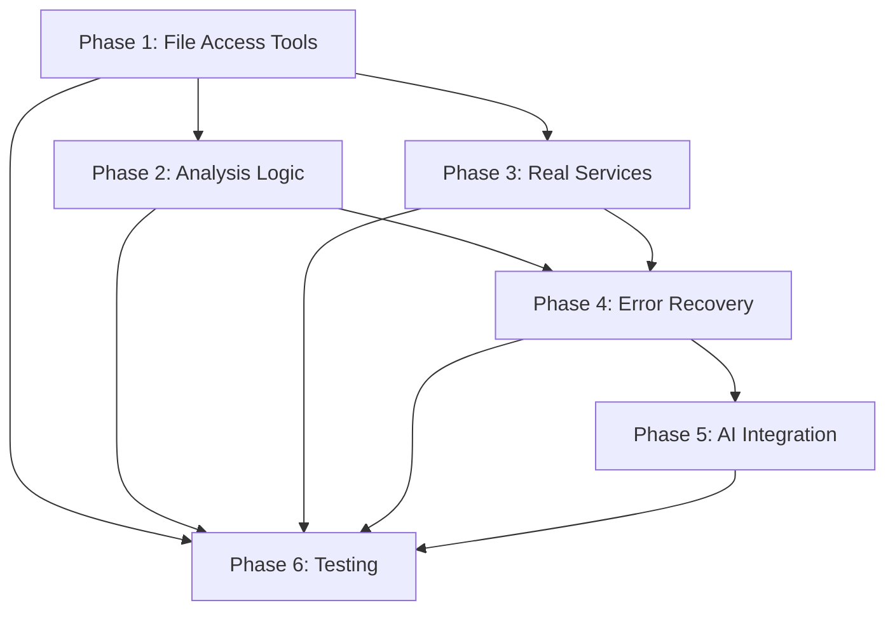

# MCP Tools Implementation Plan

## Executive Summary

This plan addresses the gaps identified between the pipeline stages and MCP tools, while respecting the architectural differences. The MCP tools use a session-based, service-oriented architecture where AI orchestration happens externally through the conversation handler.

## Implementation Phases

### Phase 1: File Access Tool Integration (Priority: HIGH)
**Timeline: 1-2 weeks**
**Goal: Enable MCP tools to explore repositories like pipeline stages do**

#### 1.1 Create File Access Service
```go
// pkg/mcp/application/services/file_access.go
type FileAccessService interface {
    ReadFile(ctx context.Context, sessionID, path string) (string, error)
    ListDirectory(ctx context.Context, sessionID, path string) ([]FileInfo, error)
    FileExists(ctx context.Context, sessionID, path string) (bool, error)
    GetFileTree(ctx context.Context, sessionID, rootPath string) (string, error)
}
```

#### 1.2 Implement File Access Tools as MCP Tools
- Create `read_file`, `list_directory`, `file_exists` as proper MCP tools
- Register them in `tool_registration.go`
- These tools will use the session workspace as base path for security

#### 1.3 Update Consolidated Commands
- Inject FileAccessService into analyze, build, deploy commands
- Use file access service instead of stub methods
- Maintain session isolation for security

**Deliverables:**
- [ ] FileAccessService interface and implementation
- [ ] Three new MCP tools for file operations
- [ ] Updated consolidated commands using file access service
- [ ] Security validation for path traversal prevention

### Phase 2: Implement Analysis Logic (Priority: HIGH)
**Timeline: 2-3 weeks**
**Goal: Replace stub methods with real implementations**

#### 2.1 Language Detection Implementation
```go
// Real implementation for detectLanguageByExtension
func (cmd *ConsolidatedAnalyzeCommand) detectLanguageByExtension(ctx context.Context, workspaceDir string) (map[string]int, error) {
    // Use FileAccessService to scan directory
    // Count files by extension
    // Map extensions to languages
}
```

#### 2.2 Framework Detection
- Implement `detectGoFramework` - check for go.mod, popular frameworks (gin, echo, etc.)
- Implement `detectJSFramework` - check package.json for React, Angular, Vue, etc.
- Implement `detectPythonFramework` - check for Django, Flask, FastAPI patterns
- Implement `detectJavaFramework` - check pom.xml/build.gradle for Spring, etc.

#### 2.3 Dependency Analysis
- Implement `analyzeGoDependencies` - parse go.mod/go.sum
- Implement `analyzeNodeDependencies` - parse package.json/package-lock.json
- Implement `analyzePythonDependencies` - parse requirements.txt/setup.py
- Implement `analyzeJavaDependencies` - parse pom.xml/build.gradle

#### 2.4 Database Detection
```go
// Implement database detection similar to pipeline
func (cmd *ConsolidatedAnalyzeCommand) detectDatabases(ctx context.Context, workspaceDir string) ([]DatabaseInfo, error) {
    // Search for database connection patterns
    // Check for ORM configurations
    // Look for migration files
    // Parse environment files
}
```

**Deliverables:**
- [ ] Complete language detection with file scanning
- [ ] Framework detection for Go, JS/TS, Python, Java, .NET
- [ ] Dependency parsing for all major languages
- [ ] Database detection including connection strings and ORMs
- [ ] Port detection from configuration files

### Phase 3: Real Service Implementations (Priority: MEDIUM)
**Timeline: 1-2 weeks**
**Goal: Replace mock implementations with real functionality**

#### 3.1 Push Image Tool
```go
// Update LazyPushTool to use real Docker client
func (t *LazyPushTool) Execute(ctx context.Context, input api.ToolInput) (api.ToolOutput, error) {
    // Get DockerClient from services
    // Authenticate with registry
    // Actually push the image
    // Return real push results
}
```

#### 3.2 Generate Dockerfile Tool
- Create standalone implementation (not delegating to analyze)
- Use template system from pipeline
- Support multiple language templates
- Include best practices and multi-stage builds

#### 3.3 Session Management Tools
- `list_sessions`: Query real SessionStore
- `ping`: Check actual server health
- `server_status`: Return real metrics from service container

**Deliverables:**
- [ ] Real Docker push implementation
- [ ] Standalone Dockerfile generation
- [ ] Real session listing from BoltDB
- [ ] Actual server health checks
- [ ] Performance metrics collection

### Phase 4: Enhanced Error Recovery (Priority: MEDIUM)
**Timeline: 1 week**
**Goal: Expand AutoFixHelper strategies**

#### 4.1 Additional Fix Strategies
```go
// Add to AutoFixHelper
- "invalid_port": Try common ports (8080, 3000, 5000)
- "missing_dependency": Suggest package installation
- "syntax_error": Basic Dockerfile syntax fixes
- "resource_limits": Adjust memory/CPU limits
- "health_check_failure": Try different health check strategies
```

#### 4.2 Context-Aware Fixes
- Use session state to make smarter fix decisions
- Access previous analysis results for better suggestions
- Chain multiple fix attempts

**Deliverables:**
- [ ] 10+ new fix strategies
- [ ] Context-aware fix decisions
- [ ] Fix strategy documentation
- [ ] Integration tests for auto-fix

### Phase 5: AI-Assisted Analysis Integration (Priority: LOW)
**Timeline: 2 weeks**
**Goal: Optional AI enhancement for deep analysis**

#### 5.1 AI Analysis Service
```go
// Optional service for AI-powered analysis
type AIAnalysisService interface {
    AnalyzeCodePatterns(ctx context.Context, files []string) (*AIAnalysis, error)
    SuggestOptimizations(ctx context.Context, dockerfile string) ([]Suggestion, error)
    DetectSecurityIssues(ctx context.Context, code string) ([]SecurityIssue, error)
}
```

#### 5.2 Integration Points
- Add optional AI analysis to analyze command
- AI-powered Dockerfile optimization suggestions
- Security vulnerability detection
- Performance optimization recommendations

**Deliverables:**
- [ ] AIAnalysisService interface
- [ ] Integration with Azure OpenAI
- [ ] Analysis result caching
- [ ] Cost management for AI calls

### Phase 6: Testing and Documentation (Priority: HIGH)
**Timeline: Ongoing with each phase**
**Goal: Ensure quality and maintainability**

#### 6.1 Unit Tests
- Test each new implementation
- Mock service dependencies
- Achieve 80%+ coverage

#### 6.2 Integration Tests
- Test tool interactions through session state
- Test workflow execution
- Test error recovery scenarios

#### 6.3 Documentation
- Update tool guides with new capabilities
- Document fix strategies
- Create troubleshooting guides
- Add architecture diagrams

**Deliverables:**
- [ ] Unit tests for all new code
- [ ] Integration test suite
- [ ] Updated documentation
- [ ] Performance benchmarks

## Implementation Order and Dependencies



## Resource Requirements

### Development Team
- 2 Senior Go Developers
- 1 DevOps Engineer (for Docker/K8s integration)
- 1 QA Engineer
- 0.5 Technical Writer

### Infrastructure
- Development Kubernetes cluster
- Container registry for testing
- Azure OpenAI credits (Phase 5 only)

## Success Metrics

### Functional Metrics
- All 9 tools have real implementations (no mocks)
- File access tools integrated and working
- 90%+ of stub methods implemented
- AutoFixHelper handles 80%+ of common errors

### Quality Metrics
- 80%+ unit test coverage
- All tools pass integration tests
- Performance: <300μs P95 per tool execution
- Zero security vulnerabilities

### User Experience Metrics
- 90%+ success rate for containerization workflows
- 50% reduction in manual fixes needed
- Clear error messages with actionable suggestions

## Risk Mitigation

### Technical Risks
1. **File Access Security**
   - Mitigation: Strict path validation, session-based isolation

2. **Performance Impact**
   - Mitigation: Caching, lazy loading, concurrent operations

3. **Backward Compatibility**
   - Mitigation: Versioned APIs, migration guides

### Operational Risks
1. **Resource Constraints**
   - Mitigation: Phased rollout, feature flags

2. **Integration Complexity**
   - Mitigation: Incremental integration, comprehensive testing

## Rollout Strategy

### Phase 1 Rollout (Weeks 1-2)
- Internal testing of file access tools
- Limited beta with selected users
- Monitor for security issues

### Phase 2 Rollout (Weeks 3-5)
- Deploy analysis improvements
- A/B testing with pipeline comparison
- Gather user feedback

### Phase 3-4 Rollout (Weeks 6-8)
- Full production deployment
- Deprecation notices for pipeline
- Migration assistance

### Phase 5 Rollout (Weeks 9-10)
- Optional AI features as preview
- Collect usage metrics
- Optimize based on feedback

## Conclusion

This implementation plan transforms the MCP tools from a proof-of-concept to a production-ready system while maintaining the architectural principles of session-based context sharing and external AI orchestration. The phased approach allows for incremental delivery of value while managing risk.

The key insight is that we're not trying to replicate the pipeline's embedded AI approach, but rather enabling the MCP tools to provide the same capabilities through a different, more modular architecture that better fits the Model Context Protocol paradigm.
