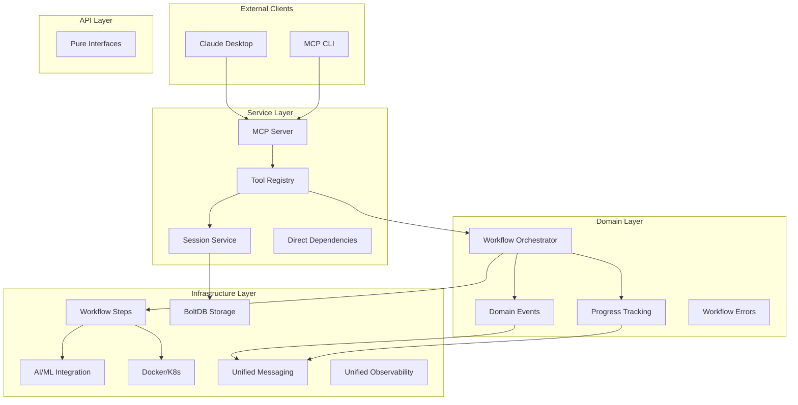

[](https://github.com/Azure/container-kit/actions/workflows/ci-simple.yml)

# Container Kit

AI-Powered Application Containerization and Kubernetes Deployment

Container Kit automates the complete containerization process from repository analysis to Kubernetes deployment using individual, chainable tools. Built on a simplified 4-layer architecture with Domain-Driven Design and direct dependency injection, it provides 15 focused tools that can be used individually or chained together for complete workflows with AI-powered error recovery and built-in progress tracking.

## 🚀 Quick Install

### One-Line Installation

**Linux/macOS:**
```bash
curl -sSL https://raw.githubusercontent.com/Azure/container-kit/main/scripts/install.sh | bash
```

**Windows (PowerShell as Administrator):**
```powershell
Set-ExecutionPolicy Bypass -Scope Process -Force; Invoke-WebRequest -Uri https://raw.githubusercontent.com/Azure/container-kit/main/scripts/install.ps1 -OutFile install.ps1; ./install.ps1; Remove-Item install.ps1
```

### Verify Installation
```bash
# Check executable
./container-kit-mcp --version

# Verify build
make build
```

For detailed usage and troubleshooting, see the examples directory and development guidelines.

## 🏃 Quick Start

### Prerequisites
- Docker
- kubectl (optional, for Kubernetes features)
- Azure OpenAI access (for AI features)

### Basic Usage
```bash
# Run MCP server (main executable)
./container-kit-mcp

# Container Kit provides 15 individual tools via MCP protocol:
# - 10 workflow step tools (analyze_repository, generate_dockerfile, build_image, etc.)
# - 2 orchestration tools (start_workflow, workflow_status)
# - 3 utility tools (list_tools, ping, server_status)
# Connect with MCP client for step-by-step containerization
```

### Building from Source
```bash
git clone https://github.com/Azure/container-kit.git
cd container-kit

# Set up make alias (required for WSL/Linux)
alias make='/usr/bin/make'

# Build the MCP server
make build

# Run tests
make test              # Unit tests
make test-integration  # Integration tests

# Code quality
make fmt               # Format code
make lint              # Run linter
```

## 📖 Documentation

### For Users
- **[Examples](examples/)** - Working code examples and patterns

### For Developers
- **[Architectural Decisions](docs/architecture/adr/)** - ADRs documenting key design decisions
- **[Container Kit Design Document](docs/CONTAINER_KIT_DESIGN_DOCUMENT.md)** - Complete system design and architecture
- **[New Developer Guide](docs/NEW_DEVELOPER_GUIDE.md)** - Getting started with development

### For Contributors
- **[Contributing Guide](CONTRIBUTING.md)** - Development workflow and standards
- **[Development Guidelines](DEVELOPMENT_GUIDELINES.md)** - Coding standards and practices

## 🏗️ Architecture

Container Kit uses a **simplified 4-layer architecture** with Domain-Driven Design and direct dependency injection:



### Architecture Layers

```
pkg/mcp/
├── api/                   # Interface definitions and contracts
│   └── interfaces.go      # Essential MCP tool interfaces
├── service/               # Unified service layer (simplified from application)
│   ├── bootstrap/         # Application bootstrapping
│   ├── commands/          # CQRS command handlers
│   ├── config/            # Configuration management
│   ├── dependencies.go    # Simple direct dependency injection
│   ├── lifecycle/         # Application lifecycle management
│   ├── queries/           # CQRS query handlers  
│   ├── registrar/         # MCP tool/resource registration
│   ├── registry/          # Service registry
│   ├── server.go          # MCP server implementation with direct DI
│   ├── session/           # Session management
│   ├── tools/             # Individual tool implementations (15 tools)
│   ├── transport/         # HTTP and stdio transport
│   └── workflow/          # Workflow orchestration
├── domain/                # Business logic and workflows
│   ├── events/            # Domain events
│   ├── health/            # Health check interfaces
│   ├── progress/          # Progress tracking (business concept)
│   ├── prompts/           # Prompt interfaces
│   ├── resources/         # Resource interfaces
│   ├── sampling/          # LLM sampling domain logic
│   ├── session/           # Session domain objects
│   └── workflow/          # Core containerization workflow
│       ├── workflow_error.go # Simple workflow error handling
│       └── utils.go       # Workflow utility functions
└── infrastructure/        # Technical implementations (consolidated)
    ├── ai_ml/             # AI/ML implementations
    │   ├── prompts/       # Prompt management
    │   │   └── templates/ # Embedded prompt templates
    │   └── sampling/      # LLM integration
    ├── core/              # Core infrastructure
    │   ├── resources/     # Resource providers and stores
    │   ├── testutil/      # Testing utilities
    │   ├── util/          # General utilities
    │   ├── utilities/     # Advanced utilities
    │   └── validation/    # Validation logic
    ├── messaging/         # UNIFIED: Event publishing and progress reporting
    │   ├── cli_direct.go        # CLI progress reporting
    │   ├── emitter.go           # Progress emitters
    │   ├── event_publisher.go   # Domain event publishing
    │   ├── factory_direct.go    # Progress factory
    │   └── mcp_direct.go        # MCP progress reporting
    ├── observability/     # UNIFIED: Monitoring, tracing, and health
    │   ├── monitor.go           # Health monitoring
    │   ├── tracing_config.go    # OpenTelemetry configuration
    │   ├── tracing_helpers.go   # Tracing utilities
    │   └── tracing_integration.go # Tracing middleware
    ├── orchestration/     # Container and K8s orchestration
    │   └── steps/         # Focused workflow step implementations
    └── persistence/       # Data persistence
        └── session/       # Session storage (BoltDB)
```

**Key Architecture Features:**
- **Clean Dependencies**: Infrastructure → Service → Domain → API
- **Direct Dependency Injection**: Simple Dependencies struct replaces complex Wire patterns
- **Unified Infrastructure**: Consolidated messaging, observability, and orchestration packages
- **Individual Tools**: 15 focused tools with intelligent chaining capabilities
- **Session State Persistence**: WorkflowState shared across tool boundaries via BoltDB
- **Domain-Driven**: Core business logic isolated in domain layer
- **Separation of Concerns**: Each layer has clear responsibilities
- **Simple Error Handling**: Workflow errors with step and attempt tracking

> **📖 Technical Details**: See [Architecture Diagrams](docs/architecture/diagrams/README-architecture.md), [ADRs](docs/architecture/adr/), and [Development Guidelines](DEVELOPMENT_GUIDELINES.md).

## 🛠️ Key Features

- **15 Individual Tools**: Focused tools for each step with intelligent chaining capabilities
- **Tool Chaining System**: Each tool suggests next steps with pre-populated parameters
- **Session State Persistence**: WorkflowState shared seamlessly across tool calls via BoltDB
- **AI-Powered Error Recovery**: Intelligent error analysis and automated retry logic with context
- **Real-Time Progress Tracking**: Visual progress indicators with step-by-step feedback
- **Simple Error Handling**: Workflow errors with clear step identification and attempt tracking
- **Unified Infrastructure**: Consolidated messaging and observability packages
- **Event-Driven Coordination**: Domain events for workflow orchestration and observability
- **Clean Architecture**: Simplified 4-layer Domain-Driven Design with direct dependency injection
- **Security Integration**: Comprehensive vulnerability scanning with Trivy/Grype
- **Kubernetes Native**: Automated manifest generation and deployment with health checks
- **Multi-Transport Support**: stdio and HTTP transports with graceful shutdown
- **Non-Interactive Mode**: Test mode simulation prevents interactive prompts

## 🧪 Quick Example

```bash
# Start MCP server
./container-kit-mcp

# Container Kit provides 15 individual tools:

# 10 Workflow Step Tools:
# - analyze_repository: Repository analysis and language detection
# - generate_dockerfile: AI-powered Dockerfile generation  
# - build_image: Container image building with error recovery
# - scan_image: Security vulnerability scanning with Trivy/Grype
# - tag_image: Image tagging with version information
# - push_image: Push to container registry
# - generate_k8s_manifests: Kubernetes manifest generation
# - prepare_cluster: Kubernetes cluster setup and validation
# - deploy_application: Application deployment to K8s
# - verify_deployment: Health checks and endpoint discovery

# 2 Orchestration Tools:
# - start_workflow: Begin complete containerization workflow
# - workflow_status: Check workflow progress and status

# 3 Utility Tools:
# - list_tools: Show all available tools and capabilities
# - ping: Test MCP connectivity
# - server_status: Get server status information

# Each tool provides chain hints for the next step:
# Example workflow: analyze_repository → generate_dockerfile → build_image → ...
```

## 🤝 Contributing

We welcome contributions! See our [Contributing Guide](CONTRIBUTING.md) for:
- Development setup (devcontainer recommended)
- Code standards and testing requirements
- Pull request process

## 📝 License

This project is licensed under the MIT License - see the LICENSE file for details.

## 🔒 Security

See [SECURITY.md](SECURITY.md) for security policy and reporting vulnerabilities.

## 📞 Support

- **Issues**: Use GitHub Issues for bug reports and feature requests
- **Discussions**: Use GitHub Discussions for questions and help
- **Documentation**: Check the [Development Guidelines](DEVELOPMENT_GUIDELINES.md) and [Container Kit Design Document](docs/CONTAINER_KIT_DESIGN_DOCUMENT.md)

## Trademarks

This project may contain trademarks or logos for projects, products, or services. Authorized use of Microsoft trademarks or logos is subject to and must [follow Microsoft’s Trademark & Brand Guidelines](https://www.microsoft.com/en-us/legal/intellectualproperty/trademarks). Use of Microsoft trademarks or logos in modified versions of this project must not cause confusion or imply Microsoft sponsorship. Any use of third-party trademarks or logos are subject to those third-party’s policies.
