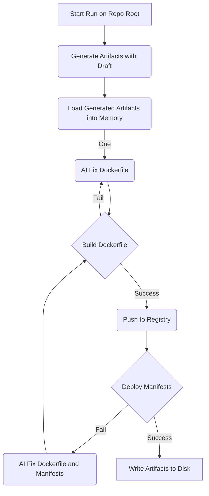

# Container Kit

AI-Powered App Containerization and Kubernetes Artifact Generation

## Getting Started

### Running Locally
Prerequisites:
- Go 1.22
- Kubectl
- Docker
- Kind
- Azure CLI (for automatic setup)

1. Clone the repo
```
git clone git@github.com:Azure/container-copilot.git && cd container-copilot
```

2. Run container-kit directly

The simplest way to get started is to just run the generate command with your target repository:

```bash
# From root of container-copilot repo
go run . generate <path/to/target-repo>
```

If you don't have Azure OpenAI resources configured, the tool will automatically:
- Set up Azure OpenAI resources
- Create resource group, OpenAI service, and deployment
- Save configuration to a .env file for future use

After the automatic setup is complete, it will continue with the containerization process.

Alternatively, you can manually set up your Azure OpenAI environment:

1. Set Azure OpenAI KEY and ENDPOINT

- Create an AzureOpenAI Instance in the AzPortal
- Go to Develop Tab
- Copy Key and Endpoint values (Key Number doesn't matter)


Run the following commands to set these values in your environment:
```
export AZURE_OPENAI_KEY=xxxxxxx
export AZURE_OPENAI_ENDPOINT=xxxxxx
```

5. Set Azure OpenAI Deployment ID
- From the 'Overview Blade' > 'Get Started Tab', open 'Explore Azure AI Foundry Portal'
- Accept "You're leaving azure.com" with 'Continue' Button
- In Azure AI Foundry, on the left select the 'Deployments' Blade under 'Shared Resources' 
- Select "Deply a Mdoel" > "Deploy base model" > "o3-mini"
- Name the new deployment "container-kit"

Run the following commands to set your deployment ID in your environment:
```
export AZURE_OPENAI_DEPLOYMENT_ID=container-kit
```

### Setup Command

You can explicitly provision Azure OpenAI resources using the `setup` command:

```bash
# From root of container-kit repo
go run . setup --target-repo=<path/to/target-repo>
```

The setup command will:
1. Check if Azure OpenAI environment variables are already set
   - If they are, it will skip the setup process unless `--force-setup` is specified
2. Load existing values from a `.env` file if it exists
3. Provision all required Azure OpenAI resources
4. Create/update the model deployment
5. Save all environment variables to the `.env` file in your project root

Once setup is complete, you'll need to run the generate command to containerize your application:

```bash
# From root of container-kit repo
go run . generate <path/to/target-repo>
```

The setup command accepts additional options to customize your Azure resources:

```bash
go run . setup --resource-group=mygroup --location=eastus \
  --openai-resource=myopenai --deployment=mydeploy \
  --target-repo=<path/to/target-repo>
```

You can also provide these values via environment variables or a `.env` file. Copy the `env.example` to `.env` in the project root and fill in the required values:

```bash
# Container‑Copilot settings:
CCP_RESOURCE_GROUP=mygroup
CCP_LOCATION=eastus
CCP_OPENAI_RESOURCE_NAME=myopenai
CCP_DEPLOYMENT_NAME=mydeploy
CCP_TARGET_REPO=<path/to/target-repo>

# Optional (defaults shown):
CCP_MODEL_ID=o3-mini
CCP_MODEL_VERSION=2025-01-31
```

### Path Handling

Container Kit supports both absolute and relative paths for the target repository. When you provide a relative path, it will be automatically converted to an absolute path to ensure artifacts are generated in the correct location regardless of where you run the command from.

For example, both of these commands are valid:
```bash
go run . generate ../my-app
go run . generate /home/user/projects/my-app
```

### Additional Options

**Force Setup**: If you want to recreate your Azure OpenAI resources even when environment variables are already configured, you can use the `--force-setup` flag:

```bash
go run . setup --force-setup --target-repo=<path/to/target-repo>
```

Use this when you want to:
- Start completely fresh after a failed setup
- Change your Azure OpenAI model or deployment configuration  
- Clear out old environment variables and regenerate everything
- Troubleshoot issues with existing Azure deployments

**Warning**: This will delete your existing `.env` file and recreate Azure OpenAI deployments. The underlying Azure resources (resource groups, Cognitive Services accounts) are preserved.

**Registry**: You can specify a custom container registry with the `--registry` flag:

```bash
go run . generate --registry=myregistry.azurecr.io <path/to/target-repo>
```

**Dockerfile Generator**: By default, container-kit uses the "draft" Dockerfile generator. You can disable this with:

```bash
go run . generate --dockerfile-generator=none <path/to/target-repo>
```

### Using via Github Actions
```
> not implemented yet :)
```

## Contributing

### generate command flow


This project welcomes contributions and suggestions.  Most contributions require you to agree to a
Contributor License Agreement (CLA) declaring that you have the right to, and actually do, grant us
the rights to use your contribution. For details, visit https://cla.opensource.microsoft.com.

When you submit a pull request, a CLA bot will automatically determine whether you need to provide
a CLA and decorate the PR appropriately (e.g., status check, comment). Simply follow the instructions
provided by the bot. You will only need to do this once across all repos using our CLA.

This project has adopted the [Microsoft Open Source Code of Conduct](https://opensource.microsoft.com/codeofconduct/).
For more information see the [Code of Conduct FAQ](https://opensource.microsoft.com/codeofconduct/faq/) or
contact [opencode@microsoft.com](mailto:opencode@microsoft.com) with any additional questions or comments.

## Trademarks

This project may contain trademarks or logos for projects, products, or services. Authorized use of Microsoft 
trademarks or logos is subject to and must follow 
[Microsoft's Trademark & Brand Guidelines](https://www.microsoft.com/en-us/legal/intellectualproperty/trademarks/usage/general).
Use of Microsoft trademarks or logos in modified versions of this project must not cause confusion or imply Microsoft sponsorship.
Any use of third-party trademarks or logos are subject to those third-party's policies.