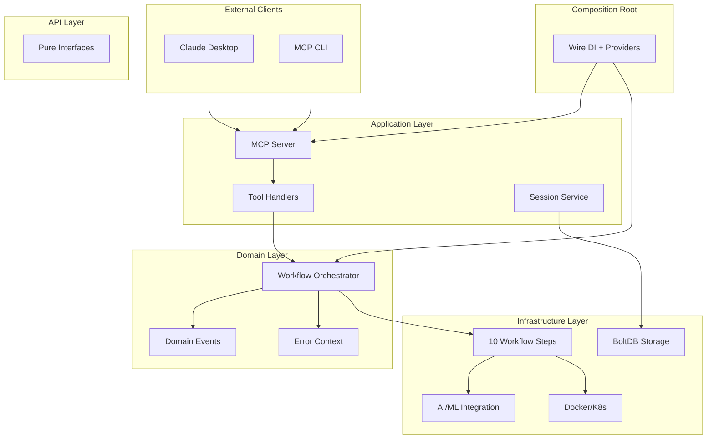

[](https://github.com/Azure/container-kit/actions/workflows/ci-simple.yml)

# Container Kit

AI-Powered Application Containerization and Kubernetes Deployment

Container Kit automates the complete containerization process from repository analysis to Kubernetes deployment using a unified workflow approach. Built on a clean 4-layer architecture with Domain-Driven Design, it provides a single, powerful workflow tool that handles the entire process with AI-powered error recovery and built-in progress tracking.

## 🚀 Quick Install

### One-Line Installation

**Linux/macOS:**
```bash
curl -sSL https://raw.githubusercontent.com/Azure/container-kit/main/scripts/install.sh | bash
```

**Windows (PowerShell as Administrator):**
```powershell
Set-ExecutionPolicy Bypass -Scope Process -Force; Invoke-WebRequest -Uri https://raw.githubusercontent.com/Azure/container-kit/main/scripts/install.ps1 -OutFile install.ps1; ./install.ps1; Remove-Item install.ps1
```

### Verify Installation
```bash
# Check executable
./container-kit-mcp --version

# Verify build
make build
```

For detailed usage and troubleshooting, see the examples directory and development guidelines.

## 🏃 Quick Start

### Prerequisites
- Docker
- kubectl (optional, for Kubernetes features)
- Azure OpenAI access (for AI features)

### Basic Usage
```bash
# Run MCP server (main executable)
./container-kit-mcp

# Container Kit operates via MCP protocol
# Connect with MCP client for guided containerization
```

### Building from Source
```bash
git clone https://github.com/Azure/container-kit.git
cd container-kit

# Set up make alias (required for WSL/Linux)
alias make='/usr/bin/make'

# Build the MCP server
make build

# Run tests
make test              # Unit tests
make test-integration  # Integration tests

# Code quality
make fmt               # Format code
make lint              # Run linter
```

## 📖 Documentation

### For Users
- **[Examples](examples/)** - Working code examples and patterns

### For Developers
- **[Architectural Decisions](docs/architecture/adr/)** - ADRs documenting key design decisions
- **[Container Kit Design Document](docs/CONTAINER_KIT_DESIGN_DOCUMENT.md)** - Complete system design and architecture
- **[New Developer Guide](docs/NEW_DEVELOPER_GUIDE.md)** - Getting started with development

### For Contributors
- **[Contributing Guide](CONTRIBUTING.md)** - Development workflow and standards
- **[Development Guidelines](DEVELOPMENT_GUIDELINES.md)** - Coding standards and practices

## 🏗️ Architecture

Container Kit uses a **clean 4-layer architecture** with Domain-Driven Design and a composition root pattern:



### Architecture Layers

```
pkg/mcp/
├── composition/         # Composition root (outside 4 layers)
│   ├── providers.go     # Dependency injection providers
│   ├── server.go        # Server composition
│   └── wire_gen.go      # Wire-generated DI code
├── api/                 # Interface definitions only
│   └── interfaces.go    # Pure interfaces, no implementations
├── application/         # Application services & orchestration
│   ├── server.go        # MCP server implementation
│   ├── session/         # Session management service
│   ├── registrar/       # Tool/resource registration
│   └── providers.go     # Application-specific providers
├── domain/              # Business logic & workflows
│   ├── workflow/        # Core workflow orchestration
│   │   ├── base_orchestrator.go  # Base implementation
│   │   ├── decorators.go         # Event/Saga decorators
│   │   └── error_context.go      # Progressive error tracking
│   ├── events/          # Domain event system
│   └── progress/        # Progress tracking domain
└── infrastructure/      # Technical implementations
    ├── ai_ml/           # AI/ML integration
    │   ├── ml/          # Machine learning services
    │   ├── prompts/     # Prompt management
    │   └── sampling/    # LLM integration
    ├── orchestration/   # Container & K8s operations
    │   └── steps/       # 10 workflow step implementations
    └── persistence/     # Data persistence (BoltDB)
```

**Key Architecture Features:**
- **Composition Root Pattern**: Dependency injection separated from business logic
- **Clean 4-Layer Architecture**: Strict layer boundaries with dependency rule
- **Single Workflow Tool**: `containerize_and_deploy` handles complete 10-step process
- **Decorator Pattern**: Composable orchestrator with events, saga, metrics, retry
- **Progressive Error Context**: AI-assisted error recovery with pattern learning
- **Event-Driven Design**: Domain events for workflow coordination and observability
- **Session Persistence**: BoltDB-based state management across server restarts
- **Wire Dependency Injection**: Compile-time safe DI with provider functions

> **📖 Technical Details**: See [Architecture Diagrams](docs/architecture/diagrams/README-architecture.md), [ADRs](docs/architecture/adr/), and [Development Guidelines](DEVELOPMENT_GUIDELINES.md).

## 🛠️ Key Features

- **Single Workflow Tool**: Complete containerization via `containerize_and_deploy` with 10 structured steps
- **AI-Powered Error Recovery**: Intelligent error analysis and automated retry logic with context
- **Real-Time Progress Tracking**: Visual progress indicators with step-by-step feedback
- **Rich Error System**: Structured error handling with actionable suggestions and severity levels
- **ML-Enhanced Optimization**: Machine learning for build optimization and pattern recognition
- **Event-Driven Coordination**: Domain events for workflow orchestration and observability
- **Session Persistence**: BoltDB-based state management with automatic cleanup
- **Clean Architecture**: 4-layer Domain-Driven Design with proper dependency flow
- **Security Integration**: Comprehensive vulnerability scanning with Trivy/Grype
- **Kubernetes Native**: Automated manifest generation and deployment with health checks
- **Multi-Transport Support**: stdio and HTTP transports with graceful shutdown
- **Comprehensive Testing**: Unit and integration tests with workflow validation

## 🧪 Quick Example

```bash
# Start MCP server
./container-kit-mcp

# Container Kit provides a single powerful workflow tool:
# - containerize_and_deploy: Complete containerization workflow
#   ├── 1/10: Analyze repository structure and detect language/framework
#   ├── 2/10: Generate optimized Dockerfile with AI assistance
#   ├── 3/10: Build Docker image with AI-powered error fixing
#   ├── 4/10: Set up local Kubernetes cluster with registry
#   ├── 5/10: Load Docker image into Kubernetes cluster
#   ├── 6/10: Generate Kubernetes deployment manifests
#   ├── 7/10: Deploy application to Kubernetes cluster
#   ├── 8/10: Perform health checks and endpoint discovery
#   ├── 9/10: Run security vulnerability scan (optional)
#   └── 10/10: Finalize workflow results and cleanup

# Use through Claude Desktop or direct MCP protocol
# Example: "Containerize my Node.js app and deploy to Kubernetes"
```

## 🤝 Contributing

We welcome contributions! See our [Contributing Guide](CONTRIBUTING.md) for:
- Development setup (devcontainer recommended)
- Code standards and testing requirements
- Pull request process

## 📝 License

This project is licensed under the MIT License - see the LICENSE file for details.

## 🔒 Security

See [SECURITY.md](SECURITY.md) for security policy and reporting vulnerabilities.

## 📞 Support

- **Issues**: Use GitHub Issues for bug reports and feature requests
- **Discussions**: Use GitHub Discussions for questions and help
- **Documentation**: Check the [Development Guidelines](DEVELOPMENT_GUIDELINES.md) and [Container Kit Design Document](docs/CONTAINER_KIT_DESIGN_DOCUMENT.md)
