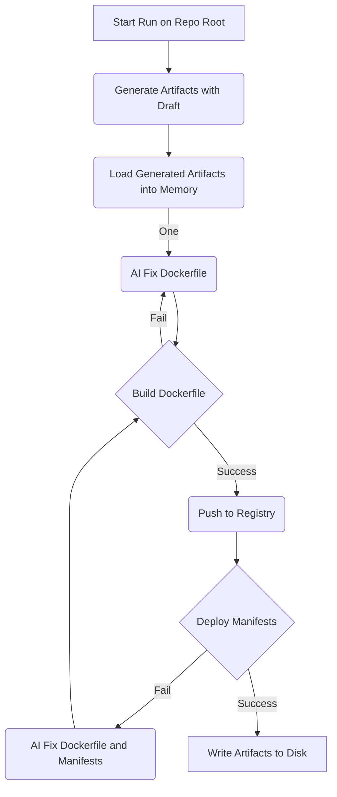

# Container Copilot

AI-Powered App Containerization and Kubernetes Artifact Generation

## Getting Started

### Running Locally
Prerequisites:
- Go 1.22
- Kubectl
- Docker
- Kind

1. Clone the repo
```
git clone git@github.com:Azure/container-copilot.git && cd container-copilot
```

2. Set Azure OpenAI KEY and ENDPOINT

- Create an AzureOpenAI Instance in the AzPortal
- Go to Develop Tab
- Copy Key and Endpoint values (Key Number doesn't matter)


Run the following commands to set these values in your environment:
```
export AZURE_OPENAI_KEY=xxxxxxx
export AZURE_OPENAI_ENDPOINT=xxxxxx
```

3. Set Azure OpenAI Deployment ID
- From the 'Overview Blade' > 'Get Started Tab', open 'Explore Azure AI Foundry Portal'
- Accept "You're leaving azure.com" with 'Continue' Button
- In Azure AI Foundry, on the left select the 'Deployments' Blade under 'Shared Resources' 
- Select "Deply a Mdoel" > "Deploy base model" > "o3-mini"
- Name the new deployment "container-copilot"

Run the following commands to set your deployment ID in your environment:
```
export AZURE_OPENAI_DEPLOYMENT_ID=container-copilot
```

4. Execute container-copilot
Run on a local repo to test (this will be referred to as the "target repo" for containerization):

one option to test with is https://github.com/chamilad/tomcat-hello-world (clone to a local dir first to test)

run container-copilot
```
# From root of container-copilot repo
go run . generate <../path/to/target-repo>
```

### Using script

Update the env.example in the hack directory, and rename it to .env
```
chmod +x hack/run-container-copilot.sh
./hack/run-container-copilot.sh
```

### Using via Github Actions
```
> not implemented yet :)
```

## Contributing

### generate command flow


This project welcomes contributions and suggestions.  Most contributions require you to agree to a
Contributor License Agreement (CLA) declaring that you have the right to, and actually do, grant us
the rights to use your contribution. For details, visit https://cla.opensource.microsoft.com.

When you submit a pull request, a CLA bot will automatically determine whether you need to provide
a CLA and decorate the PR appropriately (e.g., status check, comment). Simply follow the instructions
provided by the bot. You will only need to do this once across all repos using our CLA.

This project has adopted the [Microsoft Open Source Code of Conduct](https://opensource.microsoft.com/codeofconduct/).
For more information see the [Code of Conduct FAQ](https://opensource.microsoft.com/codeofconduct/faq/) or
contact [opencode@microsoft.com](mailto:opencode@microsoft.com) with any additional questions or comments.

## Trademarks

This project may contain trademarks or logos for projects, products, or services. Authorized use of Microsoft 
trademarks or logos is subject to and must follow 
[Microsoft's Trademark & Brand Guidelines](https://www.microsoft.com/en-us/legal/intellectualproperty/trademarks/usage/general).
Use of Microsoft trademarks or logos in modified versions of this project must not cause confusion or imply Microsoft sponsorship.
Any use of third-party trademarks or logos are subject to those third-party's policies.
