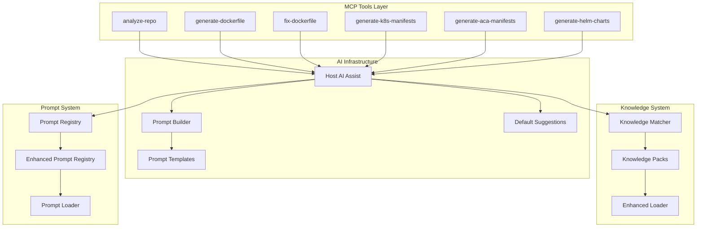
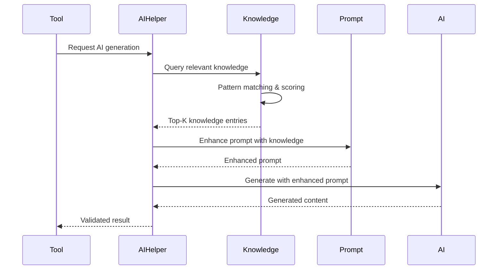
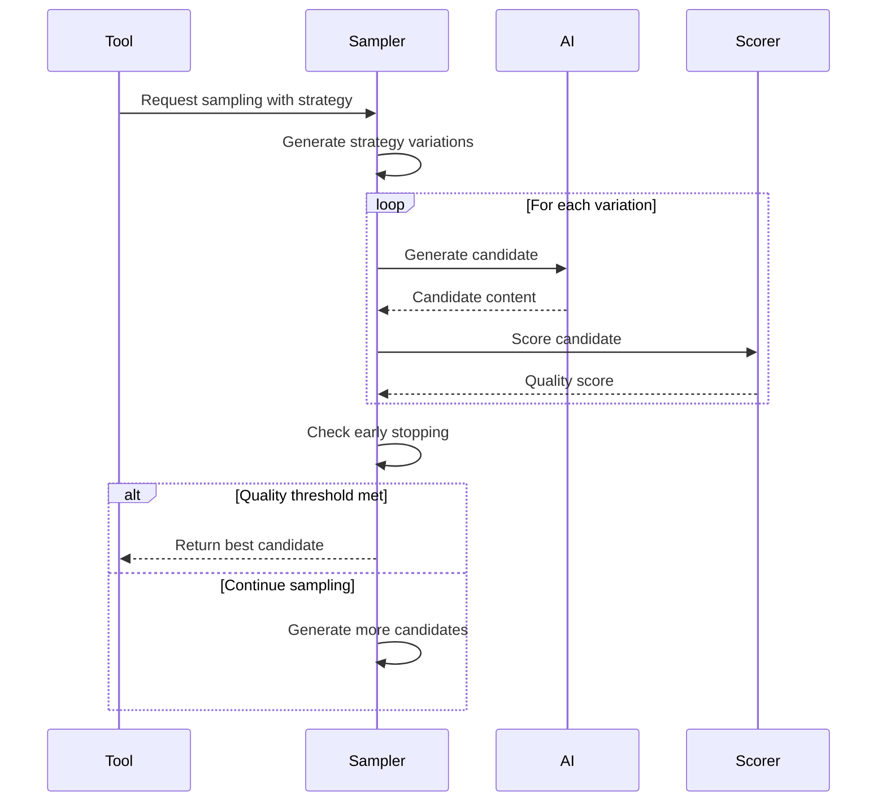
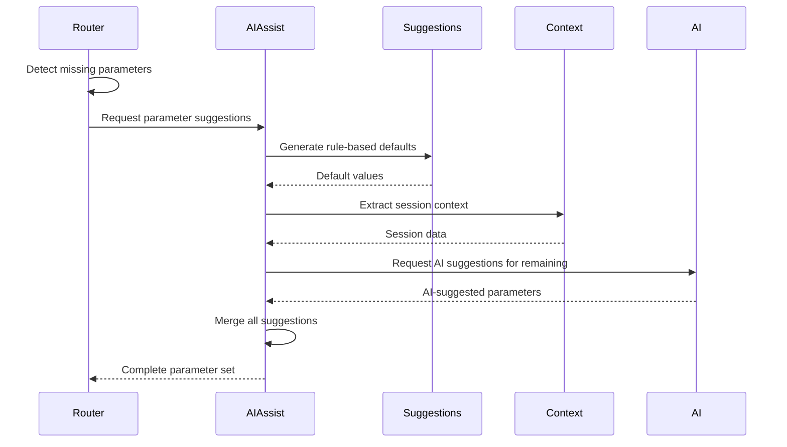
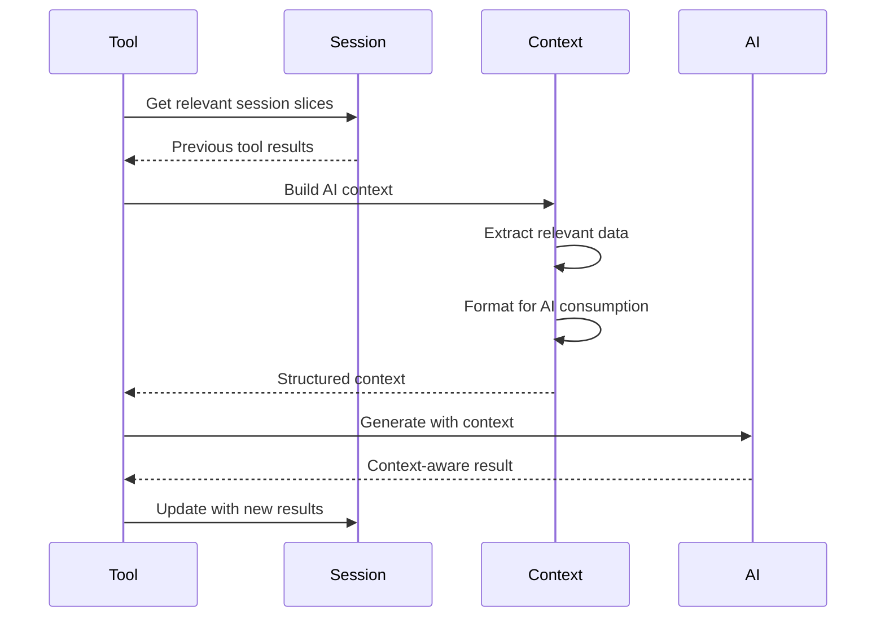

# AI Integration Design Document
## Containerization-Assist MCP Server

**Version**: 1.0
**Date**: 2025-09-15
**Authors**: System Analysis

---

## Table of Contents

1. [Executive Summary](#executive-summary)
2. [Architecture Overview](#architecture-overview)
3. [AI-Enabled Tools](#ai-enabled-tools)
4. [Prompt System](#prompt-system)
5. [Knowledge Base Integration](#knowledge-base-integration)
6. [AI Infrastructure](#ai-infrastructure)
7. [Data Flows](#data-flows)
8. [Integration Patterns](#integration-patterns)
9. [Future Considerations](#future-considerations)

---

## Executive Summary

The containerization-assist MCP server implements a sophisticated AI-powered system for automated containerization workflows. This document provides a comprehensive analysis of AI integration patterns, architectural components, and data flows across the system.

### Key Findings

- **7 AI-powered tools** out of 17 total MCP tools
- **14 prompt templates** organized by functional categories
- **Knowledge base** with 30+ language/framework-specific packs
- **Multi-layered fallback strategy** ensuring reliability
- **Session-aware context management** for intelligent parameter inference

---

## Architecture Overview

### System Components



### Design Principles

1. **Reliability First**: AI enhancement with rule-based fallbacks
2. **Context Awareness**: Session-aware parameter inference
3. **Knowledge Enhancement**: Prompt augmentation with domain expertise
4. **Modular Architecture**: Clear separation of AI, knowledge, and prompt concerns
5. **Performance Optimization**: Caching and early stopping strategies

---

## AI-Enabled Tools

### Primary AI-Powered Tools

#### `analyze-repo`
**Purpose**: Enhanced repository analysis with AI insights
**AI Functions**:
- Language/framework detection validation
- Dependency analysis enhancement
- Architecture pattern recognition
- Risk assessment and recommendations

**Prompt Integration**: `enhance-repo-analysis.json`
**Knowledge Integration**: Framework-specific analysis patterns
**Fallback Strategy**: Rule-based file analysis with regex patterns

```typescript
// Example usage pattern
const analysis = await aiGenerateWithSampling(context, {
  prompt: enhancePromptWithKnowledge(basePrompt, knowledgeEntries),
  strategy: 'guided-analysis',
  samples: 3
});
```

#### `generate-dockerfile`
**Purpose**: AI-powered Dockerfile generation
**AI Functions**:
- Multi-stage Dockerfile optimization
- Security hardening recommendations
- Performance optimization strategies
- Language-specific best practices

**Prompt Integration**:
- Primary: `dockerfile-generation.json`
- Fallback: `dockerfile-direct-analysis.json`

**Knowledge Integration**: Language/framework-specific containerization patterns
**Sampling Strategy**: Multi-candidate generation with quality scoring

```typescript
// Routing logic based on confidence
if (confidenceScore > 0.7) {
  return generateGuidedDockerfile(context, params);
} else {
  return generateDirectAnalysisDockerfile(context, params);
}
```

#### `fix-dockerfile`
**Purpose**: Intelligent Dockerfile repair and optimization
**AI Functions**:
- Error pattern recognition
- Security vulnerability fixes
- Performance optimization suggestions
- Best practice compliance

**Prompt Integration**: `fix-dockerfile.json`
**Knowledge Integration**: Fix patterns and optimization recommendations

#### `generate-k8s-manifests`
**Purpose**: Kubernetes manifest generation
**AI Functions**:
- Resource requirement estimation
- Security policy generation
- ConfigMap/Secret management
- Service mesh configuration

**Prompt Integration**: `generate-k8s-manifests.json`
**Knowledge Integration**: K8s best practices and security policies

#### `generate-aca-manifests`
**Purpose**: Azure Container Apps manifest generation
**AI Functions**:
- Azure-specific configuration optimization
- Scaling parameter suggestions
- Environment variable management

**Prompt Integration**: `generate-aca-manifests.json`
**Knowledge Integration**: ACA-specific patterns and Azure best practices

#### `generate-helm-charts`
**Purpose**: Helm chart generation and templating
**AI Functions**:
- Template structure optimization
- Value schema generation
- Dependency management

**Prompt Integration**: `generate-helm-charts.json`
**Knowledge Integration**: Helm templating patterns

### Tool Classification Matrix

| Tool | AI Level | Prompts | Knowledge | Fallback | Sampling |
|------|----------|---------|-----------|----------|----------|
| `analyze-repo` | High | 1 | Framework-specific | Rule-based | Yes |
| `generate-dockerfile` | High | 2 | Language-specific | Template-based | Yes |
| `fix-dockerfile` | Medium | 1 | Fix patterns | Rule-based | No |
| `generate-k8s-manifests` | High | 1 | K8s patterns | Template-based | Yes |
| `generate-aca-manifests` | Medium | 1 | ACA patterns | Template-based | No |
| `generate-helm-charts` | Medium | 1 | Helm patterns | Template-based | No |
| `build-image` | None | 0 | N/A | N/A | No |
| `scan` | None | 0 | N/A | N/A | No |
| Others | None | 0 | N/A | N/A | No |

---

## Prompt System

### Organizational Structure

```
src/prompts/
├── analysis/
│   └── enhance-repo-analysis.json
├── containerization/
│   ├── dockerfile-generation.json
│   ├── dockerfile-direct-analysis.json
│   ├── fix-dockerfile.json
│   └── generate-dockerfile.json
├── orchestration/
│   ├── generate-k8s-manifests.json
│   ├── generate-aca-manifests.json
│   ├── convert-aca-to-k8s.json
│   └── k8s-manifest-generation.json
├── sampling/
│   ├── dockerfile-sampling.json
│   └── strategy-optimization.json
├── security/
│   └── security-analysis.json
└── validation/
    ├── parameter-suggestions.json
    └── parameter-validation.json
```

### Prompt Template Structure

Each prompt follows a standardized JSON schema:

```json
{
  "id": "dockerfile-generation",
  "version": "1.0",
  "description": "Generate optimized Dockerfiles with AI assistance",
  "category": "containerization",
  "template": "Generate a Dockerfile for {{language}} project...",
  "variables": ["language", "framework", "dependencies"],
  "constraints": {
    "maxTokens": 2048,
    "format": "dockerfile"
  },
  "examples": [
    {
      "input": {"language": "node", "framework": "express"},
      "output": "FROM node:18-alpine..."
    }
  ]
}
```

### Template Rendering System

**Mustache-Style Variables**: `{{variable}}`
**Conditional Blocks**: `{{#condition}}...{{/condition}}`
**Loop Constructs**: `{{#items}}{{.}}{{/items}}`

```typescript
// Template rendering with knowledge enhancement
const enhancedPrompt = await enhancePromptWithKnowledge(
  basePrompt,
  await getRelevantKnowledge(context, operation)
);

const renderedPrompt = renderTemplate(enhancedPrompt, variables);
```

### Prompt Categories

#### Analysis Prompts
- **Purpose**: Repository analysis and enhancement
- **Input**: File structure, dependencies, configuration
- **Output**: Structured analysis with insights

#### Containerization Prompts
- **Purpose**: Docker-related generation and fixes
- **Input**: Application context, requirements
- **Output**: Dockerfiles, optimization suggestions

#### Orchestration Prompts
- **Purpose**: Kubernetes and deployment manifests
- **Input**: Application requirements, environment
- **Output**: YAML manifests, configuration files

#### Validation Prompts
- **Purpose**: Parameter suggestions and validation
- **Input**: Tool parameters, context
- **Output**: Suggested values, validation results

---

## Knowledge Base Integration

### Knowledge Pack Structure

The knowledge base consists of 30+ specialized packs organized by technology:

#### Language Packs
- `nodejs-pack.json` (47 entries)
- `python-pack.json` (52 entries)
- `java-pack.json` (38 entries)
- `go-pack.json` (31 entries)
- `dotnet-pack.json` (44 entries)
- `ruby-pack.json` (29 entries)
- `rust-pack.json` (26 entries)
- `php-pack.json` (33 entries)

#### Framework-Specific Packs
- `dotnet-blazor-pack.json`
- `dotnet-grpc-pack.json`
- `dotnet-ef-core-pack.json`
- `dotnet-signalr-pack.json`
- `dotnet-worker-pack.json`
- `dotnet-identity-pack.json`
- `dotnet-mediatr-pack.json`

#### Platform Packs
- `kubernetes-pack.json`
- `azure-container-apps-pack.json`
- `database-pack.json`
- `security-pack.json`

### Knowledge Entry Schema

```json
{
  "id": "node-package-cache",
  "category": "dockerfile",
  "pattern": "COPY package\\.json",
  "recommendation": "Copy package.json and package-lock.json first for better caching",
  "example": "COPY package*.json ./\nRUN npm ci --only=production\nCOPY . .",
  "severity": "medium",
  "tags": ["node", "caching", "optimization", "npm"],
  "description": "Proper dependency caching improves build times significantly",
  "score": 75
}
```

### Knowledge Matching Algorithm

```typescript
function calculateKnowledgeScore(entry: KnowledgeEntry, context: AnalysisContext): number {
  let score = 0;

  // Pattern matching (highest weight)
  if (entry.pattern && entry._compiled?.pattern?.test(context.content)) {
    score += 30;
  }

  // Category matching
  if (entry.category === context.category) {
    score += 20;
  }

  // Language matching
  if (entry.tags?.includes(context.language)) {
    score += 15;
  }

  // Framework matching
  if (entry.tags?.includes(context.framework)) {
    score += 10;
  }

  // Tag matching (per tag)
  const tagMatches = entry.tags?.filter(tag =>
    context.keywords?.includes(tag)
  ).length || 0;
  score += tagMatches * 10;

  return score;
}
```

### Knowledge Enhancement Process

1. **Context Analysis**: Extract language, framework, and keywords
2. **Pack Selection**: Load relevant knowledge packs
3. **Pattern Matching**: Apply RegExp patterns to content
4. **Scoring**: Calculate relevance scores for entries
5. **Top-K Selection**: Select highest scoring entries
6. **Prompt Enhancement**: Inject knowledge into prompts

```typescript
async function enhancePromptWithKnowledge(
  basePrompt: string,
  operation: string,
  context: Record<string, unknown>
): Promise<string> {
  const knowledge = await getRelevantKnowledge(context, operation);
  const topEntries = knowledge
    .sort((a, b) => b.score - a.score)
    .slice(0, 10);

  const knowledgeSection = formatKnowledgeForPrompt(topEntries);
  return `${basePrompt}\n\nRelevant Knowledge:\n${knowledgeSection}`;
}
```

---

## AI Infrastructure

### Core Components

#### Host AI Assist (`src/mcp/ai/host-ai-assist.ts`)

**Purpose**: Primary interface for AI parameter suggestions and validation

**Key Functions**:
- `suggestParameters()`: Generate intelligent parameter defaults
- `validateSuggestions()`: Validate AI-generated parameters
- `isAIAssistanceAvailable()`: Check AI service availability

**Configuration**:
```typescript
interface AIAssistantConfig {
  enabled?: boolean;
  defaultConfidence?: number;
  maxTokens?: number;
  customSuggestions?: Record<string, SuggestionGenerator>;
}
```

**Integration Pattern**:
```typescript
// Missing parameters detected during tool validation
const suggestions = await suggestParameters(deps, {
  toolName: 'generate-dockerfile',
  currentParams: userParams,
  missingParams: ['baseImage', 'ports'],
  sessionContext: session.getSlice('analysis')
}, context);
```

#### Prompt Builder (`src/mcp/ai/prompt-builder.ts`)

**Purpose**: Functional utilities for structured prompt construction

**Builder Pattern**:
```typescript
const prompt = pipe(
  addSection('Tool Context', toolContext),
  addSection('Current Parameters', currentParams),
  addSection('Missing Parameters', missingParams),
  addSeparator(),
  addInstruction('Generate missing parameters as JSON'),
  addInstruction('Example: {"baseImage": "node:18-alpine", "ports": [3000]}')
)([]); // Start with empty sections array
```

**Template Functions**:
- `createParameterSuggestionPrompt()`: Parameter suggestion templates
- `createContextAnalysisPrompt()`: Context analysis templates
- `buildPrompt()`: Final prompt assembly

#### Default Suggestions (`src/mcp/ai/default-suggestions.ts`)

**Purpose**: Rule-based parameter suggestion system

**Suggestion Registry**:
```typescript
const registry = createSuggestionRegistry({
  imageId: (params, context) => `${extractAppName(context)}:latest`,
  namespace: (params, context) => extractNamespace(context) || 'default',
  replicas: (params, context) => extractReplicas(context) || 3,
  ports: (params, context) => extractPorts(context) || [80, 443]
});
```

**Generator Types**:
- Static generators (fixed values)
- Context-aware generators (extract from session)
- Pattern-based generators (analyze file contents)
- Composite generators (combine multiple strategies)

#### Prompt Templates (`src/mcp/ai/prompt-templates.ts`)

**Purpose**: Standardized templates for AI interactions

**Template Categories**:
- Parameter suggestion templates
- Content generation templates
- Analysis and validation templates
- Error handling templates

### AI Helper Functions

#### AI Knowledge Enhancer (`src/lib/ai-knowledge-enhancer.ts`)

**Purpose**: Integrate knowledge base recommendations into AI prompts

```typescript
export async function enhancePromptWithKnowledge(
  basePrompt: string,
  operation: string,
  context: Record<string, unknown> = {}
): Promise<string> {
  const categoryMap = {
    'dockerfile': 'dockerfile',
    'k8s': 'kubernetes',
    'analysis': 'repository'
  };

  const category = categoryMap[operation] || 'general';
  const knowledge = await getRelevantKnowledge(context, category);

  if (knowledge.length === 0) return basePrompt;

  const knowledgeText = formatKnowledgeForPrompt(knowledge);
  return `${basePrompt}\n\n## Relevant Best Practices\n${knowledgeText}`;
}
```

#### Tool AI Helpers (`src/mcp/tool-ai-helpers.ts`)

**Purpose**: Sampling and multi-candidate generation

**Sampling Strategy**:
```typescript
export async function aiGenerateWithSampling(
  context: ToolContext,
  options: SamplingOptions
): Promise<SamplingResult> {
  const variations = generateStrategyVariations(options.strategy);
  const candidates = await Promise.all(
    variations.map(variation =>
      generateCandidate(context, { ...options, variation })
    )
  );

  const scored = await Promise.all(
    candidates.map(async candidate => ({
      ...candidate,
      score: await scoreContent(candidate.content, options.category)
    }))
  );

  return selectWinner(scored, options.stopThreshold);
}
```

**Early Stopping Logic**:
- Quality threshold checking
- Diminishing returns detection
- Timeout and resource limits

#### Tool AI Generation (`src/mcp/tool-ai-generation.ts`)

**Purpose**: Core AI invocation with retry and validation

**Generation Flow**:
1. Prompt preparation and validation
2. MCP sampling request construction
3. Response validation and parsing
4. Error handling and retry logic
5. Fallback strategy execution

```typescript
export async function aiGenerate(
  context: ToolContext,
  prompt: string,
  options: GenerationOptions
): Promise<Result<string>> {
  const maxRetries = 3;
  let lastError: Error;

  for (let attempt = 1; attempt <= maxRetries; attempt++) {
    try {
      const response = await context.sampling.createMessage({
        messages: [{ role: 'user', content: [{ type: 'text', text: prompt }] }],
        maxTokens: options.maxTokens || 2048
      });

      if (response.content?.[0]?.text) {
        const content = response.content[0].text;
        const validation = validateContent(content, options.expectedFormat);
        if (validation.valid) {
          return Success(content);
        }
      }
    } catch (error) {
      lastError = error;
      await delay(Math.pow(2, attempt) * 1000); // Exponential backoff
    }
  }

  return Failure(`AI generation failed after ${maxRetries} attempts: ${lastError.message}`);
}
```

---

## Data Flows

### Knowledge Enhancement Flow



### Multi-Candidate Sampling Flow



### Parameter Suggestion Flow



### Session-Aware Context Building



---

## Integration Patterns

### Layered Fallback Strategy

The system implements a three-tier fallback strategy for reliability:

```typescript
async function generateWithFallback<T>(
  primaryFn: () => Promise<Result<T>>,
  secondaryFn: () => Promise<Result<T>>,
  fallbackFn: () => Promise<Result<T>>
): Promise<Result<T>> {
  // Tier 1: AI-powered generation
  const primaryResult = await primaryFn();
  if (primaryResult.ok) return primaryResult;

  // Tier 2: Rule-based generation
  const secondaryResult = await secondaryFn();
  if (secondaryResult.ok) return secondaryResult;

  // Tier 3: Template-based fallback
  return await fallbackFn();
}
```

**Implementation Example**:
```typescript
// generate-dockerfile tool
const dockerfile = await generateWithFallback(
  () => aiGenerateDockerfile(context, params),
  () => ruleBasedDockerfile(analysis, params),
  () => templateDockerfile(language, params)
);
```

### Session-Aware Intelligence

Tools maintain awareness of previous operations through session management:

```typescript
class SessionAwareAI {
  async generateWithContext(
    toolName: string,
    params: Record<string, unknown>,
    context: ToolContext
  ): Promise<Result<unknown>> {
    // Extract relevant context from session
    const sessionContext = this.buildSessionContext(context.session, toolName);

    // Enhance prompt with session awareness
    const enhancedPrompt = await this.enhanceWithSessionContext(
      basePrompt,
      sessionContext
    );

    return await this.generate(enhancedPrompt, params);
  }

  private buildSessionContext(session: Session, toolName: string) {
    return {
      previousResults: session.getSlice('results'),
      analysis: session.getSlice('analysis'),
      userPreferences: session.getSlice('preferences'),
      toolHistory: session.getToolHistory(toolName)
    };
  }
}
```

### Progressive Enhancement Strategy

AI capabilities are progressively enhanced based on available data:

```typescript
interface ProgressiveAIStrategy {
  // Base level: Rule-based defaults
  level1: () => Promise<Result<T>>;

  // Enhanced level: Knowledge-enhanced prompts
  level2: (knowledge: KnowledgeEntry[]) => Promise<Result<T>>;

  // Premium level: Multi-candidate sampling with scoring
  level3: (knowledge: KnowledgeEntry[], context: SessionContext) => Promise<Result<T>>;
}
```

### Error Handling and Retry Logic

Comprehensive error handling with structured retry strategies:

```typescript
class AIRetryHandler {
  async executeWithRetry<T>(
    operation: () => Promise<T>,
    config: RetryConfig = {}
  ): Promise<Result<T>> {
    const maxRetries = config.maxRetries || 3;
    const backoffMs = config.backoffMs || 1000;

    for (let attempt = 1; attempt <= maxRetries; attempt++) {
      try {
        const result = await operation();
        return Success(result);
      } catch (error) {
        if (attempt === maxRetries) {
          return Failure(`Operation failed after ${maxRetries} attempts: ${error.message}`);
        }

        // Exponential backoff with jitter
        const delay = backoffMs * Math.pow(2, attempt - 1) + Math.random() * 1000;
        await this.sleep(delay);
      }
    }
  }
}
```

### Content Validation Pipeline

Multi-stage validation ensures output quality:

```typescript
interface ValidationStage<T> {
  name: string;
  validate: (content: T) => ValidationResult;
  required: boolean;
}

class ContentValidator<T> {
  private stages: ValidationStage<T>[] = [];

  addStage(stage: ValidationStage<T>): this {
    this.stages.push(stage);
    return this;
  }

  async validate(content: T): Promise<ValidationResult> {
    for (const stage of this.stages) {
      const result = stage.validate(content);
      if (!result.valid && stage.required) {
        return result;
      }
    }
    return { valid: true };
  }
}

// Example usage for Dockerfile validation
const dockerfileValidator = new ContentValidator<string>()
  .addStage({
    name: 'format',
    validate: (content) => isValidDockerfileContent(content),
    required: true
  })
  .addStage({
    name: 'security',
    validate: (content) => checkSecurityPractices(content),
    required: false
  })
  .addStage({
    name: 'optimization',
    validate: (content) => checkOptimizationOpportunities(content),
    required: false
  });
```

---

## Future Considerations

### Scalability Enhancements

1. **Caching Layer**: Redis-based caching for expensive AI operations
2. **Load Balancing**: Multiple AI providers for redundancy
3. **Rate Limiting**: Intelligent request throttling
4. **Batch Processing**: Bulk operations for improved efficiency

### AI Capability Extensions

1. **Custom Model Integration**: Support for specialized models
2. **Fine-Tuning Pipeline**: Domain-specific model training
3. **Feedback Loop**: Learning from user corrections
4. **A/B Testing**: Strategy comparison and optimization

### Knowledge Base Evolution

1. **Dynamic Knowledge Updates**: Real-time knowledge base updates
2. **Community Contributions**: Crowdsourced knowledge entries
3. **Version Management**: Knowledge base versioning and rollback
4. **Analytics**: Knowledge usage patterns and effectiveness metrics

### Integration Improvements

1. **IDE Integration**: Direct integration with development environments
2. **CI/CD Pipelines**: Automated containerization in build processes
3. **Monitoring Integration**: Feedback from production deployments
4. **Multi-Cloud Support**: Cloud-specific optimizations and patterns

---

## Conclusion

The containerization-assist MCP server demonstrates a mature and sophisticated approach to AI integration in developer tooling. The system successfully balances intelligent automation with reliable fallback mechanisms, creating a robust platform for containerization workflows.

Key strengths include:
- **Modular Architecture**: Clear separation of concerns enables easy maintenance and extension
- **Comprehensive Fallback Strategy**: Ensures reliability even when AI services are unavailable
- **Rich Knowledge Integration**: Domain expertise is effectively leveraged to enhance AI outputs
- **Session Awareness**: Context from previous operations improves relevance and accuracy

The system provides a solid foundation for continued evolution and demonstrates best practices for AI integration in enterprise developer tools.

---

**Document Version**: 1.0
**Last Updated**: 2025-09-15
**Next Review**: 2025-12-15