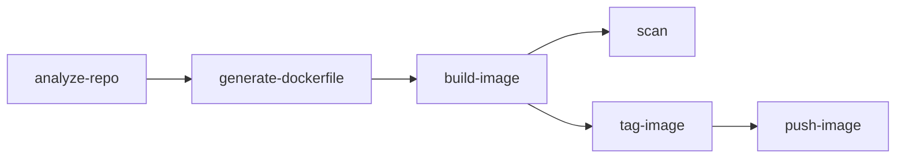
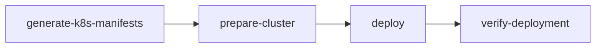

# Session Management Guide

## Overview

The containerization-assist MCP server uses a typed session slice pattern for managing tool-specific state across operations. This provides type safety, clear ownership, and debugging capabilities while maintaining backward compatibility.

## Architecture

### Session Slices

Each tool owns a typed slice of session data with three components:

```typescript
interface SessionSlice<In, Out, State> {
  input: In;      // Last validated input to the tool
  output?: Out;   // Last validated output from the tool  
  state: State;   // Tool-specific progress/flags
  updatedAt?: Date;
}
```

### Benefits

- **Type Safety**: Compile-time validation of session data
- **Clear Ownership**: Each tool manages its own slice
- **Zero Coupling**: Tools are independent
- **Backward Compatible**: Works with existing session infrastructure
- **Debugging Support**: Built-in inspection tool

## Usage Patterns

### For Tool Developers

#### 1. Define Your Schemas

```typescript
import { z } from 'zod';
import { defineToolIO } from '@/mcp/tool-session-helpers';

// Define your result schema
const MyToolResultSchema = z.object({
  success: z.boolean(),
  data: z.string(),
  // ... other fields
});

// Define tool IO pairing
const io = defineToolIO(myToolParamsSchema, MyToolResultSchema);

// Define state schema for tool-specific tracking
const StateSchema = z.object({
  lastProcessedAt: z.date().optional(),
  processCount: z.number().default(0),
  // ... tool-specific state
});
```

#### 2. Use Session Slices in Your Tool

```typescript
import { 
  ensureSession, 
  useSessionSlice 
} from '@/mcp/tool-session-helpers';

async function myTool(params: MyToolParams, context: ToolContext) {
  // Ensure session exists
  const sessionResult = await ensureSession(context, params.sessionId);
  if (!sessionResult.ok) {
    return Failure(sessionResult.error);
  }

  const { id: sessionId } = sessionResult.value;
  
  // Get typed slice operations
  const slice = useSessionSlice('my-tool', io, context, StateSchema);
  if (!slice) {
    return Failure('Session manager not available');
  }

  // Record input
  await slice.patch(sessionId, { input: params });

  // Do your work...
  const result = await processData(params);

  // Record output and state
  await slice.patch(sessionId, {
    output: result,
    state: {
      lastProcessedAt: new Date(),
      processCount: 1,
    }
  });

  return Success(result);
}
```

#### 3. Reading Other Tools' Data

Tools can read data from other tools' slices (read-only):

```typescript
// Get session state
const session = sessionResult.value.state;

// Access metadata (backward compatibility)
const analysisResult = session.metadata?.analysis_result;
const buildResult = session.metadata?.build_result;

// Or access typed slices directly
const slices = session.metadata?.toolSlices;
const analyzeSlice = slices?.['analyze-repo'];
```

## Tool Data Flow

### Core Containerization Chain



### Kubernetes Deployment Chain



### Session Data Dependencies

| Tool | Reads From | Writes To |
|------|------------|-----------|
| analyze-repo | - | analysis_result, repo_path |
| generate-dockerfile | analysis_result | dockerfile_result |
| fix-dockerfile | dockerfile_result, build_result.error | dockerfile_result |
| build-image | dockerfile_result, repo_path | build_result |
| scan | build_result.imageId | scan_result |
| tag-image | build_result.imageId | build_result.tags |
| generate-k8s-manifests | build_result.tags, analysis_result | k8s_result |
| deploy | k8s_manifests | deployment_result |
| verify-deployment | deployment_result | verification_result |

## Debugging Sessions

### Using the Inspection Tool

The `inspect_session` tool provides debugging capabilities:

```bash
# Get session summary
mcp call inspect_session --sessionId abc123 --format summary

# Get detailed JSON output
mcp call inspect_session --sessionId abc123 --format json

# Check specific slices
mcp call inspect_session --sessionId abc123 --includeSlices true
```

### Output Example

```json
{
  "sessionId": "abc123",
  "exists": true,
  "summary": {
    "totalSlices": 5,
    "sliceNames": ["analyze-repo", "generate-dockerfile", "build-image"],
    "completedSteps": ["analyze", "generate", "build"],
    "hasWorkflow": true
  },
  "validation": {
    "valid": true
  }
}
```

## Migration Guide

### From Direct Session Updates

**Before:**
```typescript
await updateSession(sessionId, {
  my_data: result,
  some_flag: true
}, context);
```

**After:**
```typescript
const slice = useSessionSlice('my-tool', io, context);
await slice.patch(sessionId, {
  output: result,
  state: { someFlag: true }
});
```

### Maintaining Backward Compatibility

Always update both the typed slice AND the legacy metadata:

```typescript
// Update typed slice
await slice.patch(sessionId, { output: result });

// Update legacy metadata for backward compatibility
if (context.sessionManager) {
  await context.sessionManager.update(sessionId, {
    metadata: {
      ...session.metadata,
      my_tool_result: result
    }
  });
}
```

## Best Practices

1. **Always Define Schemas**: Use Zod schemas for type safety
2. **Track State**: Use the state field for tool-specific tracking
3. **Handle Errors**: Check Result types and handle failures gracefully
4. **Maintain Compatibility**: Update both slices and metadata
5. **Use Inspection**: Debug with the inspect_session tool

## API Reference

### Core Functions

- `ensureSession(context, sessionId?)`: Ensure session exists
- `useSessionSlice(toolName, io, context, stateSchema?)`: Get slice operations
- `defineToolIO(inputSchema, outputSchema)`: Define tool IO schemas

### SessionSlice Operations

- `slice.get(sessionId)`: Get current slice
- `slice.set(sessionId, slice)`: Replace entire slice
- `slice.patch(sessionId, partial)`: Update slice partially
- `slice.clear(sessionId)`: Remove slice

## Examples

### Complete Tool Implementation

See `/src/tools/tag-image/tool.ts` for a complete example of typed session slices in action.

### Workflow Integration

The workflow tool (`/src/tools/workflow/tool.ts`) shows complex state management with comprehensive tracking.