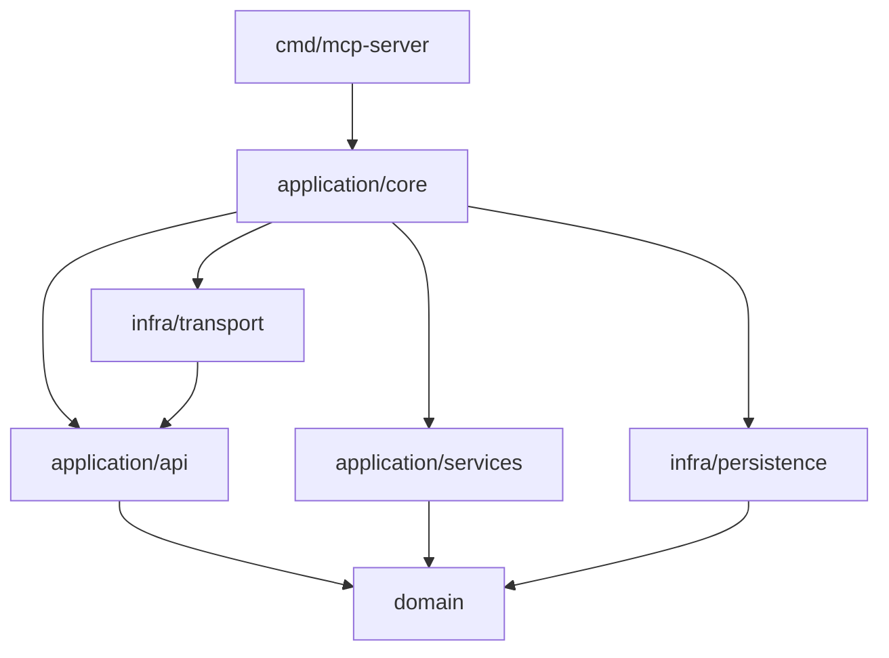

# Container Kit Architecture

## Overview

Container Kit follows a **three-layer clean architecture** pattern with strict dependency rules to ensure maintainability, testability, and scalability.

## Architecture Principles

1. **Separation of Concerns**: Each layer has distinct responsibilities
2. **Dependency Rule**: Dependencies only point inward
3. **Interface Segregation**: Small, focused interfaces
4. **Dependency Injection**: Manual DI for flexibility
5. **Domain-Driven Design**: Business logic in the domain layer

## Layer Structure

```
┌─────────────────────────────────────────────────┐
│                Infrastructure                    │
│  (External Systems, Transport, Persistence)      │
├─────────────────────────────────────────────────┤
│                 Application                      │
│     (Use Cases, Orchestration, Services)        │
├─────────────────────────────────────────────────┤
│                   Domain                         │
│        (Business Logic, Entities, Rules)         │
└─────────────────────────────────────────────────┘
```

### Domain Layer (`pkg/mcp/domain/`)
**Responsibility**: Core business logic and rules

**Contains**:
- Business entities and value objects
- Domain services and specifications
- Business rules and validation
- Domain events and errors

**Dependencies**: None (pure Go)

**Key Packages**:
- `config/` - Configuration entities
- `containerization/` - Container operations
- `errors/` - Rich error system
- `security/` - Security policies
- `session/` - Session entities
- `types/` - Core domain types

### Application Layer (`pkg/mcp/application/`)
**Responsibility**: Use case orchestration

**Contains**:
- Application services
- Use case implementations
- Command and query handlers
- Application-level validation
- Interface definitions

**Dependencies**: Domain layer only

**Key Packages**:
- `api/` - Canonical interfaces
- `commands/` - Command implementations
- `orchestration/` - Workflow coordination
- `services/` - Service interfaces
- `tools/` - Tool implementations

### Infrastructure Layer (`pkg/mcp/infra/`)
**Responsibility**: External integrations

**Contains**:
- Database implementations
- External service clients
- Transport mechanisms
- Framework integrations
- Infrastructure utilities

**Dependencies**: Domain and Application layers

**Key Packages**:
- `docker/` - Docker integration
- `k8s/` - Kubernetes integration
- `persistence/` - Storage layer
- `telemetry/` - Monitoring
- `transport/` - MCP protocol

## Dependency Flow

```
Infrastructure → Application → Domain
     ↓               ↓           ↓
  External       Use Cases   Business
  Systems      Orchestration   Logic
```

## Interface System

### Single Source of Truth
All public interfaces are defined in:
`pkg/mcp/application/api/interfaces.go`

This file contains:
- Tool interfaces
- Registry interfaces
- Session interfaces
- Workflow interfaces
- Pipeline interfaces

### Service Container Pattern

```go
type ServiceContainer interface {
    // Core Services
    ToolRegistry() ToolRegistry
    SessionManager() SessionManager
    WorkflowEngine() WorkflowEngine

    // Domain Services
    BuildExecutor() BuildExecutor
    Scanner() Scanner
    Deployer() Deployer

    // Infrastructure Services
    Storage() Storage
    DockerClient() DockerClient
    K8sClient() K8sClient
}
```

## Key Architectural Decisions

### ADR-001: Three-Layer Architecture
Simplified from 30+ packages to 3 bounded contexts

### ADR-004: Unified Error System
Single RichError type with context and suggestions

### ADR-006: Manual Dependency Injection
Explicit wiring for clarity and control

## Architecture Diagrams

### Component Overview
```
┌──────────────┐     ┌──────────────┐     ┌──────────────┐
│  MCP Server  │────▶│ Tool Registry │────▶│    Tools     │
└──────────────┘     └──────────────┘     └──────────────┘
        │                    │                     │
        ▼                    ▼                     ▼
┌──────────────┐     ┌──────────────┐     ┌──────────────┐
│   Session    │────▶│   Pipeline   │────▶│   Storage    │
│   Manager    │     │    Engine    │     │   (BoltDB)   │
└──────────────┘     └──────────────┘     └──────────────┘
```

### Data Flow
```
Request → Transport → Handler → Service → Domain → Infrastructure
   ↑                                                      ↓
   └──────────────────── Response ←──────────────────────┘
```

## Module Dependencies



## Performance Architecture

### Design Goals
- <300μs P95 latency for tool operations
- Horizontal scalability
- Efficient resource usage
- Graceful degradation

### Optimization Strategies
1. **Connection pooling** for external services
2. **Caching** at multiple layers
3. **Async processing** for long operations
4. **Batch operations** where possible

## Security Architecture

### Principles
1. **Defense in depth**
2. **Least privilege**
3. **Secure by default**
4. **Audit everything**

### Implementation
- Input validation at boundaries
- Sanitization in domain layer
- Authentication in transport
- Authorization in application
- Encryption at rest and in transit

## Scalability Patterns

### Horizontal Scaling
- Stateless services
- Session affinity via external store
- Load balancing at transport layer

### Vertical Scaling
- Resource limits per operation
- Timeout enforcement
- Circuit breakers for dependencies

## Monitoring and Observability

### Metrics
- Business metrics in domain
- Performance metrics in application
- System metrics in infrastructure

### Tracing
- OpenTelemetry integration
- Distributed trace context
- Automatic span creation

### Logging
- Structured logging (slog)
- Contextual information
- Log aggregation support
