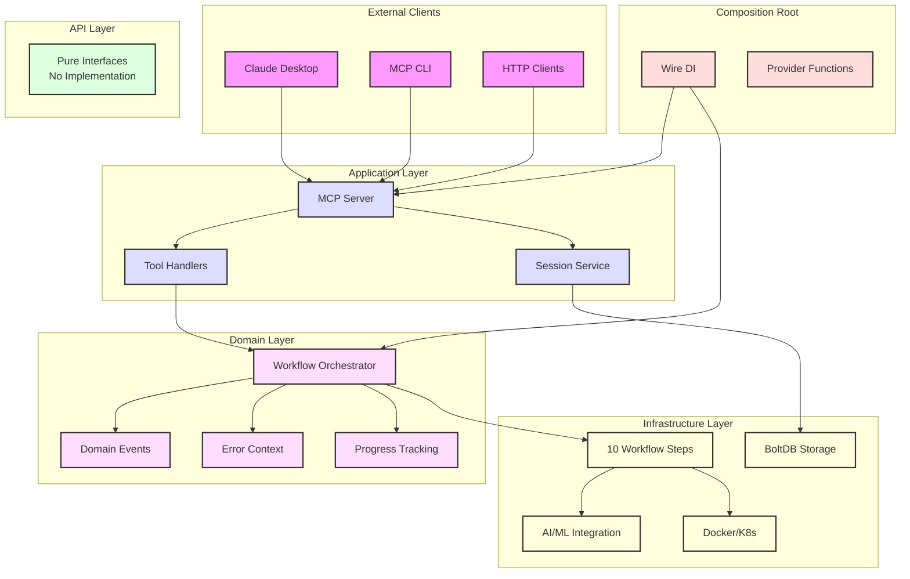
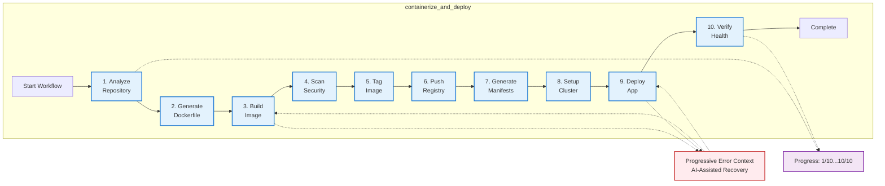
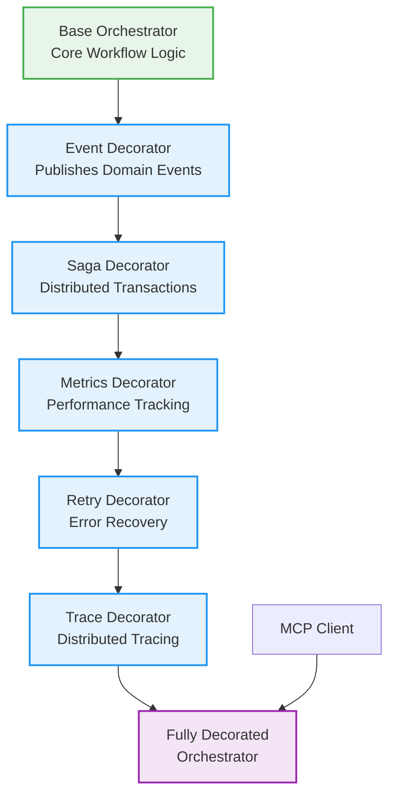
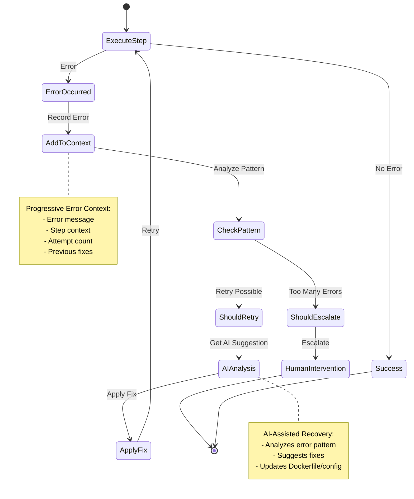

# Container Kit Architecture Diagrams

## Simplified Architecture Overview



## Workflow Execution Flow



## Decorator Pattern for Orchestration



## Error Recovery Flow



## Key Architecture Patterns

### 1. Composition Root
- All dependency injection outside business layers
- Wire-based compile-time DI
- Clean separation of wiring from logic

### 2. Decorator Pattern
- Base orchestrator with pure business logic
- Decorators add cross-cutting concerns
- Composable and testable

### 3. Progressive Error Context
- Accumulates error history
- AI-assisted recovery suggestions
- Automatic escalation logic

### 4. Single Workflow Architecture
- One tool: `containerize_and_deploy`
- 10 structured steps with progress
- Built-in error recovery

### 5. Clean Architecture
- Strict layer boundaries
- Dependency rule: outer depends on inner
- Domain logic isolated from infrastructure

## File Structure

```
pkg/mcp/
├── composition/            # Composition root (outside layers)
│   ├── providers.go
│   ├── server.go
│   └── wire_gen.go
├── api/                   # Interface layer
│   └── interfaces.go
├── application/           # Application services
│   ├── server.go
│   ├── session/
│   └── providers.go
├── domain/                # Business logic
│   ├── workflow/
│   │   ├── orchestrator.go
│   │   ├── decorators.go
│   │   └── error_context.go
│   └── events/
└── infrastructure/        # Technical implementations
    ├── ai_ml/
    ├── orchestration/
    │   └── steps/         # 10 workflow steps
    └── persistence/
```