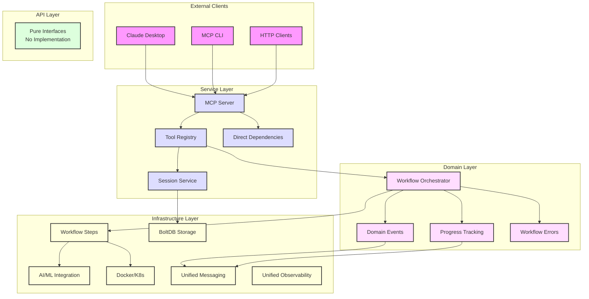
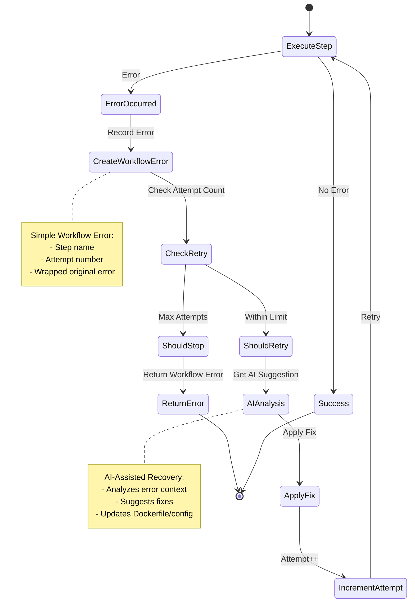

# Container Kit Architecture Diagrams

## Simplified Architecture Overview



## Individual Tools Flow

```mermaid
graph LR
    %% 10 Workflow Tools
    subgraph "Workflow Tools (10)"
        T1[analyze_repository]
        T2[generate_dockerfile]
        T3[build_image]
        T4[scan_image]
        T5[tag_image]
        T6[push_image]
        T7[generate_k8s_manifests]
        T8[prepare_cluster]
        T9[deploy_application]
        T10[verify_deployment]
    end

    %% Tool chaining with hints
    T1 --> T2 : "Chain Hint"
    T2 --> T3 : "Chain Hint"
    T3 --> T4 : "Chain Hint"
    T4 --> T5 : "Chain Hint"
    T5 --> T6 : "Chain Hint"
    T6 --> T7 : "Chain Hint"
    T7 --> T8 : "Chain Hint"
    T8 --> T9 : "Chain Hint"
    T9 --> T10 : "Chain Hint"

    %% Orchestration Tools
    subgraph "Orchestration Tools (2)"
        O1[start_workflow]
        O2[workflow_status]
    end

    %% Utility Tools
    subgraph "Utility Tools (3)"
        U1[list_tools]
        U2[ping]
        U3[server_status]
    end

    %% Session state
    Session[Session State<br/>BoltDB Persistence]
    T1 -.-> Session
    T10 -.-> Session

    %% Error handling
    Error[Simple Workflow Errors<br/>Step + Attempt Tracking]
    T3 -.-> Error
    T9 -.-> Error

    %% Styling
    classDef workflow fill:#e3f2fd,stroke:#1976d2,stroke-width:2px
    classDef orchestration fill:#e8f5e9,stroke:#4caf50,stroke-width:2px
    classDef utility fill:#fff3e0,stroke:#ff9800,stroke-width:2px
    classDef session fill:#f3e5f5,stroke:#7b1fa2,stroke-width:2px
    classDef error fill:#ffebee,stroke:#c62828,stroke-width:2px
    
    class T1,T2,T3,T4,T5,T6,T7,T8,T9,T10 workflow
    class O1,O2 orchestration
    class U1,U2,U3 utility
    class Session session
    class Error error
```

## Tool Registry Pattern

```mermaid
graph TB
    %% Tool Registry
    Registry[Tool Registry<br/>Table-Driven Configuration]
    
    %% Tool configurations
    Config1[analyze_repository<br/>NextTool: generate_dockerfile]
    Config2[generate_dockerfile<br/>NextTool: build_image]
    Config3[build_image<br/>NextTool: scan_image]
    ConfigN[... 12 more tools]
    
    Registry --> Config1
    Registry --> Config2
    Registry --> Config3
    Registry --> ConfigN
    
    %% Tool handler generation
    Handler[Generic Tool Handler]
    Config1 --> Handler : generates
    Config2 --> Handler : generates
    
    %% Step provider
    StepProvider[Step Provider<br/>GetAnalyzeStep()<br/>GetDockerfileStep()]
    Handler --> StepProvider : uses
    
    %% Chain hints
    ChainHint[Chain Hint<br/>NextTool + Reason]
    Handler --> ChainHint : provides
    
    %% MCP Server
    MCPServer[MCP Server]
    Registry --> MCPServer : registers all tools
    
    %% Styling
    classDef registry fill:#e8f5e9,stroke:#4caf50,stroke-width:2px
    classDef config fill:#e3f2fd,stroke:#2196f3,stroke-width:2px
    classDef handler fill:#f3e5f5,stroke:#9c27b0,stroke-width:2px
    classDef server fill:#fff3e0,stroke:#ff9800,stroke-width:2px
    
    class Registry registry
    class Config1,Config2,Config3,ConfigN config
    class Handler,StepProvider,ChainHint handler
    class MCPServer server
```

## Simple Error Handling Flow



## Key Architecture Patterns

### 1. Direct Dependency Injection
- Simple Dependencies struct replaces complex Wire patterns
- All dependencies in single buildDependencies() function
- Clear initialization order and validation

### 2. Tool Registry Pattern
- Table-driven tool configuration
- Generic tool handler generation
- Easy addition of new tools

### 3. Simple Workflow Errors
- Lightweight error with step context
- Attempt tracking for retry logic
- Standard Go error wrapping

### 4. Individual Tool Architecture
- 15 focused tools (10 workflow, 2 orchestration, 3 utility)
- Tool chaining with hints
- Session state persistence across tools

### 5. Unified Infrastructure
- Consolidated messaging package (events + progress)
- Consolidated observability package (tracing + health)
- Reduced complexity and cognitive load

### 6. Clean Architecture
- Simplified 4-layer structure (API/Service/Domain/Infrastructure)
- Dependency rule: outer depends on inner
- Domain logic isolated from infrastructure

## File Structure

```
pkg/mcp/
├── api/                   # Interface layer
│   └── interfaces.go      # Essential MCP tool interfaces
├── service/               # Unified service layer
│   ├── server.go          # MCP server with direct DI
│   ├── dependencies.go    # Simple dependency injection
│   ├── tools/             # Tool registry
│   │   ├── registry.go    # Table-driven tool configs
│   │   └── helpers.go     # Tool helper functions
│   ├── session/           # Session management
│   ├── bootstrap/         # Application bootstrapping
│   └── transport/         # HTTP and stdio transports
├── domain/                # Business logic
│   ├── workflow/
│   │   ├── orchestrator.go
│   │   ├── workflow_error.go  # Simple error handling
│   │   └── utils.go
│   ├── events/            # Domain events
│   └── progress/          # Progress tracking
└── infrastructure/        # Technical implementations
    ├── ai_ml/
    │   ├── sampling/      # LLM integration
    │   └── prompts/       # Template management
    ├── messaging/         # UNIFIED: Events + Progress
    ├── observability/     # UNIFIED: Tracing + Health
    ├── orchestration/
    │   └── steps/         # Workflow step implementations
    └── persistence/
        └── session/       # BoltDB storage
```