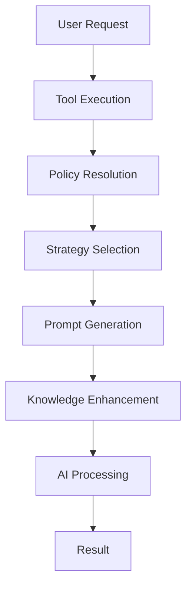

# Strategy & Flow Usage Guide

## Overview

This guide explains the complete flow of how tools should use the strategy system in the Containerization Assist MCP server. Understanding this flow is critical for tool development and maintenance.

## The Complete Flow: Policy → Strategy → Prompt → Knowledge



### 1. Policy Resolution

When a tool is invoked, the system first resolves the applicable policy based on:
- Tool name
- Content type (dockerfile, kubernetes, generic)
- Environment (development, production)

```typescript
// Example: Getting effective config for a tool
import { getEffectiveConfig } from '@config/resolver';

const config = getEffectiveConfig('generate-dockerfile', {
  contentType: 'dockerfile',
  environment: 'production'
});
```

The policy provides:
- **Model constraints**: Which AI models can be used
- **Token limits**: Maximum tokens for the request
- **Timeouts**: Maximum execution time
- **Rule weights**: Scoring rules for the content type
- **Tool defaults**: Default parameters for the tool

### 2. Strategy Selection

Based on the policy and context, a strategy is selected. Strategies define:
- Model parameters (temperature, max tokens)
- Prompt variations
- Processing approach

```typescript
// Example: Getting strategy for a content type
import { getStrategySelection } from '@config/resolver';

const strategy = getStrategySelection('dockerfile', {
  complexity: 'high',
  framework: 'nodejs'
}, 'production');
```

Strategy selection conditions:
- Context-based (e.g., framework type, complexity)
- Environment-specific overrides
- Default fallback strategies

### 3. Prompt Generation

The selected strategy determines which prompt to use and how to render it:

```typescript
// Example: Rendering a prompt with the registry
import { prompts } from '@prompts/prompt-registry';

const result = await prompts.render('generate-dockerfile', {
  framework: 'nodejs',
  version: '20',
  buildSystem: 'npm',
  ...strategyParams
});
```

Prompts support:
- Variable substitution using Mustache templates
- Conditional sections based on parameters
- JSON output format specification
- Version management

### 4. Knowledge Enhancement

Knowledge packs provide domain-specific context to enhance prompts:

```typescript
// Example: Loading knowledge for a context
import { getKnowledgeForContext } from '@knowledge/index';

const knowledge = await getKnowledgeForContext({
  contentType: 'dockerfile',
  framework: 'nodejs',
  patterns: ['security', 'optimization']
});
```

Knowledge includes:
- Framework-specific best practices
- Security guidelines
- Performance optimizations
- Common patterns and anti-patterns

## Complete Example: generate-dockerfile Tool

Here's how the `generate-dockerfile` tool uses the complete flow:

```typescript
export async function generateDockerfile(
  context: ToolContext,
  params: GenerateDockerfileParams
): Promise<Result<GenerateDockerfileOutput>> {
  // 1. Policy Resolution
  const config = getEffectiveConfig('generate-dockerfile', {
    contentType: 'dockerfile',
    environment: context.environment || 'development'
  });

  // 2. Strategy Selection
  const strategyResult = getStrategySelection('dockerfile', {
    framework: params.framework,
    complexity: analyzeComplexity(params)
  }, context.environment);

  if (!strategyResult) {
    return Failure('No strategy available for the given context');
  }

  // 3. Knowledge Enhancement
  const knowledge = await getKnowledgeForContext({
    contentType: 'dockerfile',
    framework: params.framework,
    version: params.version,
    patterns: ['security', 'multi-stage', 'caching']
  });

  // 4. Prompt Generation with Knowledge
  const promptResult = await prompts.render('generate-dockerfile', {
    ...params,
    strategy: strategyResult.strategy,
    knowledge: knowledge.snippets,
    bestPractices: knowledge.bestPractices,
    securityGuidelines: knowledge.security
  });

  if (!promptResult.ok) {
    return Failure(`Failed to render prompt: ${promptResult.error}`);
  }

  // 5. AI Processing with Policy Constraints
  const aiResult = await context.ai.generate({
    model: config.model,
    prompt: promptResult.value,
    maxTokens: config.parameters.maxTokens,
    temperature: config.parameters.temperature,
    timeout: config.timeouts.sampling
  });

  // 6. Process and validate result
  return processDockerfileResult(aiResult);
}
```

## Correct Usage Patterns

### ✅ DO: Use the Complete Flow

```typescript
// Correct: Using all components of the flow
export async function myTool(context: ToolContext, params: MyParams) {
  // Get policy-based configuration
  const config = getEffectiveConfig('my-tool', {
    contentType: determineContentType(params),
    environment: context.environment
  });

  // Select strategy based on context
  const strategy = getStrategySelection(
    config.contentType,
    buildContextFromParams(params),
    context.environment
  );

  // Load relevant knowledge
  const knowledge = await getKnowledgeForContext({
    contentType: config.contentType,
    ...params
  });

  // Generate prompt with all context
  const prompt = await prompts.render('my-tool-prompt', {
    ...params,
    strategy,
    knowledge
  });

  // Execute with policy constraints
  return executeWithConstraints(prompt, config);
}
```

### ❌ DON'T: Skip Components

```typescript
// Incorrect: Bypassing the strategy system
export async function myTool(context: ToolContext, params: MyParams) {
  // Wrong: Hardcoding model and parameters
  const result = await context.ai.generate({
    model: 'claude-3-opus',  // Should use config
    prompt: 'Generate something', // Should use prompt registry
    maxTokens: 4096, // Should respect policy limits
    temperature: 0.7 // Should use strategy params
  });

  return result;
}
```

### ❌ DON'T: Ignore Policy Constraints

```typescript
// Incorrect: Not respecting policy limits
export async function myTool(context: ToolContext, params: MyParams) {
  const config = getEffectiveConfig('my-tool');

  // Wrong: Overriding policy constraints
  const result = await context.ai.generate({
    model: 'gpt-4', // Might be forbidden by policy
    maxTokens: 10000, // Exceeds policy limit
    timeout: 600000 // Exceeds timeout constraint
  });

  return result;
}
```

## Strategy Consultation Pattern

When tools need to make decisions based on strategy:

```typescript
// Example: Consulting strategy for decision making
export async function optimizeDockerfile(
  context: ToolContext,
  params: OptimizeParams
): Promise<Result<OptimizeOutput>> {
  const config = getEffectiveConfig('optimize-dockerfile', {
    contentType: 'dockerfile'
  });

  // Get strategy to determine optimization approach
  const strategy = getStrategySelection('dockerfile', {
    currentSize: params.imageSize,
    layers: params.layerCount,
    baseImage: params.baseImage
  });

  // Strategy determines optimization focus
  let optimizationFocus: string[];
  switch (strategy?.strategy) {
    case 'aggressive-optimization':
      optimizationFocus = ['size', 'layers', 'cache'];
      break;
    case 'security-first':
      optimizationFocus = ['vulnerabilities', 'base-image', 'user-permissions'];
      break;
    case 'build-speed':
      optimizationFocus = ['cache-efficiency', 'parallel-builds', 'layer-reuse'];
      break;
    default:
      optimizationFocus = ['size', 'security'];
  }

  // Apply optimizations based on strategy
  return applyOptimizations(params.dockerfile, optimizationFocus, config);
}
```

## Environment-Specific Behavior

Tools should adapt behavior based on environment:

```typescript
export async function deployApplication(
  context: ToolContext,
  params: DeployParams
): Promise<Result<DeployOutput>> {
  const environment = context.environment || 'development';

  // Get environment-specific configuration
  const config = getEffectiveConfig('deploy', {
    contentType: 'kubernetes',
    environment
  });

  // Environment determines validation strictness
  const validationLevel = environment === 'production'
    ? 'strict'
    : 'permissive';

  // Environment determines rollback strategy
  const rollbackStrategy = environment === 'production'
    ? 'automatic-with-monitoring'
    : 'manual-intervention';

  // Production requires additional checks
  if (environment === 'production') {
    const safetyChecks = await performProductionSafetyChecks(params);
    if (!safetyChecks.ok) {
      return Failure(`Production safety checks failed: ${safetyChecks.error}`);
    }
  }

  return performDeployment(params, {
    validation: validationLevel,
    rollback: rollbackStrategy,
    constraints: config
  });
}
```

## Testing Strategy Integration

When testing tools that use the strategy system:

```typescript
import { initializeResolver } from '@config/resolver';
import { initializeRegistry } from '@prompts/prompt-registry';
import { initializeKnowledge } from '@knowledge/index';

describe('MyTool', () => {
  beforeAll(async () => {
    // Initialize all components
    initializeResolver({
      policyFile: 'test/fixtures/test-policy.yaml',
      environment: 'test'
    });

    await initializeRegistry('src/prompts');
    await initializeKnowledge('src/knowledge');
  });

  it('should respect policy constraints', async () => {
    const context = createTestContext();
    const params = { framework: 'nodejs' };

    const result = await myTool(context, params);

    // Verify policy was respected
    expect(context.ai.generate).toHaveBeenCalledWith(
      expect.objectContaining({
        maxTokens: expect.any(Number),
        model: expect.stringMatching(/claude|gpt/)
      })
    );
  });

  it('should use correct strategy for context', async () => {
    const context = createTestContext({ environment: 'production' });
    const params = { framework: 'java', complexity: 'high' };

    const result = await myTool(context, params);

    // Verify strategy selection
    expect(result.value.strategy).toBe('enterprise-java-strategy');
  });
});
```

## Summary

The complete flow ensures:
1. **Policy Compliance**: All tools respect organizational constraints
2. **Strategy Adaptation**: Tools adapt to different contexts intelligently
3. **Knowledge Integration**: Domain expertise is consistently applied
4. **Prompt Consistency**: All AI interactions use validated, versioned prompts

By following this flow, tools maintain consistency, reliability, and compliance across all operations.