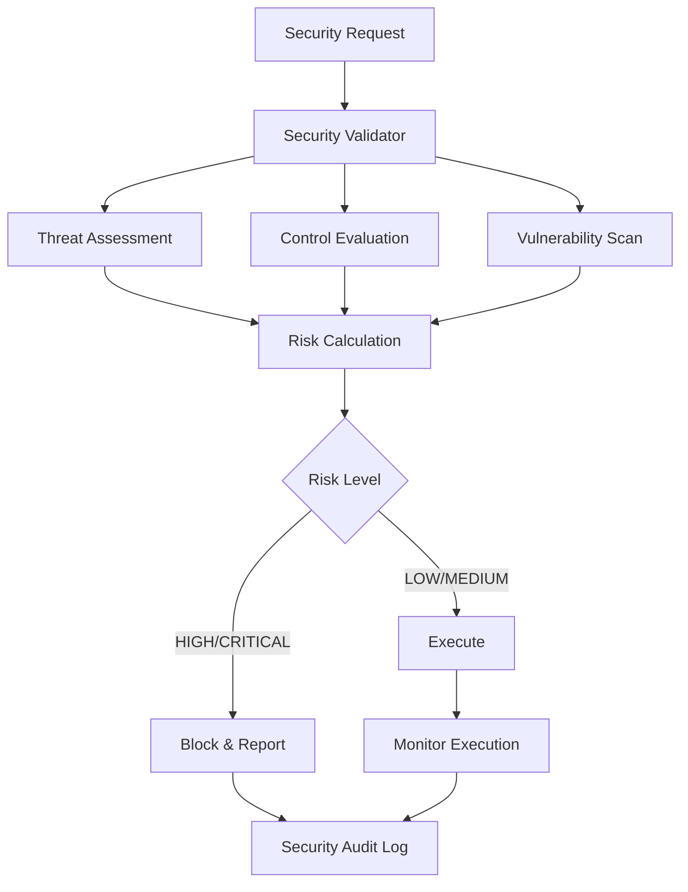

# Security Architecture

## Overview

Container Kit implements a multi-layered security architecture designed to provide defense-in-depth for containerized workloads. The security architecture encompasses sandboxing, validation, policy enforcement, and continuous monitoring.

## Security Layers

### 1. Container Isolation Layer

```
┌─────────────────────────────────────────────┐
│              Host System                     │
├─────────────────────────────────────────────┤
│           Docker Engine                     │
├─────────────────────────────────────────────┤
│        Security Policy Engine              │
├─────────────────────────────────────────────┤
│         Sandboxed Container                 │
│  ┌─────────────────────────────────────────┐│
│  │         Application Code                ││
│  │    (User:1000, Group:1000)             ││
│  │    Read-only Filesystem                 ││
│  │    Network Isolated                     ││
│  │    Capabilities Dropped                 ││
│  └─────────────────────────────────────────┘│
└─────────────────────────────────────────────┘
```

### 2. Security Control Framework



## Security Components

### Sandbox Executor (`sandbox_executor.go`)

The sandbox executor provides secure, isolated execution environments with the following security features:

**Key Security Features:**
- Non-root user execution (UID/GID 1000)
- Read-only root filesystem
- Network isolation (--network=none by default)
- Resource limits (CPU, memory)
- Linux capability dropping
- Seccomp and AppArmor profiles

**Security Controls:**
```go
type AdvancedSandboxOptions struct {
    User         string   // Non-root user (1000)
    Group        string   // Non-root group (1000)
    Capabilities []string // Linux capabilities (none by default)
    SecurityPolicy SecurityPolicy
}
```

### Security Validator (`security_validator.go`)

Comprehensive security validation framework implementing:

**Threat Model:**
- **T001**: Container Escape
- **T002**: Code Injection
- **T003**: Resource Exhaustion
- **T004**: Privilege Escalation
- **T005**: Data Exfiltration

**Security Controls:**
- **C001**: Non-root User Execution
- **C002**: Read-only Root Filesystem
- **C003**: Network Isolation
- **C004**: Input Validation
- **C005**: Command Allowlisting
- **C006**: Seccomp Profile
- **C007**: Resource Limits
- **C008**: Execution Timeout
- **C009**: Capability Dropping
- **C010**: AppArmor Profile
- **C011**: Audit Logging
- **C012**: Volume Restrictions
- **C013**: Encrypted Storage

### Security Policy Engine

The security policy engine enforces runtime security policies:

```go
type SecurityPolicy struct {
    AllowNetworking    bool
    AllowFileSystem    bool
    RequireNonRoot     bool
    TrustedRegistries  []string
}
```

## Risk Assessment

### Risk Calculation Formula

```
Risk Score = Impact × Probability × (Mitigated ? 0.3 : 1.0)

Risk Levels:
- CRITICAL: Score ≥ 7.0
- HIGH:     Score ≥ 5.0
- MEDIUM:   Score ≥ 3.0
- LOW:      Score < 3.0
```

### Impact and Probability Scoring

| Level  | Impact Score | Probability Score |
|--------|--------------|-------------------|
| HIGH   | 3.0          | 3.0               |
| MEDIUM | 2.0          | 2.0               |
| LOW    | 1.0          | 1.0               |

## Security Monitoring

### Audit Logging

All security events are logged with structured metadata:

```go
type SecurityAuditEvent struct {
    Timestamp   time.Time
    SessionID   string
    EventType   string // EXECUTION_STARTED, EXECUTION_BLOCKED, etc.
    Severity    string // INFO, WARN, HIGH, CRITICAL
    Action      string // ALLOW, DENY, MONITOR
    Details     map[string]interface{}
}
```

### Resource Monitoring

Real-time monitoring of:
- CPU usage and limits
- Memory consumption
- Network activity (when enabled)
- Filesystem access patterns

## Compliance Integration

### CIS Docker Benchmark

Automated compliance checking against CIS Docker Benchmark v1.6.0:
- **4.1**: Run containers with a non-root user
- **4.5**: Use read-only root filesystems
- **5.3**: Restrict container networking
- **5.9**: Limit container capabilities
- **5.12**: Set container memory limits
- **5.13**: Set container CPU limits

### NIST SP 800-190

Alignment with NIST Special Publication 800-190:
- **CM-2**: Baseline configuration management
- **AC-6**: Least privilege access control
- **SC-3**: Security function isolation
- **SI-3**: Malicious code protection

## Security Boundaries

### Trust Boundaries

1. **Host ↔ Container**: Enforced by Docker runtime and kernel namespaces
2. **Container ↔ Application**: Enforced by security policies and controls
3. **Network ↔ Container**: Enforced by network isolation policies
4. **User ↔ Process**: Enforced by user namespace isolation

### Attack Surface Reduction

- Minimal base images (Alpine Linux preferred)
- No unnecessary packages or services
- Disabled network access by default
- Restricted filesystem access
- Limited Linux capabilities

## Security Testing

### Validation Framework

The security validation framework provides:
- **Real-time threat assessment**
- **Control effectiveness evaluation**
- **Vulnerability scanning**
- **Compliance verification**
- **Risk scoring and reporting**

### Testing Scenarios

1. **Secure Configuration Testing**
   - Non-root execution
   - Read-only filesystem
   - Network isolation
   - Resource limits

2. **Insecure Configuration Testing**
   - Root execution detection
   - Dangerous capabilities
   - Network access validation
   - Resource exhaustion protection

3. **Command Security Testing**
   - Dangerous command detection
   - Privilege escalation attempts
   - Remote code execution patterns
   - Command injection prevention

## Integration Points

### MCP Server Integration

The security architecture integrates with the MCP server through:
- **Tool Validation**: Security checks before tool execution
- **Session Security**: Per-session security policies
- **Audit Integration**: Security events in MCP audit logs

### Docker Integration

Security controls are implemented through Docker runtime:
- **Container Configuration**: Secure defaults
- **Runtime Security**: Policy enforcement
- **Resource Management**: Limits and quotas

## Performance Considerations

### Security Overhead

- **Validation Latency**: <10ms per security check
- **Resource Monitoring**: <1% CPU overhead
- **Audit Logging**: Asynchronous to minimize impact

### Optimization Strategies

- **Cached Validations**: Reuse validation results
- **Parallel Processing**: Concurrent security checks
- **Efficient Logging**: Structured, indexed audit logs

## Future Enhancements

### Planned Security Features

1. **Advanced Threat Detection**
   - Behavioral analysis
   - Anomaly detection
   - Machine learning integration

2. **Enhanced Isolation**
   - gVisor integration
   - Kata containers support
   - Hardware-assisted virtualization

3. **Extended Compliance**
   - SOC 2 compliance
   - PCI DSS requirements
   - GDPR data protection

## References

- [CIS Docker Benchmark v1.6.0](https://www.cisecurity.org/benchmark/docker)
- [NIST SP 800-190](https://csrc.nist.gov/publications/detail/sp/800-190/final)
- [Docker Security Best Practices](https://docs.docker.com/engine/security/)
- [Container Security Standards](https://kubernetes.io/docs/concepts/security/)