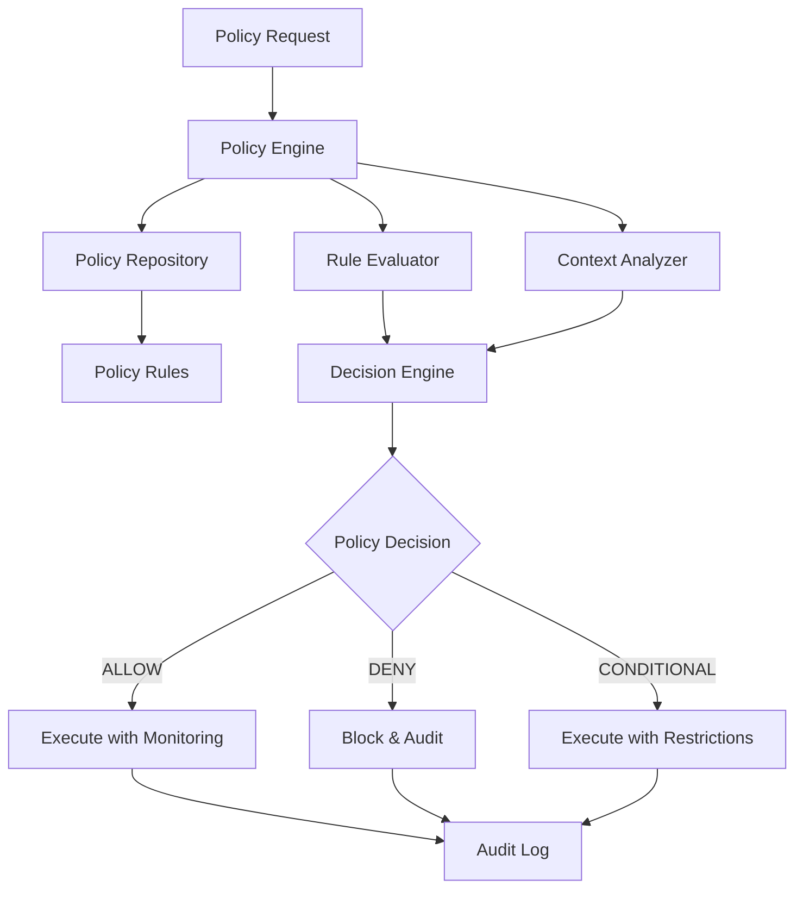

# Security Policies

## Overview

The Security Policy Engine provides centralized policy management, enforcement, and governance for Container Kit operations. It implements a flexible, rule-based system that allows fine-grained control over security behavior while maintaining operational efficiency.

## Policy Engine Architecture

### Core Components



### Policy Engine Implementation

```go
type SecurityPolicyEngine struct {
    logger      zerolog.Logger
    repository  PolicyRepository
    evaluator   *RuleEvaluator
    mutex       sync.RWMutex
    policies    map[string]*SecurityPolicy
    cache       *PolicyCache
}

func NewSecurityPolicyEngine(logger zerolog.Logger) *SecurityPolicyEngine {
    return &SecurityPolicyEngine{
        logger:     logger,
        repository: NewPolicyRepository(),
        evaluator:  NewRuleEvaluator(),
        policies:   make(map[string]*SecurityPolicy),
        cache:      NewPolicyCache(time.Hour), // 1-hour cache TTL
    }
}
```

## Security Policy Structure

### Base Policy Definition

```go
type SecurityPolicy struct {
    ID                string                 `json:"id"`
    Name              string                 `json:"name"`
    Version           string                 `json:"version"`
    Description       string                 `json:"description"`
    Scope             PolicyScope            `json:"scope"`
    Rules             []PolicyRule           `json:"rules"`
    DefaultAction     PolicyAction           `json:"default_action"`
    Enforcement       EnforcementMode        `json:"enforcement"`
    Metadata          map[string]interface{} `json:"metadata"`
    CreatedAt         time.Time              `json:"created_at"`
    UpdatedAt         time.Time              `json:"updated_at"`
    
    // Runtime configuration
    AllowNetworking   bool                   `json:"allow_networking"`
    AllowFileSystem   bool                   `json:"allow_filesystem"`
    RequireNonRoot    bool                   `json:"require_non_root"`
    TrustedRegistries []string               `json:"trusted_registries"`
    MaxResourceLimits ResourceLimits         `json:"max_resource_limits"`
}

type PolicyScope struct {
    Environment []string `json:"environment"`  // dev, staging, prod
    UserGroups  []string `json:"user_groups"`  // admin, developer, readonly
    Sessions    []string `json:"sessions"`     // specific session IDs
    Operations  []string `json:"operations"`   // build, deploy, scan
}

type PolicyRule struct {
    ID          string            `json:"id"`
    Name        string            `json:"name"`
    Condition   string            `json:"condition"`   // Rule expression
    Action      PolicyAction      `json:"action"`
    Priority    int               `json:"priority"`    // Higher = evaluated first
    Enabled     bool              `json:"enabled"`
    Parameters  map[string]string `json:"parameters"`
}

type PolicyAction string

const (
    ActionAllow      PolicyAction = "ALLOW"
    ActionDeny       PolicyAction = "DENY"
    ActionRestrict   PolicyAction = "RESTRICT"
    ActionMonitor    PolicyAction = "MONITOR"
    ActionAudit      PolicyAction = "AUDIT"
)

type EnforcementMode string

const (
    EnforcementStrict    EnforcementMode = "STRICT"    // Block on violations
    EnforcementWarn      EnforcementMode = "WARN"      // Log warnings only
    EnforcementMonitor   EnforcementMode = "MONITOR"   // Passive monitoring
)
```

## Built-in Security Policies

### Default Security Policy

```go
func GetDefaultSecurityPolicy() *SecurityPolicy {
    return &SecurityPolicy{
        ID:          "default-security-policy",
        Name:        "Default Container Security Policy", 
        Version:     "1.0.0",
        Description: "Baseline security policy for all container operations",
        Scope: PolicyScope{
            Environment: []string{"*"},
            UserGroups:  []string{"*"},
            Operations:  []string{"*"},
        },
        Rules: []PolicyRule{
            {
                ID:        "non-root-required",
                Name:      "Require Non-Root Execution",
                Condition: "user == 'root' || user == '0'",
                Action:    ActionDeny,
                Priority:  100,
                Enabled:   true,
            },
            {
                ID:        "network-isolation",
                Name:      "Default Network Isolation",
                Condition: "allow_networking == true && environment != 'dev'",
                Action:    ActionRestrict,
                Priority:  90,
                Enabled:   true,
                Parameters: map[string]string{
                    "allowed_ports": "80,443",
                    "max_connections": "10",
                },
            },
            {
                ID:        "resource-limits",
                Name:      "Enforce Resource Limits",
                Condition: "memory > 1GB || cpu > 2.0",
                Action:    ActionRestrict,
                Priority:  80,
                Enabled:   true,
            },
        },
        DefaultAction:     ActionDeny,
        Enforcement:       EnforcementStrict,
        AllowNetworking:   false,
        AllowFileSystem:   true,
        RequireNonRoot:    true,
        TrustedRegistries: []string{"docker.io", "gcr.io", "quay.io"},
        MaxResourceLimits: ResourceLimits{
            Memory: "1GB",
            CPU:    "2.0",
            Disk:   "10GB",
        },
    }
}
```

### Development Environment Policy

```go
func GetDevelopmentPolicy() *SecurityPolicy {
    return &SecurityPolicy{
        ID:          "development-policy",
        Name:        "Development Environment Policy",
        Version:     "1.0.0",
        Description: "Relaxed security policy for development environments",
        Scope: PolicyScope{
            Environment: []string{"dev", "local"},
            UserGroups:  []string{"developer"},
        },
        Rules: []PolicyRule{
            {
                ID:        "dev-networking",
                Name:      "Allow Development Networking",
                Condition: "environment == 'dev'",
                Action:    ActionAllow,
                Priority:  100,
                Enabled:   true,
            },
            {
                ID:        "dev-debugging",
                Name:      "Allow Debugging Tools",
                Condition: "operation == 'debug'",
                Action:    ActionAllow,
                Priority:  90,
                Enabled:   true,
            },
        },
        DefaultAction:     ActionMonitor,
        Enforcement:       EnforcementWarn,
        AllowNetworking:   true,
        AllowFileSystem:   true,
        RequireNonRoot:    true,
        TrustedRegistries: []string{"*"}, // Allow all registries in dev
        MaxResourceLimits: ResourceLimits{
            Memory: "4GB",
            CPU:    "4.0",
            Disk:   "50GB",
        },
    }
}
```

### Production Environment Policy

```go
func GetProductionPolicy() *SecurityPolicy {
    return &SecurityPolicy{
        ID:          "production-policy",
        Name:        "Production Environment Policy",
        Version:     "1.0.0", 
        Description: "Strict security policy for production environments",
        Scope: PolicyScope{
            Environment: []string{"prod", "production"},
            UserGroups:  []string{"admin", "operator"},
        },
        Rules: []PolicyRule{
            {
                ID:        "prod-network-deny",
                Name:      "Deny Network Access",
                Condition: "allow_networking == true",
                Action:    ActionDeny,
                Priority:  100,
                Enabled:   true,
            },
            {
                ID:        "prod-capabilities-deny",
                Name:      "Deny Dangerous Capabilities",
                Condition: "capabilities contains 'CAP_SYS_ADMIN'",
                Action:    ActionDeny,
                Priority:  95,
                Enabled:   true,
            },
            {
                ID:        "prod-registry-whitelist",
                Name:      "Trusted Registry Enforcement",
                Condition: "registry not in trusted_registries",
                Action:    ActionDeny,
                Priority:  90,
                Enabled:   true,
            },
        },
        DefaultAction:     ActionDeny,
        Enforcement:       EnforcementStrict,
        AllowNetworking:   false,
        AllowFileSystem:   false, // Read-only only
        RequireNonRoot:    true,
        TrustedRegistries: []string{"internal-registry.company.com"},
        MaxResourceLimits: ResourceLimits{
            Memory: "512MB",
            CPU:    "1.0",
            Disk:   "1GB",
        },
    }
}
```

## Rule Evaluation Engine

### Expression Language

The policy engine uses a simple expression language for rule conditions:

**Operators:**
- `==`, `!=`: Equality
- `>`, `<`, `>=`, `<=`: Comparison
- `contains`, `not contains`: String/array containment
- `in`, `not in`: Membership testing
- `&&`, `||`: Logical operators
- `!`: Negation

**Variables:**
- `user`: Execution user
- `environment`: Runtime environment
- `operation`: Operation type
- `capabilities`: Linux capabilities array
- `memory`, `cpu`, `disk`: Resource values
- `registry`: Container registry
- `allow_networking`: Network permission
- `session_id`: Session identifier

### Rule Evaluator Implementation

```go
type RuleEvaluator struct {
    parser    *ExpressionParser
    functions map[string]func(interface{}) interface{}
}

func NewRuleEvaluator() *RuleEvaluator {
    return &RuleEvaluator{
        parser:    NewExpressionParser(),
        functions: initBuiltinFunctions(),
    }
}

func (re *RuleEvaluator) EvaluateRule(rule PolicyRule, context PolicyContext) (bool, error) {
    // Parse the rule condition
    expr, err := re.parser.Parse(rule.Condition)
    if err != nil {
        return false, fmt.Errorf("invalid rule condition: %w", err)
    }
    
    // Evaluate expression with context
    result, err := expr.Evaluate(context)
    if err != nil {
        return false, fmt.Errorf("rule evaluation failed: %w", err)
    }
    
    // Convert result to boolean
    boolResult, ok := result.(bool)
    if !ok {
        return false, fmt.Errorf("rule condition must evaluate to boolean")
    }
    
    return boolResult, nil
}

type PolicyContext struct {
    User            string            `json:"user"`
    Group           string            `json:"group"`
    Environment     string            `json:"environment"`
    Operation       string            `json:"operation"`
    SessionID       string            `json:"session_id"`
    Capabilities    []string          `json:"capabilities"`
    Memory          string            `json:"memory"`
    CPU             string            `json:"cpu"`
    Disk            string            `json:"disk"`
    Registry        string            `json:"registry"`
    AllowNetworking bool              `json:"allow_networking"`
    Metadata        map[string]string `json:"metadata"`
}
```

## Policy Decision Engine

### Decision Logic

```go
func (spe *SecurityPolicyEngine) EvaluatePolicy(ctx context.Context, 
    policyID string, context PolicyContext) (*PolicyDecision, error) {
    
    // Get policy
    policy, err := spe.getPolicy(policyID)
    if err != nil {
        return nil, fmt.Errorf("policy not found: %w", err)
    }
    
    // Check policy scope
    if !spe.matchesScope(policy.Scope, context) {
        return &PolicyDecision{
            Action:  ActionAllow,
            Reason:  "Policy scope does not match context",
            Applied: false,
        }, nil
    }
    
    // Evaluate rules in priority order
    sort.Slice(policy.Rules, func(i, j int) bool {
        return policy.Rules[i].Priority > policy.Rules[j].Priority
    })
    
    for _, rule := range policy.Rules {
        if !rule.Enabled {
            continue
        }
        
        matches, err := spe.evaluator.EvaluateRule(rule, context)
        if err != nil {
            spe.logger.Error().Err(err).Str("rule_id", rule.ID).Msg("Rule evaluation error")
            continue
        }
        
        if matches {
            return &PolicyDecision{
                Action:     rule.Action,
                Reason:     fmt.Sprintf("Rule '%s' matched", rule.Name),
                Applied:    true,
                RuleID:     rule.ID,
                Parameters: rule.Parameters,
            }, nil
        }
    }
    
    // No rules matched, use default action
    return &PolicyDecision{
        Action:  policy.DefaultAction,
        Reason:  "No rules matched, using default action",
        Applied: true,
    }, nil
}

type PolicyDecision struct {
    Action      PolicyAction      `json:"action"`
    Reason      string            `json:"reason"`
    Applied     bool              `json:"applied"`
    RuleID      string            `json:"rule_id,omitempty"`
    Parameters  map[string]string `json:"parameters,omitempty"`
    Timestamp   time.Time         `json:"timestamp"`
    PolicyID    string            `json:"policy_id"`
    Enforcement EnforcementMode   `json:"enforcement"`
}
```

## Policy Management

### Policy Repository

```go
type PolicyRepository interface {
    GetPolicy(id string) (*SecurityPolicy, error)
    ListPolicies() ([]*SecurityPolicy, error)
    CreatePolicy(policy *SecurityPolicy) error
    UpdatePolicy(policy *SecurityPolicy) error
    DeletePolicy(id string) error
    ValidatePolicy(policy *SecurityPolicy) error
}

type FilePolicyRepository struct {
    basePath string
    mutex    sync.RWMutex
}

func (fpr *FilePolicyRepository) GetPolicy(id string) (*SecurityPolicy, error) {
    fpr.mutex.RLock()
    defer fpr.mutex.RUnlock()
    
    filePath := filepath.Join(fpr.basePath, id+".json")
    data, err := os.ReadFile(filePath)
    if err != nil {
        return nil, fmt.Errorf("failed to read policy file: %w", err)
    }
    
    var policy SecurityPolicy
    if err := json.Unmarshal(data, &policy); err != nil {
        return nil, fmt.Errorf("failed to parse policy: %w", err)
    }
    
    return &policy, nil
}
```

### Policy Validation

```go
func (spe *SecurityPolicyEngine) ValidatePolicy(policy *SecurityPolicy) error {
    var errors []string
    
    // Validate basic fields
    if policy.ID == "" {
        errors = append(errors, "policy ID is required")
    }
    
    if policy.Name == "" {
        errors = append(errors, "policy name is required")
    }
    
    // Validate rules
    for i, rule := range policy.Rules {
        if rule.ID == "" {
            errors = append(errors, fmt.Sprintf("rule %d: ID is required", i))
        }
        
        if rule.Condition == "" {
            errors = append(errors, fmt.Sprintf("rule %s: condition is required", rule.ID))
        }
        
        // Validate rule condition syntax
        if _, err := spe.evaluator.parser.Parse(rule.Condition); err != nil {
            errors = append(errors, fmt.Sprintf("rule %s: invalid condition: %v", rule.ID, err))
        }
        
        // Validate action
        validActions := []PolicyAction{ActionAllow, ActionDeny, ActionRestrict, ActionMonitor, ActionAudit}
        if !contains(validActions, rule.Action) {
            errors = append(errors, fmt.Sprintf("rule %s: invalid action: %s", rule.ID, rule.Action))
        }
    }
    
    // Validate resource limits
    if err := spe.validateResourceLimits(policy.MaxResourceLimits); err != nil {
        errors = append(errors, fmt.Sprintf("invalid resource limits: %v", err))
    }
    
    if len(errors) > 0 {
        return fmt.Errorf("policy validation failed: %s", strings.Join(errors, "; "))
    }
    
    return nil
}
```

## Policy Caching

### Cache Implementation

```go
type PolicyCache struct {
    cache    map[string]*CacheEntry
    mutex    sync.RWMutex
    ttl      time.Duration
    janitor  *time.Ticker
}

type CacheEntry struct {
    Policy    *SecurityPolicy
    ExpiresAt time.Time
}

func NewPolicyCache(ttl time.Duration) *PolicyCache {
    pc := &PolicyCache{
        cache: make(map[string]*CacheEntry),
        ttl:   ttl,
    }
    
    // Start cache cleanup goroutine
    pc.janitor = time.NewTicker(ttl / 2)
    go pc.cleanup()
    
    return pc
}

func (pc *PolicyCache) Get(id string) (*SecurityPolicy, bool) {
    pc.mutex.RLock()
    defer pc.mutex.RUnlock()
    
    entry, exists := pc.cache[id]
    if !exists || time.Now().After(entry.ExpiresAt) {
        return nil, false
    }
    
    return entry.Policy, true
}

func (pc *PolicyCache) Set(id string, policy *SecurityPolicy) {
    pc.mutex.Lock()
    defer pc.mutex.Unlock()
    
    pc.cache[id] = &CacheEntry{
        Policy:    policy,
        ExpiresAt: time.Now().Add(pc.ttl),
    }
}

func (pc *PolicyCache) cleanup() {
    for range pc.janitor.C {
        pc.mutex.Lock()
        now := time.Now()
        for id, entry := range pc.cache {
            if now.After(entry.ExpiresAt) {
                delete(pc.cache, id)
            }
        }
        pc.mutex.Unlock()
    }
}
```

## Policy Enforcement

### Enforcement Integration

```go
func (spe *SecurityPolicyEngine) EnforcePolicy(ctx context.Context, 
    sessionID string, options AdvancedSandboxOptions) (*EnforcementResult, error) {
    
    // Build policy context
    context := PolicyContext{
        User:            options.User,
        Group:           options.Group,
        Environment:     options.Environment,
        Operation:       options.Operation,
        SessionID:       sessionID,
        Capabilities:    options.Capabilities,
        AllowNetworking: options.SecurityPolicy.AllowNetworking,
        // ... other context fields
    }
    
    // Get applicable policy
    policyID := spe.getApplicablePolicy(context)
    
    // Evaluate policy
    decision, err := spe.EvaluatePolicy(ctx, policyID, context)
    if err != nil {
        return nil, fmt.Errorf("policy evaluation failed: %w", err)
    }
    
    // Apply enforcement
    result := &EnforcementResult{
        Decision:    decision,
        Allowed:     decision.Action == ActionAllow,
        Restricted:  decision.Action == ActionRestrict,
        Monitored:   decision.Action == ActionMonitor,
        Timestamp:   time.Now(),
    }
    
    // Apply restrictions if needed
    if decision.Action == ActionRestrict {
        result.Restrictions = spe.applyRestrictions(decision.Parameters, options)
    }
    
    // Audit enforcement
    spe.auditEnforcement(sessionID, decision, result)
    
    return result, nil
}

type EnforcementResult struct {
    Decision     *PolicyDecision           `json:"decision"`
    Allowed      bool                      `json:"allowed"`
    Restricted   bool                      `json:"restricted"`
    Monitored    bool                      `json:"monitored"`
    Restrictions map[string]interface{}    `json:"restrictions,omitempty"`
    Timestamp    time.Time                 `json:"timestamp"`
}
```

## Policy Audit and Compliance

### Audit Logging

```go
type PolicyAuditEvent struct {
    Timestamp   time.Time         `json:"timestamp"`
    SessionID   string            `json:"session_id"`
    PolicyID    string            `json:"policy_id"`
    RuleID      string            `json:"rule_id,omitempty"`
    Action      PolicyAction      `json:"action"`
    Decision    string            `json:"decision"`
    Context     PolicyContext     `json:"context"`
    Enforcement EnforcementMode   `json:"enforcement"`
    Metadata    map[string]string `json:"metadata"`
}

func (spe *SecurityPolicyEngine) auditEnforcement(sessionID string, 
    decision *PolicyDecision, result *EnforcementResult) {
    
    event := PolicyAuditEvent{
        Timestamp:   time.Now(),
        SessionID:   sessionID,
        PolicyID:    decision.PolicyID,
        RuleID:      decision.RuleID,
        Action:      decision.Action,
        Decision:    decision.Reason,
        Enforcement: decision.Enforcement,
        Metadata: map[string]string{
            "allowed":    fmt.Sprintf("%t", result.Allowed),
            "restricted": fmt.Sprintf("%t", result.Restricted),
            "monitored":  fmt.Sprintf("%t", result.Monitored),
        },
    }
    
    // Log to audit system
    spe.logger.Info().
        Str("event_type", "policy_enforcement").
        Interface("audit_event", event).
        Msg("Policy enforcement decision")
}
```

## Testing Framework

### Policy Testing

```go
func TestPolicyEvaluation(t *testing.T) {
    engine := NewSecurityPolicyEngine(zerolog.New(os.Stdout))
    
    // Load default policy
    policy := GetDefaultSecurityPolicy()
    err := engine.LoadPolicy(policy)
    assert.NoError(t, err)
    
    testCases := []struct {
        name     string
        context  PolicyContext
        expected PolicyAction
    }{
        {
            name: "root user denied",
            context: PolicyContext{
                User:        "root",
                Environment: "prod",
            },
            expected: ActionDeny,
        },
        {
            name: "non-root user allowed",
            context: PolicyContext{
                User:        "1000",
                Environment: "dev",
            },
            expected: ActionAllow,
        },
    }
    
    for _, tc := range testCases {
        t.Run(tc.name, func(t *testing.T) {
            decision, err := engine.EvaluatePolicy(context.Background(), 
                policy.ID, tc.context)
            assert.NoError(t, err)
            assert.Equal(t, tc.expected, decision.Action)
        })
    }
}
```

## Best Practices

### Policy Design Guidelines

1. **Principle of Least Privilege**
   - Default to deny access
   - Grant minimal necessary permissions
   - Use time-limited exceptions

2. **Defense in Depth**
   - Layer multiple policy controls
   - Implement backup enforcement mechanisms
   - Monitor policy effectiveness

3. **Operational Efficiency**
   - Cache policy decisions
   - Optimize rule evaluation order
   - Provide clear violation messages

### Policy Maintenance

1. **Regular Reviews**
   - Periodic policy audits
   - Update based on threat landscape
   - Remove obsolete rules

2. **Version Control**
   - Track policy changes
   - Maintain rollback capability
   - Document policy evolution

3. **Testing and Validation**
   - Test policy changes in staging
   - Validate rule syntax
   - Monitor enforcement metrics

## References

- [NIST SP 800-53](https://csrc.nist.gov/publications/detail/sp/800-53/rev-5/final) - Security Controls
- [ISO 27001](https://www.iso.org/isoiec-27001-information-security.html) - Information Security Management
- [Open Policy Agent](https://www.openpolicyagent.org/) - Policy as Code
- [XACML](https://docs.oasis-open.org/xacml/3.0/xacml-3.0-core-spec-os-en.html) - Access Control Policy Language