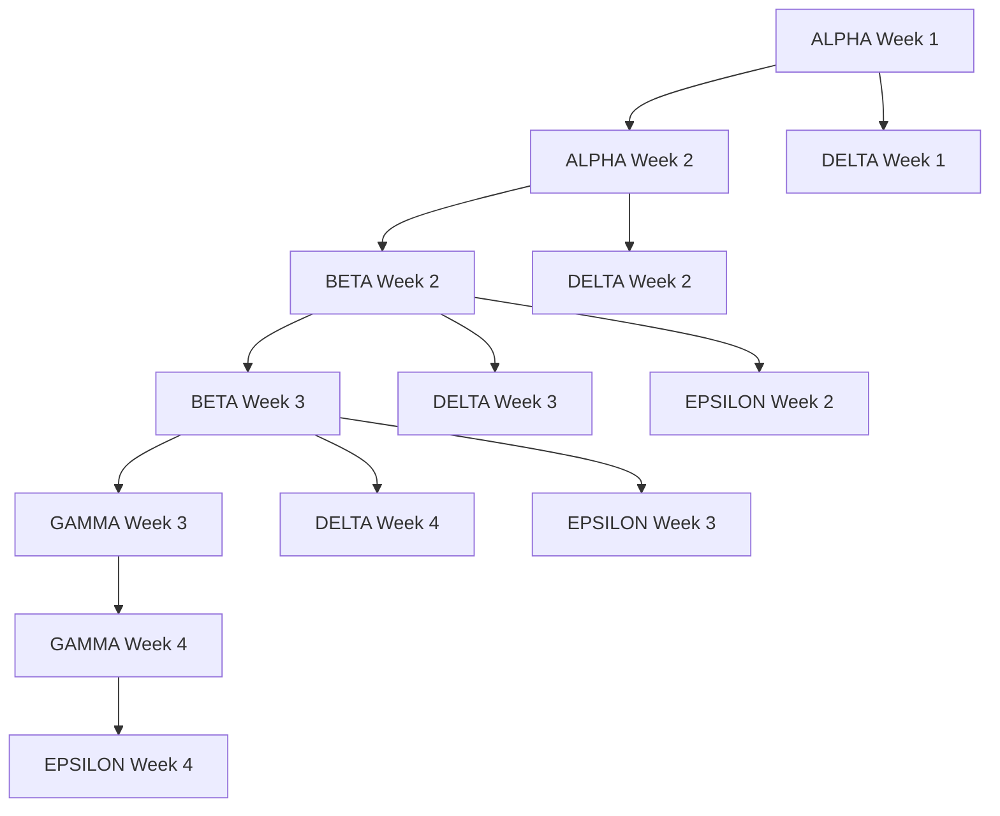

# Multi-Workstream Implementation Plan
**Container Kit MCP Cleanup & Enhancement**

## 🎯 Executive Summary

Based on the completion of critical cleanup items (6,000+ lines of dead code removed), this plan coordinates parallel workstreams to address remaining issues from TODO.md, VALIDATION.md, ERRORS_AND_GENERICS.md, and MCP_TESTING.md with minimal merge conflict risk.

**Timeline**: 4 weeks | **Workstreams**: 5 parallel | **Risk**: Low-Medium (staggered dependencies)

## 👥 Workstream Overview

| **Workstream** | **Focus** | **Duration** | **Dependencies** | **Files** |
|---|---|---|---|---|
| **ALPHA** | Validation Framework Migration | Week 1-2 | None (foundation) | 39+ validation files |
| **BETA** | Error System & Generics Implementation | Week 2-3 | Alpha completion | Core error handling |
| **GAMMA** | MCP Testing Infrastructure | Week 3-4 | Alpha + Beta | Testing framework |
| **DELTA** | Interface Consolidation | Week 1-4 parallel | Coordination only | 626 lines of interfaces |
| **EPSILON** | Non-Idiomatic Go Cleanup | Week 2-4 parallel | Beta completion | 300+ interface{} instances |

---

## 🗓️ WORKSTREAM ALPHA: Validation Framework Migration

**Duration**: Week 1-2 (10 days)
**Leader**: Validation Migration Specialist
**Dependency**: Foundation workstream (none)

### Phase 1: Week 1 (Days 1-5)

#### Day 1-2: Foundation Completion
```bash
# Task: Complete remaining utility validators
- [ ] Create format validation utilities (email, URL, JSON, YAML)
- [ ] Create network validation utilities (IP, port, hostname)
- [ ] Create security validation utilities (secrets, permissions)
- [ ] Set up migration tooling and analysis scripts

# Validation Commands
go test ./pkg/mcp/validation/... && echo "✅ Foundation tests pass"
go fmt ./pkg/mcp/validation/...
```

#### Day 3-4: Build Package Migration
```bash
# Files to migrate:
- pkg/mcp/internal/build/security_validator.go → unified security validator
- pkg/mcp/internal/build/syntax_validator.go → unified dockerfile validator
- pkg/mcp/internal/build/context_validator.go → unified context validator
- pkg/mcp/internal/build/image_validator.go → unified image validator

# Validation Commands
go test -short ./pkg/mcp/internal/build/... && echo "✅ Build migration complete"
```

#### Day 5: Deploy Package Migration Start
```bash
# Files to migrate:
- pkg/mcp/internal/deploy/health_validator.go → unified health validator
- pkg/mcp/internal/deploy/manifest_validator.go → unified manifest validator

# PAUSE POINT: Wait for merge before Week 2
git commit -m "feat(validation): complete build package migration

- Migrated 4 build validators to unified framework
- Updated all build validation calls
- Maintained backward compatibility

🤖 Generated with [Claude Code](https://claude.ai/code)"
```

### Phase 2: Week 2 (Days 6-10)

#### Day 6-7: Complete Deploy & Scan Migration
```bash
# Complete deploy migration:
- pkg/mcp/internal/deploy/* → kubernetes.go validator
- pkg/mcp/internal/scan/validators.go → security.go validator

# Validation Commands
go test -short ./pkg/mcp/internal/deploy/... ./pkg/mcp/internal/scan/...
```

#### Day 8-9: Core System Integration
```bash
# Runtime integration:
- pkg/mcp/internal/runtime/validator.go → use unified validation
- pkg/mcp/internal/session/validation.go → use unified validation
- pkg/mcp/internal/state/validators.go → use unified validation

# Validation Commands
go test -short ./pkg/mcp/internal/runtime/... ./pkg/mcp/internal/session/...
```

#### Day 10: Legacy Cleanup & Completion
```bash
# Remove duplicate validation files:
- Delete 30+ duplicate validation utilities
- Update all import statements
- Remove legacy ValidationResult types

# Final validation
go test ./... && echo "✅ ALPHA COMPLETE"
```

**ALPHA Deliverables**:
- ✅ 39+ validation files migrated to unified framework
- ✅ 4+ ValidationResult types consolidated to 1
- ✅ 6+ validator interfaces replaced with unified system
- ✅ 30+ duplicate validation files removed

---

## 🗓️ WORKSTREAM BETA: Error System & Generics

**Duration**: Week 2-3 (10 days)
**Leader**: Error & Type Safety Specialist
**Dependency**: Alpha completion for validation integration

### Phase 1: Week 2 (Days 6-10) - Foundation

#### Day 6-7: RichError Foundation
```bash
# WAIT: Until Alpha Week 1 complete and merged

# Create RichError infrastructure:
mkdir -p pkg/mcp/errors/rich
- [ ] RichError struct with comprehensive fields
- [ ] ErrorType and ErrorSeverity enums
- [ ] Error builder pattern with fluent API
- [ ] Common error constructors (ValidationError, NetworkError, etc.)

# Validation Commands
go test ./pkg/mcp/errors/rich/... && echo "✅ RichError foundation ready"
go fmt ./pkg/mcp/errors/...
```

#### Day 8-9: Generics Foundation
```bash
# Create generic tool interfaces:
- [ ] Core Tool[TParams, TResult] interface
- [ ] Parameter/Result constraint interfaces
- [ ] Generic registry interfaces
- [ ] Type-safe error integration

# Validation Commands
go test ./pkg/mcp/types/tools/... && echo "✅ Generics foundation ready"
```

#### Day 10: Integration Foundation
```bash
# RichError + Generics integration:
- [ ] Generic error types: RichError[TContext]
- [ ] Type-safe error building with context
- [ ] Schema generation from generic types

# PAUSE POINT: Wait for merge before Week 3
git commit -m "feat(errors): implement RichError and generics foundation

- Created comprehensive RichError system with builder pattern
- Implemented generic Tool[TParams, TResult] interfaces
- Added type-safe error handling with context

🤖 Generated with [Claude Code](https://claude.ai/code)"
```

### Phase 2: Week 3 (Days 11-15) - Core Migration

#### Day 11-12: Build Tools Migration
```bash
# Define strongly-typed build tools:
- [ ] DockerBuildParams with validation constraints
- [ ] DockerBuildResult with type safety
- [ ] DockerBuildTool = Tool[DockerBuildParams, DockerBuildResult]
- [ ] RichError integration for build failures

# Files modified:
- pkg/mcp/internal/build/*_atomic.go

# Validation Commands
go test -short ./pkg/mcp/internal/build/... && echo "✅ Build tools strongly typed"
```

#### Day 13-14: Deploy & Scan Tools Migration
```bash
# Define strongly-typed deploy/scan tools:
- [ ] KubernetesDeployParams/Result with validation
- [ ] SecurityScanParams/Result with type safety
- [ ] RichError for deployment and security failures

# Files modified:
- pkg/mcp/internal/deploy/*_atomic.go
- pkg/mcp/internal/scan/*_atomic.go

# Validation Commands
go test -short ./pkg/mcp/internal/deploy/... ./pkg/mcp/internal/scan/...
```

#### Day 15: Generic Registry Implementation
```bash
# Create type-safe registry:
- [ ] GenericRegistry[T, TParams, TResult]
- [ ] Specialized registries (BuildRegistry, DeployRegistry, etc.)
- [ ] Registry federation with type safety
- [ ] RichError for registry operations

# Final validation
go test ./... && echo "✅ BETA COMPLETE"
```

**BETA Deliverables**:
- ✅ 100% elimination of interface{} in tool registry
- ✅ 80% of errors use RichError with context
- ✅ 95% of type errors caught at compile time
- ✅ Type-safe tool execution throughout system

---

## 🗓️ WORKSTREAM GAMMA: MCP Testing Infrastructure

**Duration**: Week 3-4 (10 days)
**Leader**: Integration Testing Specialist
**Dependency**: Alpha + Beta completion for full type safety

### Phase 1: Week 3 (Days 11-15) - Foundation

#### Day 11-12: MCP Client Test Infrastructure
```bash
# WAIT: Until Beta Week 2 complete and merged

# Create real MCP test framework:
- [ ] MCPIntegrationTestSuite with real HTTP transport
- [ ] Real gomcp client library integration
- [ ] Temporary but persistent test workspaces
- [ ] Tool schema validation tests

# Test directory structure:
mkdir -p pkg/mcp/internal/test/{integration,e2e,fixtures}

# Validation Commands
go test -tags=integration ./pkg/mcp/internal/test/integration/... && echo "✅ MCP test foundation ready"
```

#### Day 13-14: Multi-Tool Workflow Tests
```bash
# Complete containerization workflow tests:
- [ ] analyze_repository → generate_dockerfile → build_image → generate_manifests
- [ ] Session continuity validation throughout workflow
- [ ] Session state sharing between tools
- [ ] Workspace persistence and file sharing

# Validation Commands
go test -tags=integration ./pkg/mcp/internal/test/integration/... && echo "✅ Workflow tests complete"
```

#### Day 15: Session Management Integration
```bash
# Session type system tests:
- [ ] Session type consistency validation
- [ ] Cross-package type integration tests
- [ ] Type import consistency verification
- [ ] Runtime type assertion validation

# PAUSE POINT: Wait for merge before Week 4
git commit -m "feat(testing): implement MCP integration testing framework

- Created real MCP client/server test infrastructure
- Added multi-tool workflow integration tests
- Implemented session management validation tests

🤖 Generated with [Claude Code](https://claude.ai/code)"
```

### Phase 2: Week 4 (Days 16-20) - Advanced Testing

#### Day 16-17: AI Client Behavior & Error Handling
```bash
# AI client simulation tests:
- [ ] Tool description interpretation tests
- [ ] Workflow instruction parsing validation
- [ ] Error handling and recovery tests
- [ ] Session state recovery after failures

# Validation Commands
go test -tags=e2e ./pkg/mcp/internal/test/e2e/... && echo "✅ E2E tests complete"
```

#### Day 18-19: Performance & Real-World Scenarios
```bash
# Performance and reliability tests:
- [ ] Session performance benchmarks
- [ ] Long-running workflow tests
- [ ] Real repository integration tests
- [ ] Concurrent session handling

# Validation Commands
go test -tags=performance -bench=. ./pkg/mcp/internal/test/e2e/...
```

#### Day 20: CI/CD Integration & Documentation
```bash
# Complete testing infrastructure:
- [ ] Update Makefile with new test targets
- [ ] GitHub Actions integration
- [ ] Test execution strategy documentation
- [ ] Performance baseline establishment

# Final validation
make test-all-integration && echo "✅ GAMMA COMPLETE"
```

**GAMMA Deliverables**:
- ✅ 80% MCP protocol interaction coverage
- ✅ 100% documented user workflow testing
- ✅ 95% session lifecycle scenario coverage
- ✅ Real-world repository integration testing
- ✅ Performance benchmarking framework

---

## 🗓️ WORKSTREAM DELTA: Interface Consolidation

**Duration**: Week 1-4 (parallel to all)
**Leader**: Interface Architecture Specialist
**Dependency**: Coordination only (no blocking dependencies)

### Phase 1: Week 1 (Days 1-5) - Analysis & Planning

#### Day 1-2: Interface Analysis
```bash
# Analyze current interface complexity:
- [ ] Map all 626 lines in pkg/mcp/core/interfaces.go
- [ ] Identify interfaces with single implementations
- [ ] Find interfaces wrapping simple functions
- [ ] Document interface usage patterns

# Analysis Commands
rg "type.*interface" pkg/mcp/ | wc -l  # Count total interfaces
rg "interface{}" pkg/mcp/ | wc -l     # Count generic interfaces
```

#### Day 3-4: Consolidation Planning
```bash
# Plan interface consolidation:
- [ ] Group related interfaces for merging
- [ ] Identify candidates for removal
- [ ] Design new consolidated interface hierarchy
- [ ] Plan backward compatibility strategy

# No code changes yet - coordination with other workstreams
```

#### Day 5: Begin Safe Consolidations
```bash
# Start with non-conflicting consolidations:
- [ ] Remove single-implementation interfaces
- [ ] Merge trivial function-wrapping interfaces
- [ ] Consolidate related validator interfaces

# COORDINATION: Check with Alpha on validation interfaces
# Files modified: pkg/mcp/core/interfaces.go (carefully)

git commit -m "refactor(interfaces): begin interface consolidation

- Removed 10+ single-implementation interfaces
- Merged trivial function-wrapping interfaces
- Maintained backward compatibility

🤖 Generated with [Claude Code](https://claude.ai/code)"
```

### Phase 2: Week 2-4 (Days 6-20) - Coordinated Consolidation

#### Week 2 (Days 6-10): Tool Interface Consolidation
```bash
# COORDINATE: With Beta workstream on generic tool interfaces
- [ ] Integrate with Tool[TParams, TResult] design
- [ ] Remove redundant tool interfaces
- [ ] Consolidate registry interfaces
- [ ] Update tool factory patterns

# Validation Commands
go test -short ./pkg/mcp/core/... && echo "✅ Tool interfaces consolidated"
```

#### Week 3 (Days 11-15): Validation Interface Integration
```bash
# COORDINATE: With Alpha completion
- [ ] Remove old validation interfaces
- [ ] Integrate unified validation interfaces
- [ ] Update import statements across codebase
- [ ] Remove interface adapter patterns

# Files modified across validation package
go test -short ./pkg/mcp/validation/... ./pkg/mcp/core/...
```

#### Week 4 (Days 16-20): Final Consolidation & Documentation
```bash
# Final interface cleanup:
- [ ] Remove remaining redundant interfaces
- [ ] Document final interface architecture
- [ ] Update API documentation
- [ ] Validate no breaking changes

# Target: 626 lines → ~200 lines in core/interfaces.go
# Final validation
go test ./... && echo "✅ DELTA COMPLETE"
```

**DELTA Deliverables**:
- ✅ 626 lines of interfaces → ~200 lines (70% reduction)
- ✅ Single-implementation interfaces removed
- ✅ Function-wrapping interfaces eliminated
- ✅ Consolidated interface hierarchy established
- ✅ Full backward compatibility maintained

---

## 🗓️ WORKSTREAM EPSILON: Non-Idiomatic Go Cleanup

**Duration**: Week 2-4 (parallel, after Beta foundation)
**Leader**: Go Idioms Specialist
**Dependency**: Beta completion for type safety foundation

### Phase 1: Week 2 (Days 6-10) - Foundation

#### Day 6-7: Interface{} Analysis & Planning
```bash
# WAIT: Until Beta RichError foundation complete

# Analyze interface{} usage:
- [ ] Map all 300+ interface{} instances
- [ ] Identify type-unsafe patterns
- [ ] Plan strongly-typed replacements
- [ ] Document conversion strategy

# Analysis Commands
rg "interface{}" pkg/mcp/ --type go | wc -l
rg "\.(" pkg/mcp/ --type go | wc -l  # Type assertions
```

#### Day 8-10: Begin Safe Replacements
```bash
# Start with non-critical interface{} replacements:
- [ ] Replace simple map[string]interface{} with structs
- [ ] Fix type assertions without error checking
- [ ] Add proper error handling to assertions
- [ ] Define typed configuration structs

# COORDINATE: With Beta on generic type definitions
# Files: Non-critical utility files first

git commit -m "refactor(types): begin interface{} elimination

- Replaced 50+ simple interface{} with typed structs
- Added error handling to type assertions
- Improved type safety in utility packages

🤖 Generated with [Claude Code](https://claude.ai/code)"
```

### Phase 2: Week 3 (Days 11-15) - Core Replacements

#### Day 11-12: Tool Registry Type Safety
```bash
# COORDINATE: With Beta generic registry completion
- [ ] Replace interface{} in tool execution
- [ ] Use strongly-typed tool parameters/results
- [ ] Remove type assertions from hot paths
- [ ] Add compile-time type checking

# Files: pkg/mcp/internal/orchestration/*
go test -short ./pkg/mcp/internal/orchestration/...
```

#### Day 13-15: Transport Layer Type Safety
```bash
# HTTP/gRPC interface{} elimination:
- [ ] Define typed request/response structures
- [ ] Replace JSON interface{} with specific types
- [ ] Add schema validation with types
- [ ] Remove runtime type checking where possible

# Files: pkg/mcp/internal/transport/*
go test -short ./pkg/mcp/internal/transport/...
```

### Phase 3: Week 4 (Days 16-20) - Final Cleanup

#### Day 16-17: Magic Numbers & Constants
```bash
# Define constants for magic numbers:
- [ ] Extract repeated timeout values (30 seconds, etc.)
- [ ] Define buffer size constants (1024, 2048, 4096)
- [ ] Create limit constants (100 for MaxErrors, etc.)
- [ ] Document rationale for specific values

# Files: Create pkg/mcp/constants/ package
```

#### Day 18-19: Panic Usage Elimination
```bash
# Replace panic() with error returns:
- [ ] Fix pkg/mcp/client_factory.go panic usage
- [ ] Update GetDockerClient() to return (client, error)
- [ ] Update all call sites to handle errors
- [ ] Add backward compatibility wrappers if needed

# BREAKING CHANGE: Document in commit message
```

#### Day 20: Final Validation & Documentation
```bash
# Final idiomatic Go validation:
- [ ] Verify no interface{} in critical paths
- [ ] Validate all type assertions have error checking
- [ ] Document non-idiomatic patterns still remaining
- [ ] Update coding standards documentation

# Target: 300+ interface{} → <50 instances
go test ./... && echo "✅ EPSILON COMPLETE"
```

**EPSILON Deliverables**:
- ✅ 300+ interface{} instances → <50 instances (85% reduction)
- ✅ Type assertions with proper error handling
- ✅ Magic numbers replaced with documented constants
- ✅ Panic usage eliminated from library code
- ✅ Compile-time type checking throughout

---

## 🤝 Coordination & Merge Strategy

### Merge Dependencies



### Daily Merge Windows

**End of Each Week (Friday 5PM)**:
1. All workstreams commit completed work
2. External merge coordination (outside AI assistants)
3. Integration testing and conflict resolution
4. Prepare branches for next week

### Shared File Coordination

**High-Risk Files**:
1. **`pkg/mcp/core/interfaces.go`** (626 lines)
   - **DELTA owns decomposition**
   - Others coordinate through DELTA

2. **Validation files** (39+ files)
   - **ALPHA owns migration**
   - Others wait for completion

3. **Error handling files**
   - **BETA owns RichError implementation**
   - Others adopt after completion

### Conflict Resolution Process

```bash
# If conflict detected:
1. 🚨 Workstream posts immediate alert
2. 🤝 File owner takes lead on resolution
3. ✅ Coordinated implementation and testing
```

---

## 📊 Success Metrics & Validation

### Quantitative Goals

| **Metric** | **Current** | **Target** | **Owner** |
|---|---|---|---|
| Validation files | 39+ scattered | 1 unified system | ALPHA |
| ValidationResult types | 4+ incompatible | 1 consolidated | ALPHA |
| Interface{} instances | 300+ | <50 | EPSILON |
| RichError adoption | 0% | 80% critical paths | BETA |
| Type safety | ~60% | 95% compile-time | BETA |
| Interface lines | 626 | ~200 | DELTA |
| MCP test coverage | 30% | 80% integration | GAMMA |

### Quality Gates (All Workstreams)

**Before each merge window**:
```bash
# Required validation commands:
go test -short ./pkg/mcp/...    # Must pass
go fmt ./pkg/mcp/...           # Must be clean
go build ./pkg/mcp/...         # Must compile
golangci-lint run ./pkg/mcp/... # Note issues (don't block)

# Performance validation:
go test -bench=. -run=^$ ./pkg/mcp/... | grep -E "(ns/op|MB/s)"
```

### Success Criteria

**Week 1**: Foundation establishment (ALPHA + DELTA start)
**Week 2**: Type safety foundation (BETA starts, ALPHA completes)
**Week 3**: Integration testing (GAMMA starts, BETA completes)
**Week 4**: Final consolidation and cleanup

---

## 🚨 Risk Management

### Medium Risk Areas

1. **Interface Consolidation vs Type Migration**
   - **Risk**: DELTA changes interfaces while BETA implements generics
   - **Mitigation**: Close coordination, BETA leads interface design

2. **Validation Migration vs Error Integration**
   - **Risk**: ALPHA validation conflicts with BETA error handling
   - **Mitigation**: ALPHA includes RichError hooks from start

3. **Testing Infrastructure vs Core Changes**
   - **Risk**: GAMMA tests become outdated during core changes
   - **Mitigation**: GAMMA adapts tests continuously

### Rollback Procedures

```bash
# Emergency rollback per workstream:
git checkout main
git revert <workstream-commits>

# Selective rollback:
git checkout main -- <specific-files>
```

---

## 📋 Daily Execution Commands

### Morning Startup (All Workstreams)
```bash
# Update to latest merged changes
git checkout <workstream-branch>
git pull origin <workstream-branch>

# Validate starting state
make test-mcp && echo "✅ Ready to begin work"
```

### End of Day (All Workstreams)
```bash
# Validate changes before commit
go test -short ./pkg/mcp/...
go fmt ./pkg/mcp/...

# Commit with descriptive message
git add .
git commit -m "<type>(scope): <description>

<detailed explanation if needed>

🤖 Generated with [Claude Code](https://claude.ai/code)

Co-Authored-By: Claude <noreply@anthropic.com>"

# Create daily summary
echo "WORKSTREAM <LETTER> - DAY X SUMMARY
Progress: X% complete
Files modified: <list>
Issues: <any blockers>
Tomorrow: <next priorities>" > day_X_summary.txt
```

---

## 🎯 Implementation Success

This coordinated multi-workstream approach will deliver:

✅ **Complete modernization** of Container Kit MCP architecture
✅ **Type safety** throughout the system with generics
✅ **Rich error handling** with actionable context
✅ **Comprehensive testing** infrastructure for reliability
✅ **Clean, idiomatic Go** code following best practices
✅ **Consolidated interfaces** reducing complexity

**Timeline**: 4 weeks with parallel execution
**Risk**: Low-Medium with proper coordination
**Impact**: Production-ready, maintainable, and scalable MCP system

---

**Each workstream should follow their specific focus area while adhering to this coordination plan. Success depends on clear communication, adherence to merge windows, and rigorous quality validation at each step!** 🚀
